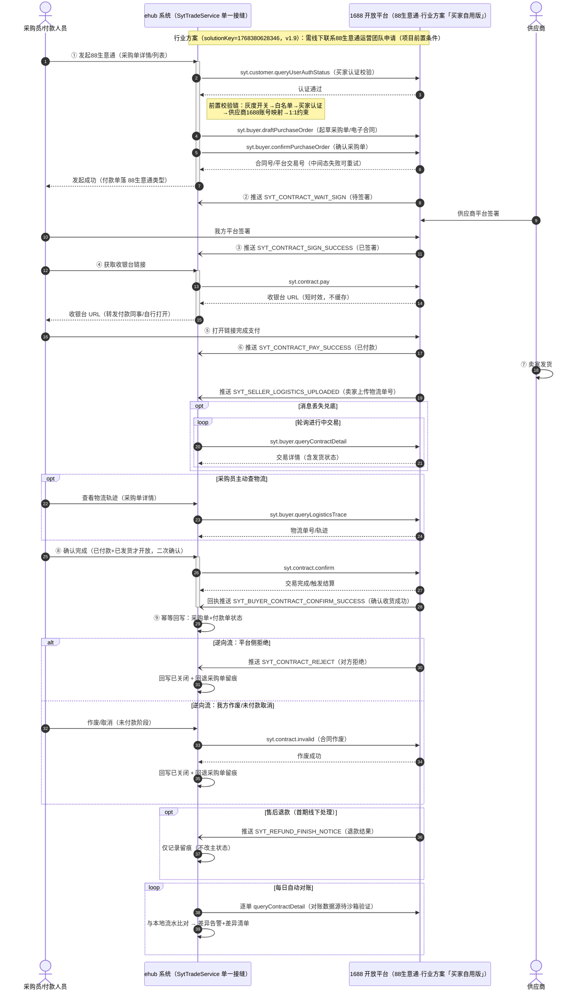
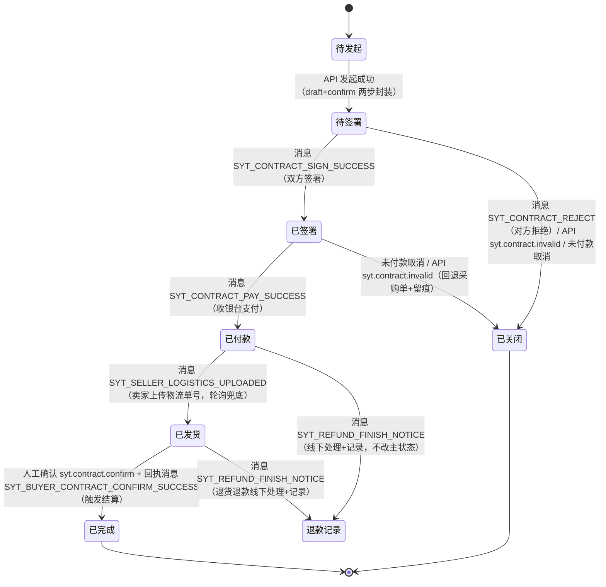

# 88生意通担保交易（alipay-88-trade）

Status: ready-for-agent

溯源：PRD 母本 `plans/alipay-88-trade-prd.md`（v1.2，含访谈 Q1–Q24、Spike 官方 API 验证结论与行业方案修正）；访谈记录 `plans/alipay-88-trade-interview.md`。术语以 `GLOSSARY.md`「88生意通」词条为准。

## Problem Statement

采购团队在线下采购场景（大额、定制类采购）中，货款通过私人账户或对公转账等方式线下打款给供应商：

1. **资金风险**：线下打款无平台担保，供应商不发货、货不对板时缺乏追索与维权凭证；
2. **凭证缺失**：无电子合同、无平台流水，财务对账与审计困难，采购成本难追溯；
3. **过程不可视**：交易进度（签署、付款、发货、结算）系统内无记录，采购员需在微信等线下渠道反复确认。

1688 官方已推出「88生意通」（担保交易 + 电子合同；正式对接目标为行业方案「88生意通解决方案（买家自用版）」v1.9，与现有跨境对接同一鉴权体系，需线下联系88生意通运营团队申请），为解决上述问题提供平台侧基础。

## Solution

在采购单链路上接入 88生意通担保交易：

1. 采购员在采购单列表/详情对符合条件的线下采购单**人工发起**担保交易（系统内封装官方「起草+确认」两步为一次操作），生成电子合同与收银台支付链接；
2. 合同签署、支付、发货、确认完成、结算等全流程状态经 SYT_* 消息推送 + 交易详情轮询兜底**自动同步**并回写采购单；
3. 财务可按供应商/时间段/状态筛选导出交易流水，自动对账任务每日比对本地与平台流水并告警差异；
4. 逆向状态（拒绝/作废/关闭）自动回写采购单并留痕；功能以开关+白名单灰度放量。

首期限于人民币境内大额/定制类线下采购；跨境场景继续走现有跨境宝等链路。

## User Stories

**发起与签署**

1. 作为采购员，我希望在采购单详情对符合条件的线下采购单一键发起 88生意通担保交易，以便我不需要线下私户打款也能获得平台担保与电子合同。
2. 作为采购员，我希望系统把官方「起草采购单+确认采购单」两步接口封装为一次操作，以便我不感知中间态；中间态失败可重试。
3. 作为采购员，我希望发起前系统校验我方 1688 账号已完成 88生意通认证，未认证时给出引导提示，以免起草后才发现无法签署。
4. 作为采购员，我希望发起前系统校验供应商档案已维护 1688 卖家账号且与交易对方匹配，以免合同签错主体。
5. 作为采购员，我希望同一张采购单最多存在一笔进行中的 88生意通交易（1:1），重复发起被拦截，以便链路清晰好对账。
6. 作为采购员，我希望发起校验不通过时得到明确的失败原因（认证/账号映射/重复发起/灰度白名单），以便立刻知道怎么改。

**支付**

7. 作为采购员，我希望发起后立即获得收银台支付链接并转发给付款同事或自行打开，以便付款方式可控且有平台凭证。
8. 作为付款操作人员，我希望支付链接是实时从平台获取的短时效链接，以便不误用过期链接。
9. 作为采购员，我不需要系统对我的 88生意通支付设额外金额硬限制（风控依赖现有采购付款审批流），以免大额定制单被误拦。

**状态可视**

10. 作为采购员，我希望在采购单详情实时看到 88生意通交易状态（待签署/已签署/待付款/已付款/已发货/已完成/已关闭），以便不用在微信上反复向供应商确认进度。
11. 作为采购员，我希望状态变化由平台消息推送驱动、消息丢失时由轮询兜底补齐，以便状态最终一致。
12. 作为采购员，我希望重复的消息推送或轮询结果不会产生副作用（幂等），以免状态被旧消息打回。

**合同**

13. 作为采购员，我希望点击「查看/下载合同」时系统实时调平台接口获取合同文件或链接，以便随时取用凭证而不依赖本地存档。
14. 作为采购员，若平台不提供合同文件下载，我至少可以跳转平台页面查看合同，以免完全失去凭证入口。

**确认完成与逆向**

15. 作为采购员，我希望在交易已付款且卖家已发货后，在采购单详情人工「确认完成」（需二次确认），以便平台触发结算给卖家、责任留痕。
16. 作为系统，我需要在「确认完成」前校验交易处于可确认状态（已付款+已发货），以免误触发结算。
17. 作为采购员，我希望合同被拒绝/作废/未付款取消时，采购单自动回退到待处理或关闭并留痕原因，以便采购单状态不与平台脱节。
18. 作为采购员，我希望售后退款走线下处理后仅做记录留痕，以便首期链路简单可控。

**对账与财务**

19. 作为财务人员，我希望自动对账任务每日将本地 88生意通交易流水与平台流水比对并告警差异，以便不需要人工逐笔核对。
20. 作为财务人员，我希望按供应商/时间段/状态筛选并导出 88生意通交易流水，以便完成月度审计与成本核算。
21. 作为财务人员，我希望手续费率与承担方可配置且默认关闭（不计入采购成本），以便官方口径确认后可平滑启用。
22. 作为财务人员，我希望手续费开关开启后采购成本计算正确包含手续费，以便成本核算准确。

**灰度与权限**

23. 作为运营管理员，我希望通过功能开关（默认关）+ 采购员/供应商白名单灰度放量，以便新链路风险可控。
24. 作为运营管理员，我希望白名单内的用户看不到任何 88生意通入口变化前（开关关闭时）的干扰，以便存量用户零感知。
25. 作为系统管理员，我希望 88生意通操作权限对齐现有采购单付款权限体系，以便不为新功能单独维护一套权限。

**供应商档案**

26. 作为采购/供应商管理人员，我希望在供应商档案维护对应的 1688 卖家账号（memberId/loginId），以便发起担保交易时校验主体匹配。

## Implementation Decisions

（溯源：PRD v1.2 Implementation Decisions，访谈 Qn 标注见 PRD/访谈记录）

### 模块与接缝（单一新接缝）

- **新建唯一的领域服务接缝**：「88生意通交易服务」（SytTradeService，下称交易服务）。发起（两步封装）、收银台链接获取、确认完成、合同获取、状态回写（幂等收敛）、逆向回退、自动对账全部经此服务进出；前端/消息/轮询/定时任务都是它的触发源。
- **平台 API client**：交易服务下游封装 88生意通官方 API 调用（复用现有跨境方案的 appKey/secret + token 鉴权与 `ApiExecutor` 基础设施），对该 client 的 mock 即测试边界。
- **SYT 消息路由**：在现有 1688 消息处理链路（WebSocket → MQ → 消息组件 → 按消息类型路由）新增 SYT_* 分支，转调交易服务的状态回写入口；不为消息开独立测试面。
- **轮询兜底**：新增定时任务对「进行中」交易调用官方交易详情查询，结果同样汇入交易服务的幂等状态回写入口；发货状态由 `SYT_SELLER_LOGISTICS_UPLOADED` 消息主驱动、轮询兜底（行业方案 v1.2 修正，v1.1 的「无发货消息」结论仅适用跨境方案）。

### 状态机（经 Spike 确认的消息/接口映射）

- 平台侧事件 → 本地交易状态收敛：`SYT_CONTRACT_WAIT_SIGN`→待签署、`SYT_CONTRACT_SIGN_SUCCESS`→已签署（待付款）、`SYT_CONTRACT_PAY_SUCCESS`→已付款、`SYT_SELLER_LOGISTICS_UPLOADED`（卖家上传物流单号，轮询兜底）→已发货、`syt.contract.confirm` 成功（回执消息 `SYT_BUYER_CONTRACT_CONFIRM_SUCCESS`）→已完成、`SYT_CONTRACT_REJECT`/合同作废/未付款取消→已关闭（回退采购单）、`SYT_REFUND_FINISH_NOTICE`→退款结果记录。
- 状态只前进不后退（幂等合并：旧消息/旧轮询结果不得覆盖新状态），回写同时更新采购单汇总状态与付款单明细状态。

### 数据模型

- **并入付款单体系**：`bill_payment` 新增「88生意通」类型；平台交易号、合同号、合同/交易状态、收银台链接获取时间、手续费配置等作为字段直接落在付款单上，**不建独立子表**（Q3/Q13）。字段以前缀规约命名（`ali_88_`/`syt_`）；若实现期字段膨胀超预期，允许回来重评估拆子表（需升版 PRD 记录）。
- **采购单回写**：担保交易状态变化回写 `purchase_order_batch`（状态回退/关闭、支付信息），列表可见。
- **供应商档案**：`Supplier` 新增维护 1688 卖家账号（memberId/loginId）字段与录入入口。

### API 与交互契约

- 发起：入参采购单 ID；前置校验链（灰度开关→白名单→买家认证→供应商账号映射→1:1 约束）任一失败返回明确错误码；通过后封装官方两步接口，失败中间态可重试。
- 收银台链接/合同文件：均为实时获取、短时效使用，不长期缓存、不落 OSS。
- 确认完成：仅「已付款+已发货」开放；前端二次确认；操作留痕。
- 自动对账：每日定时，平台侧数据源按 Spike 缺口降级方案实现（逐单详情查询比对，或消息补偿接口重建事件流），差异产出告警与差异清单。

### 权限与灰度

- 权限对齐现有采购单付款权限，不新增权限点（Q16）。
- 功能开关（默认关）+ 采购员/供应商双白名单（Q22）；开关关闭时前端不渲染任何 88生意通入口。

### 第三方边界（Spike 确认，v1.2 修正）

- **两个方案入口**（同一开放平台鉴权体系，token/权限管理沿用现有机制）：
  1. **正式对接目标**：「88生意通解决方案（买家自用版）」行业方案（solutionKey=1768380628346，v1.9）——API/消息清单更完整（含发货/确认收货消息、物流查询 API）；**申请门槛：需线下联系 88生意通运营团队申请**（项目前置条件，需提前启动商务流程）；
  2. 备选降级路径：现有已订购的「跨境综合解决方案（自用）」（solutionKey=1697014160788，v17.8）的 88生意通子集——无发货消息与物流查询 API，但含万里汇支付。
- 两个沙箱验证点在实现期第一个工单内核实：① `queryContractDetail` 是否返回合同文件/链接（否则合同获取降级为跳转平台页）；② 对账平台侧数据源形态。任一坐实降级，需升版 PRD 记录。

## Testing Decisions

- **好测试的标准**：只测交易服务接缝的外部行为——给定平台事件/查询结果（mock client），断言采购单与付款单状态收敛、幂等（重复事件无副作用）、错误码；不测内部调用序列等实现细节。
- **测试面（单一接缝）**：全部测试打 SytTradeService；消息处理与轮询任务仅作为触发源在集成层面各覆盖一条「路由→服务」通路，不展开独立测试面。
- **优先覆盖的行为**（与 PRD Testing Decisions 对齐）：
  1. 发起校验链各失败分支 + 两步封装成功/中间态重试；
  2. 状态回写：各平台事件 → 状态收敛正确且幂等（含旧消息不覆盖新状态）；
  3. 逆向回退：拒绝/作废/取消回写采购单并留痕；
  4. 对账差异：构造本地/平台差异，验证告警与差异清单产出；
  5. 手续费开关：开启前后采购成本计算差异；
  6. 灰度：开关关/白名单外的发起拦截。
- **先例（prior art）**：`ehub-tenant` 中现有 1688 消息状态同步类服务测试（如订单状态同步）、`CostControlPurchaseGoodsAmountSyncServiceImplTest` 风格的服务级单测。
- **契约回放**：以 Spike 接口能力矩阵为契约基线，mock 官方 API 响应回放（两步发起、收银台 URL、交易详情查询优先）。

## Out of Scope

- 账期支付、分阶段支付（待官方开放另起需求）；
- 免密代扣支付；
- 批量发起与失败回执重试（需求待定）；
- 跨境支付渠道（跨境宝等现有链路不变；万里汇 `syt.contract.payTransfer` 仅作后备记录）;
- 自动确认完成、自动退款售后链路（`syt.contract.refund` 平台能力首期不用）；
- 存量线下采购单补录迁移；
- 合同文件本地/OSS 存储归档；
- 新增独立权限点体系。

## Further Notes

### 业务流程图（含 88生意通接口接入点）

**端到端流程**（采购员/供应商/系统/平台四方交互，①–⑨ 主流程与状态机对应；逆向流、退款与对账为支路）：

**交易状态机**（标注每步触发源：消息推送 / 轮询 / API 调用）：

- 状态只前进不后退：推送与轮询结果幂等合并，旧消息不得覆盖新状态。
- `SYT_ADD_CONTRACT_CONTENT`（交易存证）作为附件记录落付款单，不驱动主状态流转。
- 发货状态消息主驱动 + 轮询兜底；物流单号可用 `syt.buyer.queryLogisticsTrace` 主动查询（行业方案 API）。
- 沙箱验证点：合同文件/链接是否随 `queryContractDetail` 返回（否则降级跳转平台页）；对账平台侧数据源形态。

- PRD 母本含完整 Spike 报告（v1.2）：接口能力矩阵（`syt.buyer.draftPurchaseOrder`/`syt.buyer.confirmPurchaseOrder`/`syt.contract.pay`/`syt.contract.confirm`/`syt.contract.invalid`/`syt.buyer.queryContractDetail`/`syt.customer.queryUserAuthStatus`/`syt.buyer.queryLogisticsTrace`）、完整 SYT 消息清单（含发货/确认收货回执）、鉴权形态确认。
- **正式对接目标为行业方案「88生意通解决方案（买家自用版）」（v1.9）；申请门槛：线下联系 88生意通运营团队申请**——需提前启动商务流程，建议作为独立前置工单跟踪。
- 需确认生产 appKey 订购范围/申请结果包含 88生意通权限包（行业方案 v1.9，随版本迭代）。
- TAPD 待确认项（手续费率/承担方、API 开放范围、跨境渠道）待沙箱验证结论明确后回写 TAPD 评论。
- 手续费率/承担方为可配置项，默认关闭；官方口径确认后配置启用。
