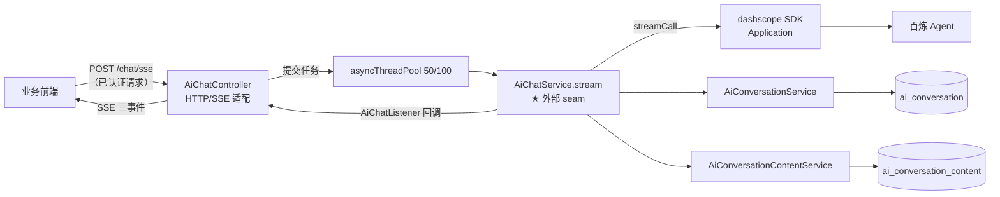
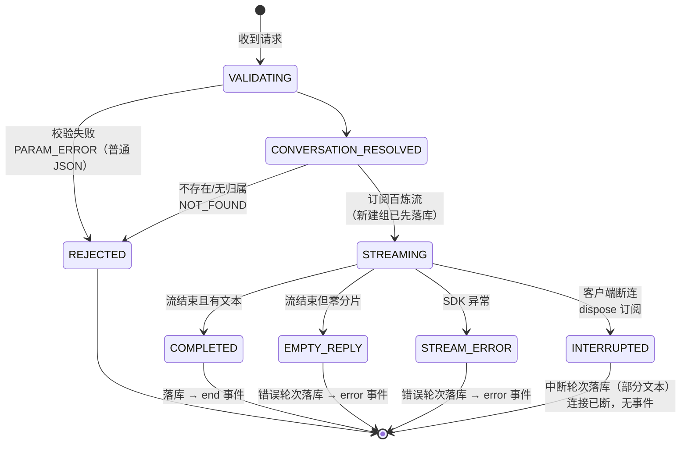
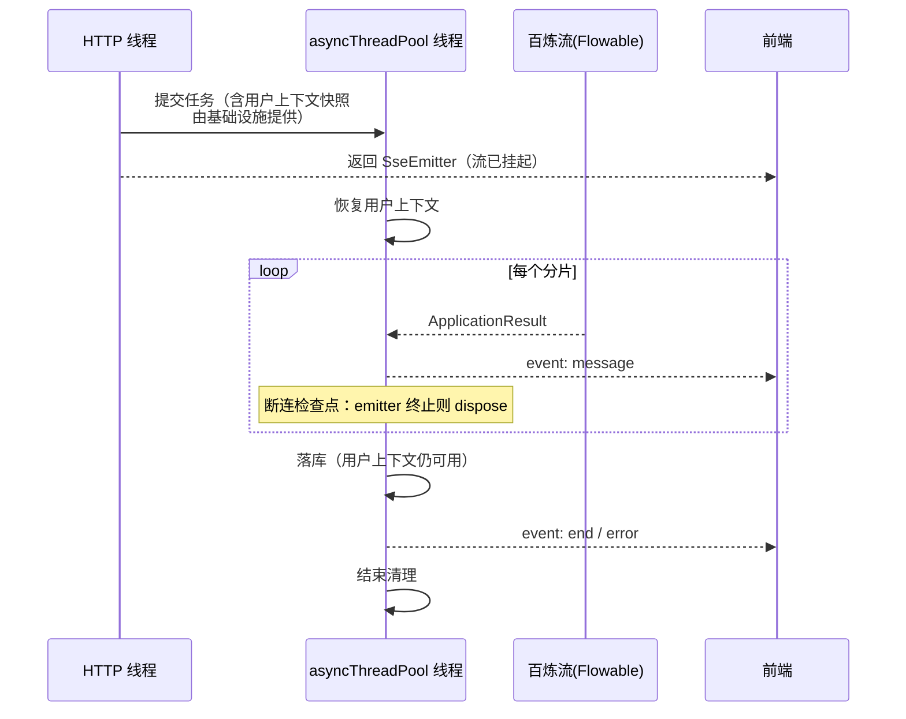

# Design — AI 对话 v1（POST /chat/sse）

> 关联：PRD 母本 `plans/ai-chat-sse-prd.md` (v1.0) ｜ 需求 `requirements/ai-chat/01~05` ｜ Spec `specs/ai-chat-spec.md` ｜ 状态：**v1.1（认证边界剥离，2026-08-20）**
>
> 本文描述 v1 的**目标设计**（含 spec 差距清单 5 项落地后的形态），使用深模块（deep module）/接口/seam 词汇。决策可溯源至母本访谈问题号（Qxx）。
>
> **设计边界（D3）**：用户登录与身份校验（JWT 解析、用户上下文的建立/跨线程传递/清理）由平台基础设施在模块上游统一完成，**不在本设计体现**（机制见 [`requirements/auth/01-接口认证.md`](../../requirements/auth/01-接口认证.md)）。本设计从「已认证请求进入 Controller」开始，模块内仅消费既有的用户上下文（如归属校验）。

## 1. 设计总览

一次对话的完整数据通路与模块关系：



设计核心：**`AiChatService.stream` 是唯一的深模块**——会话路由、百炼调用、分片累计、落库、断连回收全部藏在 `stream(ChatParam, AiChatListener)` 一个 void 调用之后；传输层（SSE/HTTP）完全不知道这些细节的存在。

## 2. 模块设计

### 2.1 模块清单与接口

| 模块 | 接口 | 职责（藏在接口后的实现） | 深度评价 |
|---|---|---|---|
| `AiChatController` | `POST /chat/sse`（HTTP） | 任务提交、监听器→SSE 帧映射 | 薄适配器（应当薄） |
| `AiChatService` | `stream(ChatParam, AiChatListener)` | 会话路由、百炼流调用、分片累计、token 统计、三种结局落库、断连取消 | **深模块**（外部 seam） |
| `AiConversationService` | 按主键/归属查询、插入、更新 sessionId | 会话组持久化 | 中等 |
| `AiConversationContentService` | `saveChatResult(ChatResultSaveParam)` | 一轮两条消息的事务性落库 + sessionId 回写 | 中等（事务边界在此） |
| `WorkbenchProperties` | 配置读取 | app-key/app-id、兜底文案、prompt 上限 | 配置模块 |

**接口演化（D2，关键设计）**：现有单方法 `AiChatCallback` 升级为三方法监听器，对应 SSE 三事件——

```
AiChatListener {
    void onMessage(AiChatResult chunk)   // 增量分片
    void onEnd(ChatTurnSummary summary)  // 正常结束（累计汇总）
    void onError(ChatError error)        // 百炼失败/空回复
}
```

- `AiChatService` 保持**传输无关**（不知道 SSE 存在），Controller 把监听器映射为带事件名的 SSE 帧——事件命名是 Web 层的事，不是领域逻辑
- 三方法仍属小接口：调用方（Controller/测试）只需学三个回调即可驱动全部行为

### 2.2 内部结构（AiChatService 实现内幕）

```
stream(param, listener)
 ├── ① 校验（prompt 空白/长度、type）           → 抛 ApiException（PARAM_ERROR）
 ├── ② getConversation(param)                    → 新建（先落库）或归属校验（NOT_FOUND）
 ├── ③ 组装 ApplicationParam（sessionId、incrementalOutput=true）
 ├── ④ streamCall(param, consumer)               → 订阅百炼 Flowable
 │      ├── 每分片：累计 + onMessage(chunk)
 │      └── 断连检查点：emitter 已终止 → dispose 订阅，跳到 ⑥b
 ├── ⑤a 流正常结束 → 空回复判定 → ⑤b
 ├── ⑥a COMPLETED：saveChatResult(user+assistant) → onEnd(summary)
 ├── ⑥b INTERRUPTED：saveChatResult(部分文本+params 标记)
 └── ⑥c ERROR：saveChatResult(占位+params 标记) → onError(code)
```

- **`SseChatContext`（累计器）**：内部 seam——文本 StringBuffer、models 去重、token 累计、sessionId 捕获。不暴露给调用方，测试经 `stream` 接口覆盖
- **`ChatResultSaveParam` 扩展**：增加结局字段（`outcome` + `params` JSON），由 `AiConversationContentService.saveChatResult` 统一翻译为两条 insert + sessionId 回写——落库细节对 `AiChatService` 收敛为一次调用

## 3. 一轮对话状态机



| 终态 | 落库 | 前端可见 |
|---|---|---|
| COMPLETED | user + assistant（全量文本、token） | `end`（累计汇总） |
| EMPTY_REPLY / STREAM_ERROR | user + assistant 占位，`params={"error":true,"code":...}` | `error` `{code,message}` |
| INTERRUPTED | user + assistant 部分文本，`params={"interrupted":true,"reason":"client_disconnected"}` | 无（连接已断） |
| REJECTED | 无 | 普通 JSON 错误（未进入流式） |

不变式：
- **凡进入 STREAMING 必落库**（三种结局全覆盖，NFR-04）
- `sessionId` 仅首次回写，已有不覆盖（FR-04）
- token 统计缺失记 0（R-03）

## 4. 线程模型



- **用户上下文跨线程传递**：主线程→池线程的快照传递机制（捕获-重建或等价方式）由平台基础设施提供；本模块仅约定「池线程内用户上下文可用、任务结束负责清理」这一契约，不设计其实现
- **断连回收**（Q9）：emitter 的 `onCompletion/onTimeout/onError` 触发时置**取消标志**；池线程在每个分片回写前检查标志，命中则 dispose 百炼订阅并走 INTERRUPTED 落库——不做双线程抢占，回收点收敛在分片边界（简单且够用，R-04 接受检测时延）
- **线程占用**：`blockingForEach` 使池线程被占用至流结束（R-02），50/100 容量为 v1 已知限制

## 5. 设计决策记录（D 编号）

| # | 决策 | 理由 / 备选 | 溯源 |
|---|---|---|---|
| D1 | `AiChatService.stream` 为外部 seam，不新增更低层 seam | 小接口藏全部行为；测试从此处注入伪 `Flowable` 即可覆盖五种终态 | Q1/Q10 |
| D2 | 单方法回调升级为三方法 `AiChatListener` | 事件命名留在 Web 层，领域模块保持传输无关；备选「Service 直接持有 SseEmitter」被否——会把传输细节渗入领域，测试必须模拟 HTTP | Q4/Q11 |
| D3 | 用户登录与身份校验剥离至模块边界外（平台基础设施职责） | 认证是横切关注点，不该渗入对话模块设计；模块内仅消费既有用户上下文做归属校验；备选「模块内维护捕获-重建 ThreadLocal 逻辑」被否——会让设计耦合具体上下文机制 | Q7 |
| D4 | 三种轮次结局统一走 `saveChatResult` 出口，标记存 `params` 列 | 落库逻辑局部化（改一处全体生效）；不改 DDL | Q8/Q12/Q13 |
| D5 | 断连取消收敛在分片边界检查，不做线程抢占 | 简单、无并发原语滥用；时延为已接受风险 | Q9/R-04 |
| D6 | `AiConversationContentService` 持有事务边界 | 一轮两条消息原子性；`AiChatService` 不感知事务 | 现状保留 |
| D7 | 配置集中 `WorkbenchProperties`（文案/prompt 上限等） | 移除硬编码兜底；NFR-05 | Q6/Q15 |

## 6. 与测试的关系

测试设计（见 spec §3）直接由本设计导出：

- **设计边界（D3）**：登录与身份校验属平台基础设施横切职责，本设计不体现；`requirements/ai-chat/05-非功能需求与风险.md` NFR-01/NFR-03 中与认证机制相关的条目由基础设施层承接
- **seam 测试**（`stream` + 伪 `Flowable`）：`Flowable.just`/`error`/`empty`/`never` 分别驱动 COMPLETED / STREAM_ERROR / EMPTY_REPLY / INTERRUPTED（配合提前 dispose）四种终态，断言监听器回调序列 + 落库参数
- **Controller 集成测试**（MockMvc 1 条）：验证监听器→SSE 帧映射（事件名、`@SkipWrapper`）、REJECTED 两分支走统一 JSON 错误
- 不断言 `SseChatContext` 内部结构（内部 seam 不进测试面）

## 7. v2 演进预留（不实现，只留缝）

- **记忆组装**（R-01）：落库的完整历史已具备服务端组装 messages 的数据基础，v2 可在 `stream` 内部替换「仅 prompt」为「prompt+历史」，接口不变
- **多 Agent 分流**：`ChatParam.type` 已收敛为单值枚举，分流可在 `stream` 内部按 type 选 appId，接口不变
- **异步订阅**（R-02）：`streamCall` 内部从 `blockingForEach` 改为异步订阅 + 回调，线程模型变化不影响外部 seam

## 8. 设计验收（关卡②）

> 2026-08-24 验收。前端链路产物：交互草图 `ai-chat-ia.md`（关卡①通过）、高保真原型 `ai-chat-pages.pen` + 导出 PNG（`page-p1-empty.png` / `page-p2-streaming.png` / `page-p3-error-interrupted.png`）、UI 设计文档 `ai-chat-ui-spec.md`。三轴核对如下：

### 轴一：FR 界面覆盖

| FR | 原型承载 | 结论 |
|---|---|---|
| FR-01 流式回复 | P2 增量渲染光标 ▌ + end 后 token 汇总 | ✅ |
| FR-02 隐式建组 | P1 空态直发无建组步骤 | ✅ |
| FR-03 续聊归属 | 深链 `/chat/{conversationId}` 回填（ia.md §4）+ NOT_FOUND toast（ui-spec §3.3） | ✅ |
| FR-04~07 落库/记忆/回收 | 非界面可观察（服务端域），中断/错误以终局态呈现于 P3 | ➖ 正确排除 |
| FR-08 断连/停止 | P2「停止」按钮（主动 abort）；被动断连同终局（P3 已中断标注） | ✅ |
| FR-09 入参校验 | P1 发送禁用前置 + P3 toast 兜底 | ✅ |

（与关卡①核对表一致，无回退。）

### 轴二：原型走查

- 三画板均为基线 token 着色（用户气泡 primary、错误卡 danger、token 汇总 secondary），结构校验无 clipping；
- 三态状态机（空态→进行中→终局分支 error/interrupted）与 §3 状态机一一对应；
- `.pen` 为唯一源，PNG 随源重导。

### 轴三：文档齐套

ia.md（关卡①）→ pages.pen + PNG → ui-spec.md（基线实例化 + 气泡范式登记）→ 本节验收，四件齐套；对话页布局对基线 §4.1 的不适用性已在 ui-spec §1 显式登记（非静默偏离）。

**验收结论：通过，可进开发。**
