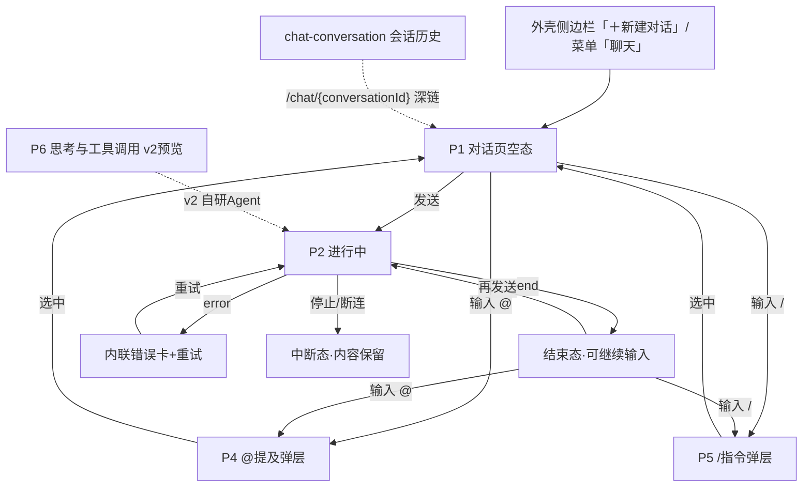

# AI 对话 — 交互草图 / 信息架构

> 模块：ai-chat ｜ 关联：PRD 母本 `plans/ai-chat-sse-prd.md`（v1.2）｜ 需求 `requirements/ai-chat/01~05` ｜ 状态：**定稿 r3（2026-08-25，新增 P6 思考与工具调用 v2 预览画板）**
>
> 🖊 **草图文件**：`ai-chat-wireframe.pen`（同目录）——P1/P2/P3 + 错误 toast 四画板，与本文 §3 一一对应；色彩 token 遵循 `../ui-baseline.md` §2。
>
> 🖌 **高保真原型**：`ai-chat-pages.pen`（同目录）——六画板 P1~P6（r2 新增 P4 @提及 / P5 /指令；r3 新增 P6 思考与工具调用 **v2 预览**）；导出 PNG（`page-p1-empty.png` / `page-p2-streaming.png` / `page-p3-error-interrupted.png` / `page-p4-mention.png` / `page-p5-command.png` / `page-p6-thinking-toolcall.png`，scale 2）；「`.pen` 为唯一源，修改后须重导同名 PNG」。
>
> 边界承接：PRD Out of Scope 会话组列表/重命名/删除/历史查询接口属 chat-conversation 模块——本模块页面**不含**管理面，仅对话面；断线重连/续传不做（v1），中断即终局。

## 1. 设计定位

- 对话页是应用外壳导航第一项「对话」（`../web/01-应用外壳与导航.md` §2），全屏单页对话界面。
- 流式体验核心：输入即发、增量渲染、三事件分支（`message`/`error`/`end`）——交互侧不感知百炼，只消费 SSE 事件协议（`specs/ai-chat-spec.md` §2.4）。
- 用户角色单一（业务用户），无角色分支。

## 2. 页面清单

| # | 页面/状态 | 形态 | 承载 FR | 草图 |
|---|---|---|---|---|
| P1 | 对话页（空态/新会话） | 独立页面（外壳内 `/chat`） | FR-01/02/09 | §3.1 |
| P2 | 对话页（进行中） | 同页消息流 + 输入区 | FR-01/03/04 | §3.2 |
| P3 | 对话页（错误/中断态） | 同页内联错误 | FR-06/07/08 | §3.3 |
| P4 | 对话页（@提及弹层） | 输入区内浮层 | —（增强体验） | §3.4 |
| P5 | 对话页（/指令弹层） | 输入区内浮层 | —（增强体验） | §3.5 |
| P6 | 对话页（思考与工具调用） | **v2 预览画板** | —（v2 自研 Agent） | §3.6 |
| — | 入参错误 toast | toast（非页面） | FR-09 | §3.3 |

**页面策略**：单页三态（空态→进行中→结束/错误），无独立子路由——续聊深链为 `/chat/{conversationId}`（`conversationId` 拼在路由路径中，与 `/chat` 同组件仅定位差异；外壳 01 §3），v1 由跳转方拼接。

## 3. 线框

### 3.1 P1 对话页（空态/新会话）

```
┌──────────────────────────────────────────────────┐
│                                                  │
│              （居中引导区）                        │
│              💬 你好，我是 AI 助手                 │
│        有什么可以帮你？输入问题开始对话             │
│                                                  │
│ ┌──────────────────────────────────────────────┐ │
│ │ 输入你的问题，Enter 发送 · Shift+Enter 换行      │ │
│ │ [📎 上传] [✨ DeepSeek-V3 ▾]    0/8000 [发送]  │ │
│ └──────────────────────────────────────────────┘ │
│    输入 @ 可提及成员 · 输入 / 可唤起指令           │
└──────────────────────────────────────────────────┘
```

要点：

- 空态无历史消息：居中欢迎区（💬 图标 + 主文案「你好，我是 AI 助手」+ 副文案「有什么可以帮你？输入问题开始对话」）+ 吸底输入区
- 输入框固定高度 120px，圆角 8，border_color 描边；内部分上下两区：上部文本输入区，下部操作底行
- **底行左侧**：①「上传」按钮（paperclip 图标 + 文字，border 描边）；②「模型选择」下拉（sparkles 图标 primary 色 + 模型名 + chevron-down）
- **底行右侧**：字数统计 `0 / 8000`（secondary）+ 发送按钮（64×32，primary 填充白字，空白时 opacity 0.5 禁用）
- 输入框下方居中提示文案：「输入 @ 可提及成员 · 输入 / 可唤起指令」（secondary 12px）
- 新会话入口 = 外壳侧边栏「＋新建对话」按钮（外壳 01 §2，跳 `/chat` 空态）；历史会话直达入口在外壳侧边栏历史会话区（chat-conversation P1）
- 不传 `conversationId` 发送 = 隐式建组（FR-02），组名取首条 prompt——用户无感知
- `prompt` 空白/超 8000 字时发送禁用（前置），服务端 PARAM_ERROR 兜底 toast（FR-09）

### 3.2 P2 对话页（进行中）

```
┌──────────────────────────────────────────────────┐
│ ↑ 消息流（纵向滚动，自动滚底）                      │
│                                    ┌──────────┐  │
│                                    │用户气泡   │  │
│                                    │（右对齐）  │  │
│                                    └──────────┘  │
│ ✨ AI 助手 [DeepSeek-V3]                         │
│ 本周销售数据汇总如下：                              │
│ · 电商渠道：GMV 128 万，环比 +12%▌                 │
│ [📋] [🔄] [👍] [👎]    ● 生成中  14:32  输入 356 · 输出 1,204 tokens │
│ ┌──────────────────────────────────────────────┐ │
│ │ 回复生成中…                                    │ │
│ │ [📎 上传] [✨ DeepSeek-V3 ▾]    0/8000 [停止]  │ │
│ └──────────────────────────────────────────────┘ │
└──────────────────────────────────────────────────┘
```

要点：

- **用户气泡**：右对齐，primary 填充白字，圆角 [12,4,4,12]（左上大、右侧小），padding [10,14]，lineHeight 1.6
- **助手消息行**（三段结构）：
  1. **助手信息头**：左侧排列 — AI 头像（26×26，primary 填充，圆角 6，内 sparkles 图标白字）+ 「AI 助手」名称（13px 600）+ 模型标签（primary_light 底，el_primary 文字，11px，圆角 4，padding [2,8]）
  2. **助手正文**：textGrowth fixed-width，lineHeight 1.6，14px；流式尾部光标 ▌
  3. **操作底行**：左右 space_between ——
     - 左侧「消息操作」：复制（copy）+ 重新生成（refresh-cw）+ 赞（thumbs-up）+ 踩（thumbs-down），均为 28×28 圆角 4 的图标按钮，secondary 色
     - 右侧「统计」：状态标记（生成中 = success 绿点 + 「生成中」success 文字）+ 时间戳（14:32）+ token 统计（「输入 356 tokens · 输出 1,204 tokens」secondary 12px）
- **输入区（流式禁用态）**：整体 opacity 0.5 禁用；占位「回复生成中…」；底行左侧同 P1；底行右侧：字数统计 + **停止按钮**（64×32，blank 底 + border_color 描边 + regular 文字「停止」）
- 首个 `message` 分片携带 `conversationId`，前端立即纳入当前会话上下文（FR-01 验收 3）
- 流式期间输入区禁用、发送变「停止」（abort 主动中断，FR-06/08 语义：中断即终局，已收内容保留渲染）
- `end` 事件后：流式光标消失，助手气泡操作底行右侧 token 汇总保留，「生成中」标记消失
- 续聊（FR-03/04）：从会话历史进入（`/chat/{conversationId}`）时消息流回填历史，上下文由百炼 sessionId 维持，前端不组装

### 3.3 P3 错误/中断态 + 入参 toast

```
┌──────────────────────────────────────────────────┐
│ ✨ AI 助手 [DeepSeek-V3]                         │
│ 上周库存对账数据如下：                              │
│ · SKU 总数 1,203，较前周……                         │
│ [📋] [🔄] [👍] [👎]    ● 已中断  14:35             │
│ ┌─ 内联错误卡 ──────────────────────────────┐     │
│ │ ⚠ 回复生成失败，请稍后重试（SYSTEM_ERROR）  [↻ 重试] │
│ └───────────────────────────────────────────┘     │
│ [输入框（恢复可用）]                      [发送]    │
└──────────────────────────────────────────────────┘
  ⚠ toast: 请输入内容后再发送（PARAM_ERROR 例）
```

- **助手中断态**：助手信息头 + 已收内容保留 + 操作底行——左侧操作按钮同 P2，右侧统计区：info 灰点 + 「已中断」secondary 文字 + 时间戳（**无 token 统计**）
- **错误事件** → 助手位内联错误卡（tag_danger_bg 填充 + danger 描边 + 圆角 8 + padding [10,14]）：左侧 ⚠ circle-alert 图标 + danger 错误文案（含错误码如 `SYSTEM_ERROR`）；右侧「重试」按钮（danger 描边 + rotate-ccw 图标 + 「重试」文字）
- 错误 toast 规则走 `../web/02-前端工程规范.md` §3
- 断连/主动停止：已收部分保留、无错误卡（区别于百炼失败），气泡尾部标注「已中断」
- 错误/中断后输入区恢复可用，发送按钮恢复 primary 填充态

### 3.4 P4 @提及成员弹层

输入 `@` 触发，浮层定位于输入框上方（absolute，输入框内左对齐 x=20），宽度 420px。

```
┌─ 提及成员 ────────── 过滤：@张 ─────┐
│ ─────────────────────────────────── │
│ 最近提及                            │
│ ● 张运营              ✔（active_bg）│
│   运营专员                          │
│ 李采购                              │
│   采购主管                          │
│ 人员                                │
│ 王仓管                              │
│   仓储管理员                        │
│ 陈财务                              │
│   财务分析师                        │
│ ─────────────────────────────────── │
│ ↑↓ 选择 · Enter 确认 · Esc 关闭     │
└────────────────────────────────────┘
```

要点：

- **弹层头**：左侧「提及成员」（13px 600）+ 右侧过滤词（secondary 12px，如「过滤：@张」）
- **成员列表**：纵向分组（「最近提及」组 + 「人员」组，组名 secondary 11px），每项 = 圆形头像（24×24 primary 填充，首字白字）+ 姓名（13px）+ 职务（secondary 11px）+ 选中 check 图标（primary）；选中行 active_bg
- **弹层脚**：快捷键提示「↑↓ 选择 · Enter 确认 · Esc 关闭」（secondary 11px）
- **选中后**：输入框内插入 chip（primary_light 底 + el_primary 文字，圆角 4，padding [1,6]，如 `@张运营`），chip 前后可继续输入文字
- 弹层外观：blank 填充 + border_color 描边 + 圆角 8 + 阴影（offset 0,4 blur 16 color #0000001A）

### 3.5 P5 /快捷指令弹层

输入 `/` 触发，浮层结构同 P4（同尺寸、同阴影、同头脚范式）。

```
┌─ 快捷指令 ────────── 过滤：/生 ─────┐
│ ─────────────────────────────────── │
│ 📄 /生成报表  ✔（active_bg）        │
│      快速生成数据报表                │
│ 🔍 /查询订单                        │
│      查询订单与物流状态              │
│ 📈 /数据分析                        │
│      多维度数据分析与图表            │
│ ⚡ /技能中心                        │
│      打开技能中心                    │
│ ─────────────────────────────────── │
│ ↑↓ 选择 · Enter 确认 · Esc 关闭     │
└────────────────────────────────────┘
```

要点：

- **弹层头**：「快捷指令」+ 过滤词
- **指令列表**：每项 = 图标底（24×24 primary_light 填充，圆角 6，内 lucide 图标 primary 色）+ 指令名（13px，选中态 600）+ 描述（secondary 11px）+ 选中 check 图标
- 选中后输入框内替换为指令文本（如 `/生成报表`），用户可继续补充
- 视觉参数（弹层外观、圆角、阴影、脚部快捷键提示）同 P4

### 3.6 P6 思考与工具调用（⚠️ v2 预览画板）

> **v2 预留**：百炼 Agent 不支持思考/工具调用中间步骤展示；本画板为自研 Agent 时的 UI 预览。PRD 预留决策 #21~23（`plans/ai-chat-sse-prd.md` Implementation Decisions）。

```
┌──────────────────────────────────────────────────┐
│ ✨ AI 助手 [DeepSeek-V3]                         │
│ ┌─ 思考块 ──────────────────────────────────┐     │
│ │ 🧠 已深度思考（用时 4 秒）          ▼     │     │
│ │ 用户需要按渠道汇总销售数据。先查询电商     │     │
│ │ 渠道与门店渠道的 GMV，再计算环比……       │     │
│ └───────────────────────────────────────────┘     │
│ ┌─ 工具调用（已完成）─────────────────── ▸┐     │
│ │ 🔧 sales_query  [已完成 · 1.2s]         │     │
│ │ 入参  {"channel":"all","period":"week"}  │     │
│ │ 出参  2 rows · 356 B                    │     │
│ └───────────────────────────────────────────┘     │
│ ┌─ 工具调用（运行中）────────────────────┐     │
│ │ ⏳ chart_render  调用中…                │     │
│ └───────────────────────────────────────────┘     │
│ 本周销售数据汇总如下：                              │
│ · 电商渠道：GMV 128 万，环比 +12%▌                 │
│ [📋] [🔄] [👍] [👎]    ● 生成中  14:32  tokens   │
└──────────────────────────────────────────────────┘
```

要点：

- **过程区**位于助手信息头与最终回答之间，纵向堆叠，按 SSE 返回顺序排列
- **思考块**：fill_page 底，圆角 6，padding [8,12] ——
  - 思考头：brain 图标（14px secondary）+ 标题「已深度思考（用时 N 秒）」（12px 600 secondary）+ chevron-down 展开箭头
  - 思考摘要（默认显示）：12px secondary，1.5 行高
  - 点击可展开完整思考内容（v2 实施时确认展开交互）
- **工具调用块**：fill_page 底 + border_light 描边，圆角 6，padding [8,12] ——
  - 工具头：wrench 图标（14px primary）+ 工具名（12px 600）+ 状态标签 + chevron-right 展开箭头
  - **已完成态**：状态标签 = primary_light 底 + el_primary 文字「已完成 · Ns」；展开后显示入参/出参行（标签 secondary 11px + JSON 代码框 blank 底 border_light 描边圆角 4）
  - **运行中态**：loader 图标（14px primary）+ 工具名 + 纯文字「调用中…」（无状态标签背景）
  - **错误态**：状态标签 = tag_danger_bg 底 + danger 文字「调用失败」；展开后显示错误信息
  - 工具入参/出参完整 JSON 展示（出参量大时直接展示，不截断）
- **最终回答**：过程区下方，与现有助手正文样式一致（14px lineHeight 1.6）
- 操作底行、输入区等与 P2 完全一致

## 4. 信息架构



- 单页状态机：空态 → 进行中 ⇄ 结束态；错误/中断为进行中的终局分支
- @提及和 /指令为输入区增强交互，不改变页面状态
- 会话历史深链入口由 chat-conversation 模块提供（本模块只消费参数）
- P6（思考/工具调用）为 v2 预览，不参与 v1 状态机；v2 实施时 P2 进行态新增「过程区」子状态（思考/工具块堆叠在信息头与正文之间）

## 5. 状态展示表

| 流状态 | 触发 | 呈现 |
|---|---|---|
| streaming | 发送后收到分片 | 助手信息头（头像+名称+模型标签）+ 增量渲染 + 流式光标 ◌ + 操作底行（复制/重新生成/赞/踩）+ 右侧 success 绿点「生成中」+ 时间戳 + token 统计 + 输入区禁用 + 「停止」按钮 |
| done | `end` 事件 | 光标消失 + 「生成中」标记消失 + token 汇总保留（secondary）+ 输入区恢复（发送按钮恢复 primary 填充） |
| error | `error` 事件 | 内联错误卡（tag_danger_bg + danger 边框，含错误码 + 「重试」按钮）+ 输入区恢复 |
| interrupted | abort/断连 | 已收内容保留 + 操作底行右侧 info 灰点 + 「已中断」secondary + 时间戳（无 token 统计）+ 输入区恢复 |
| empty | 无历史且未发送 | 居中欢迎区（图标+主副文案）+ 输入区（含上传/模型选择/字数统计 + 提示文案） |
| thinking（v2） | `thinking` 事件 | 过程区思考块：fill_page 底 + brain 图标 + 「已深度思考（用时 N 秒）」+ 摘要（可展开） |
| tool_call已完成（v2） | `tool_call` status=done | 过程区工具块：wrench 图标 + 工具名 + primary_light 状态「已完成 · Ns」+ 展开显示入参/出参 JSON |
| tool_call运行中（v2） | `tool_call` status=running | 过程区工具块：loader 图标 + 工具名 + 纯文字「调用中…」 |
| tool_call错误（v2） | `tool_call` status=error | 过程区工具块：wrench 图标 + 工具名 + tag_danger_bg 状态「调用失败」+ 展开显示错误 |

## 6. 关卡① — 交互评审（FR 覆盖核对）

> 评审基准：`requirements/ai-chat/02-功能需求.md` FR-01~09。

| FR | 草图覆盖 | 结论 |
|---|---|---|
| FR-01 流式回复 | P2 增量渲染 + end 汇总 | ✅ |
| FR-02 隐式建组 | P1 空态直发（无建组步骤） | ✅ |
| FR-03 续聊归属 | 深链回填 + NOT_FOUND toast 承接 | ✅ |
| FR-04 百炼记忆 | 非界面可观察（服务端域） | ➖ 正确排除 |
| FR-05/06/07 落库 | 非界面可观察；中断/错误以终局态呈现 | ➖ 正确排除（呈现见 P3） |
| FR-08 断连回收 | 「停止」按钮 = 主动 abort；被动断连同终局 | ✅ |
| FR-09 入参校验 | 发送禁用前置 + toast 兜底 | ✅ |

**评审结论：通过（r1）。r2 新增能力已在高保真原型中落地，文档同步更新。r3 新增 P6 v2 预览画板，不参与 v1 FR 评审。**

随图设计决策：

1. 单页三态状态机（空态/进行中/终局），无子路由
2. 流式期间输入区禁用 + 发送⇄停止切换
3. 中断与错误分呈现：中断无错误卡、错误有内联卡（含错误码 + 重试按钮）
4. token 汇总随 end 事件展示于操作底行右侧（与时间戳、状态标记同行）
5. 助手消息增加信息头（AI 头像 + 名称 + 模型标签），增强模型可感知性
6. 助手消息增加操作底行：复制 / 重新生成 / 赞 / 踩
7. 输入框增强：底行增加上传按钮 + 模型选择下拉 + 字数统计（0/8000）
8. 输入框下方提示文案引导 @提及 和 /指令
9. @提及弹层（P4）：分组列表（最近提及/人员），选中插入 chip
10. /指令弹层（P5）：图标+名称+描述列表，支持过滤，选中替换为指令文本
11. 错误卡增加「重试」按钮（danger 描边），可重新发起同一问题
12. 停止按钮样式为 blank 底 + 描边（区别于发送按钮的 primary 填充）
13. 用户气泡圆角 [12,4,4,12]（左上大右侧小），助手无气泡外壳（信息头+正文+操作底行平铺）
14. P6 思考/工具调用为 v2 预览画板：过程区（思考块+工具块）纵向堆叠于助手信息头与正文之间
15. 思考块默认折叠显示摘要+耗时，可展开完整内容（brain 图标 + chevron-down）
16. 工具调用块三种态：已完成（primary_light 状态标签 + wrench 图标）、运行中（loader 图标 + 纯文字）、错误（tag_danger_bg + danger 文案）
17. 工具入参/出参完整 JSON 展示，不截断；展开后入参/出参各一行（标签 + 代码框）
