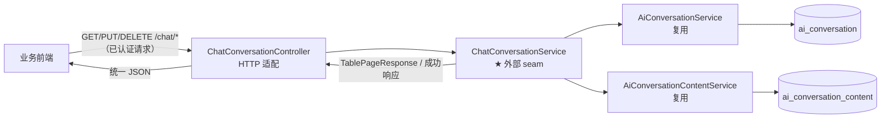
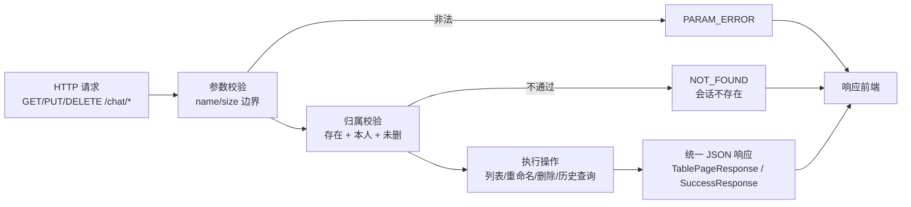
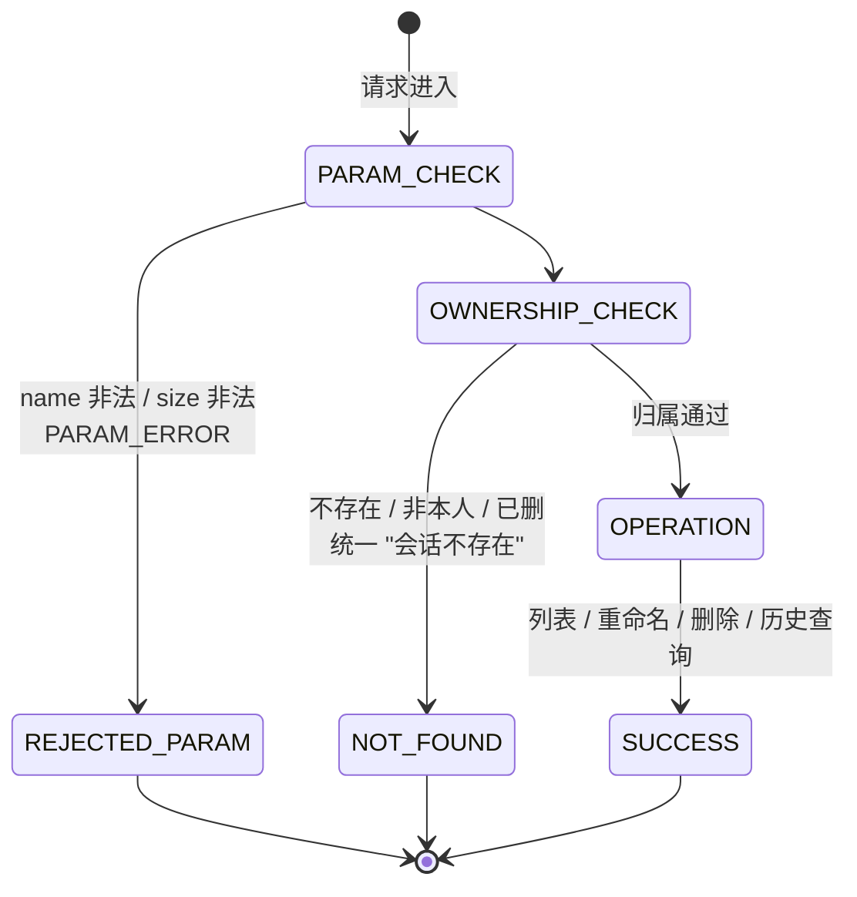
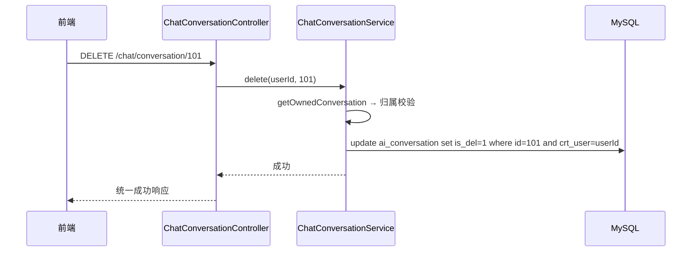

# Design — 会话组与对话内容管理 v1

> 关联：PRD 母本 `plans/chat-conversation-management-prd.md` (v1.0) ｜ 需求 `requirements/chat-conversation/01~05` ｜ Spec `specs/chat-conversation-spec.md` ｜ 状态：**v1.0（已定版，2026-08-20）**
> 关联补充：`plans/chat-conversation-content-prd.md`（会话内容只读查询 v1.0）——历史查询接口与本文 §2.1/§3 所述**为同一接口**，由本文设计承接，不另立平行设计。
>
> 本文描述 v1 的目标设计，使用深模块（deep module）/接口/seam 词汇。决策可溯源至母本访谈问题号（Qxx）。
>
> **设计边界（D3，延续 ai-chat）**：用户登录与身份校验由平台基础设施在模块上游完成；本模块从「已认证请求进入 Controller」开始，仅消费既有用户上下文（归属校验）。

## 1. 设计总览

管理接口的数据通路与模块关系：



设计核心：**`ChatConversationService` 是深模块**——归属校验、分页参数归一、列表/重命名/删除/历史查询全部藏在方法调用之后；Controller 只做参数绑定与响应形态映射。**复用** `AiConversationService` / `AiConversationContentService`（为其补充分页查询方法），不新增平行服务类，避免职责重复。

## 2. HTTP 接口定义

### 2.1 接口清单

| 方法 | 路径 | 说明 | 响应 |
|---|---|---|---|
| `GET` | `/chat/conversations` | 会话组分页列表（当前用户、未逻辑删除、`crt_time` 降序），可选 `type` 过滤 | `TablePageResponse<ConversationVO>` |
| `PUT` | `/chat/conversation/{conversationId}/name` | 重命名会话组，请求体 `{name}` | `SuccessResponse<Void>` |
| `DELETE` | `/chat/conversation/{conversationId}` | 删除会话组（逻辑删除 `is_del=1`，内容行保留） | `SuccessResponse<Void>` |
| `GET` | `/chat/conversation/{conversationId}/contents` | 历史消息分页（`id` 升序） | `TablePageResponse<ContentVO>` |

### 2.2 请求与响应要点

- **认证**：遵循全工程统一约定（见 [`requirements/auth/01-接口认证.md`](../../requirements/auth/01-接口认证.md)）；`userId` 由服务端从用户上下文获取，客户端不传用户标识
- **入参**：`page`（默认 1，`<1` 归 1）、`size`（默认 20，上限 50，非法 → `PARAM_ERROR`）、`type`（可选过滤）；重命名请求体仅 `name`（非空白且 ≤100 字符）
- **响应形态**：列表/历史查询返回 `TablePageResponse`（`{code,total,data}`，空列表 `total=0,data=[]`）；重命名/删除返回 `SuccessResponse`（`{code,data:null}`）
- **视图字段**：`ConversationVO` = `id/name/type/crtTime`（不含最近消息摘要）；`ContentVO` = `id/role/content/crtTime/models/inputToken/outputToken`（不含 `tools/params/media_content`）
- **错误**：`name`/`size` 非法 → `PARAM_ERROR`；会话组不存在/非本人/已删 → `NOT_FOUND "会话不存在"`；认证失败见 auth 文档

### 2.3 处理流程



> 完整接口契约（字段表、请求/响应示例、事件时序）见 `requirements/chat-conversation/03-接口规范.md`；实现层约束（响应类型形态、错误码映射）见 `specs/chat-conversation-spec.md` §2。

## 3. 模块设计

### 3.1 模块清单与接口

| 模块 | 接口 | 职责（藏在接口后的实现） | 深度评价 |
|---|---|---|---|
| `ChatConversationController` | `GET /chat/conversations`、`PUT /chat/conversation/{id}/name`、`DELETE /chat/conversation/{id}`、`GET /chat/conversation/{id}/contents` | 参数绑定、路径解析、VO 映射 | 薄适配器（应当薄） |
| `ChatConversationService` | `pageConversations(userId, type, page, size)`、`rename(userId, id, name)`、`delete(userId, id)`、`pageContents(userId, id, page, size)` | 归属校验（统一 `NOT_FOUND`）、分页参数归一、CRUD、VO 组装 | **深模块**（外部 seam） |
| `AiConversationService`（复用+扩展） | 增加分页查询 `selectPageChatByUserId` / `selectByIdAndUserId`（已有） | 会话组持久化、分页 | 中等 |
| `AiConversationContentService`（复用+扩展） | 增加分页查询 `selectPageByConversationId` | 内容持久化、分页 | 中等 |
| `PaginationInnerInterceptor`（新增） | MyBatis-Plus 分页拦截器 | 分页 SQL 改写、`maxLimit` 上限 | 基础设施 |
| `ConversationVO` / `ContentVO` | — | 视图对象（只含对外字段） | 薄 |

**服务方法形状（外部 seam）**：`ChatConversationService` 对外暴露四个方法，对应四类操作——分页会话组列表、重命名、删除、分页历史查询。方法以 `userId` 为隔离输入，返回 `TablePageResponse` 或空（写操作），校验失败抛统一业务异常。

- 归属校验收敛为 service 内部私有方法（`getOwnedConversation(userId, id)` → 统一 `NOT_FOUND`），四种接口共用，文案一致（Q7/Q12）
- 分页参数归一（`page<1`→1、`size>50`→50、`size` 非法→`PARAM_ERROR`）也收敛在 service，Controller 不重复

### 3.2 服务与持久层协作

**视图对象（VO）**：`ConversationVO` 与 `ContentVO` 只含对外字段（见 §2.2），由 service 组装，Controller 不接触 DAO 实体。

**Service 与持久层协作**（复用扩展，不新建平行服务）：

- `AiConversationService` 新增分页查询方法：按 `crt_user`、可选 `type`、未逻辑删除过滤，`crt_time` 降序分页
- `AiConversationContentService` 新增分页查询方法：按 `conversation_id` 过滤，`id` 升序分页

分页依赖 `PaginationInnerInterceptor`（Q9 前置开发项）与 MyBatis-Plus `Page`。

### 3.3 内部结构（ChatConversationService 实现内幕）

```
pageConversations(userId, type, page, size)
 ├── ① 分页参数归一（page/size 边界）          → 非法 size → PARAM_ERROR
 ├── ② aiConversationService.selectPageChatByUserId(userId, type?, page, size)
 │      └── crt_user=userId ∧ is_del=0（@TableLogic 自动）∧ type=? ，crt_time 降序
 └── ③ 映射 ConversationVO

rename(userId, id, name)
 ├── ① name 非空白且 ≤100 校验                → 否则 PARAM_ERROR
 └── ② getOwnedConversation(userId, id)       → 统一 NOT_FOUND
     └── ③ update name

delete(userId, id)
 ├── ① getOwnedConversation(userId, id)       → 统一 NOT_FOUND
 └── ② 逻辑删除（is_del=1，@TableLogic）；内容行不动

pageContents(userId, id, page, size)
 ├── ① 分页参数归一
 ├── ② getOwnedConversation(userId, id)       → 统一 NOT_FOUND（已删组不可查）
 └── ③ aiConversationContentService.selectPageByConversationId(id, page, size)
        └── conversation_id=id ∧ id 升序，映射 ContentVO（不含内部列）
```

## 4. 归属校验状态机



| 操作 | 前置校验 | 结果 |
|---|---|---|
| 列表 | 无（仅用户维度） | `TablePageResponse`（空 → `total=0,data=[]`） |
| 重命名 | `name` 校验 + 归属 | 成功 / `PARAM_ERROR` / `NOT_FOUND` |
| 删除 | 归属 | 成功 / `NOT_FOUND` |
| 历史查询 | 归属 | `TablePageResponse` / `NOT_FOUND` |

不变式：
- **凡涉及具体会话组的操作必须先过归属校验**，且失败分支统一 `NOT_FOUND`（Q7/Q12）
- **删除永不物理删除内容行**（Q13）；已删组对外全不可见
- **列表不取最近消息摘要**（Q8）

## 5. 数据流与事务



- 重命名/删除为单表写操作，事务边界由现有 service（`@Transactional` 或单语句原子性）承担；本模块无跨表事务
- 历史查询与列表为只读分页查询，无事务要求

## 6. 设计决策记录（D 编号）

| # | 决策 | 理由 / 备选 | 溯源 |
|---|---|---|---|
| D1 | 新增 `ChatConversationService` 为深模块（外部 seam） | 归属校验/分页归一/CRUD 收敛在 service，Controller 保持薄；测试从此处注入 mock mapper 即可覆盖全部分支 | Q15/Q16 |
| D2 | 复用并扩展 `AiConversationService` / `AiConversationContentService`（加分页查询方法），不新建平行服务 | 同一实体的持久化逻辑单点；避免职责重复 | 现状 |
| D3 | 归属校验收敛为 service 内部 `getOwnedConversation`，四种接口共用 | 失败分支（不存在/非本人/已删）统一 `NOT_FOUND` 文案一致；备选「各方法各自校验」被否——重复且易漏 | Q7/Q12 |
| D4 | 删除仅置 `is_del=1`，内容行保留 | 保留审计与成本核算数据；已删组对外不可见；备选「物理删除内容行」被否——丢审计 | Q4/Q13 |
| D5 | 列表不取最近一条消息摘要 | 避免大表子查询；备选「子查询取最近消息」被否——会话量大时查询成本高 | Q8 |
| D6 | 新增 `PaginationInnerInterceptor` 支撑 `Page` 分页 | 项目当前未配置；`maxLimit` 防全表拉取；备选「手写 limit/offset」被否——割裂 mapper 集成 | Q9 |
| D7 | 分页参数归一 + `size` 上限 50 收敛在 service | Controller 不重复边界逻辑；`size` 非法 → `PARAM_ERROR` | Q11/Q18 |
| D8 | 删除不取消进行中的 SSE 流 | 取消机制复杂且非本模块职责；内容行永不物理删除，无数据丢失 | Q17 |

## 7. 与测试的关系

测试设计（见 spec §3）直接由本设计导出：

- **service seam**（`ChatConversationService` 四方法）：mock mapper，驱动归属校验三分支（不存在/非本人/已删 → 一致 `NOT_FOUND`）、分页参数归一、`PARAM_ERROR` 分支
- **Controller 集成测试**（MockMvc 4 条，每端点 1 条）：验证 HTTP 通路、路径/Query 参数绑定、统一异常包装
- 不断言内部 `getOwnedConversation` 调用细节（内部 seam 不进测试面）

## 7.1 会话内容只读查询的定位（承接 chat-conversation-content-prd.md）

本设计中的 **历史查询接口**（`GET /chat/conversation/{conversationId}/contents`，§2.1）即「会话内容管理（只读查询）」PRD 定义的唯一接口——两者**同一实现**。要点：

- **内容生命周期归属**：内容**创建**在 chat 接口（每轮落库 user + assistant 两条）、**删除**随会话组（逻辑删除后不可见）。本设计对该接口**只读**，不提供任何内容写能力
- **不做单条内容查询**（按内容 id）；仅按会话组分页查询
- **返回字段**：`id/role/content/crtTime/models/inputToken/outputToken`，不含内部列（`tools/params/media_content`）
- **归属校验/分页/排序**：与本文 §3/§4 完全一致（`getOwnedConversation` → 统一 `NOT_FOUND`；`page`/`size` 归一；`id` 升序）
- **测试**：service 单测（mock mapper）+ 1 条 MockMvc 集成测试，聚焦该接口行为（见 §7）

> 该 PRD 不另立平行设计文档；实现时合并到 `ChatConversationService.pageContents` 一个方法即可。

## 8. 演进预留（不实现，只留缝）

- **置顶/搜索**：`ai_conversation` 现有列无置顶位，若后续需要置顶需评估 DDL（本模块硬约束禁 DDL）；搜索可在 service 层加分页过滤方法，接口形态不变
- **消息编辑/撤回**：`ai_conversation_content` 现无修改接口；如需要，可在 `AiConversationContentService` 追加写方法，不影响本模块只读查询
- **删除即停流**：若后续要求删除会话组时取消进行中的 SSE 流，需在 `AiChatService` 侧增加取消机制（D8 备选），另行评估

## 9. 设计验收（关卡②）

> 2026-08-24 验收。前端链路产物：交互草图 `chat-conversation-ia.md`（关卡①通过）、高保真原型 `chat-conversation-pages.pen` + 导出 PNG（`page-p1-list-history.png` / `page-p2-rename.png` / `page-p3-delete.png`）、UI 设计文档 `chat-conversation-ui-spec.md`。三轴核对如下：

### 轴一：FR 界面覆盖

| FR | 原型承载 | 结论 |
|---|---|---|
| FR-01 列表 | P1 会话列表栏（元信息行 / 选中高亮 / 栏底分页 / 空态引导） | ✅ |
| FR-02 重命名 | P2 对话框（≤100 行内校验 + PARAM_ERROR 兜底，ui-spec §3.3） | ✅ |
| FR-03 删除 | P3 确认框（语义后果两条，danger 确认钮） | ✅ |
| FR-04 历史查询 | P1 主区历史回看（升序气泡 + token 尾注 + 续聊入口，ia.md §3.4） | ✅ |
| 归属口径 | NOT_FOUND「会话不存在」toast 统一承接（ui-spec §2） | ✅ |

（与关卡①核对表一致，无回退；P4 历史回看与 P1 同画板呈现——同页嵌合是本模块核心决策。）

### 轴二：原型走查

- 三画板均为基线 token 着色（选中项 primary-light、删除确认 danger、token 尾注 secondary），结构校验无 clipping；
- 列表栏/主区嵌合布局、对话框遮罩呈现与 ia.md §3 一致；
- `.pen` 为唯一源，PNG 随源重导。

### 轴三：文档齐套

ia.md（关卡①）→ pages.pen + PNG → ui-spec.md（基线实例化 + 侧栏布局适配登记）→ 本节验收，四件齐套；侧栏对基线 §4.1 全页三段式的适配已在 ui-spec §1 显式登记（语义结构等比缩小，非静默偏离）。

**验收结论：通过，可进开发。**
