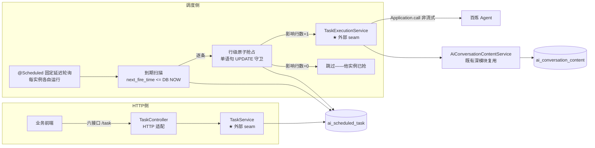
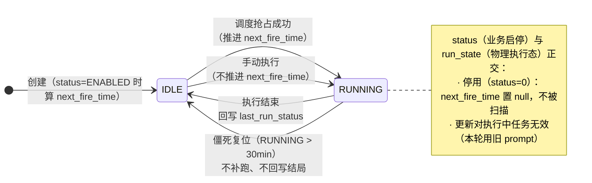
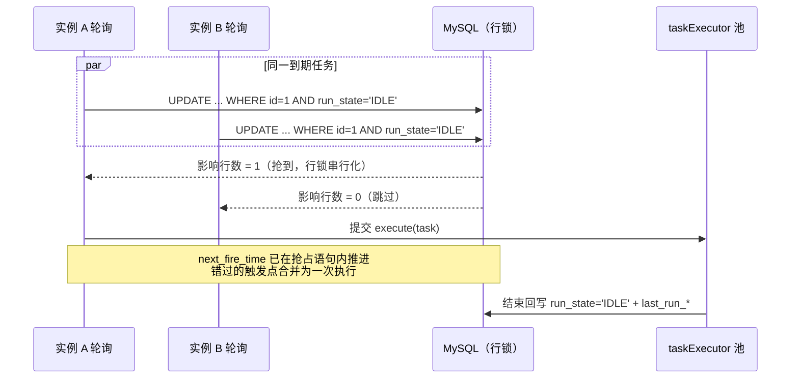

# Design — 定时任务 v1（/task 六接口 + 调度执行）

> 关联：PRD 母本 `plans/scheduled-task-prd.md` (v1.0) ｜ 需求 `requirements/scheduled-task/04-数据模型.md`（01~03/05 拆解中） ｜ 交互设计 `designs/scheduled-task/scheduled-task-ia.md`（草图+关卡①）+ `-ui-spec.md`（UI 设计文档，继承 `designs/ui-baseline.md` 工程 UI 基线）——高保真原型待产出 ｜ 状态：**v1.0（2026-08-22，随 PRD 定版；设计验收关卡②待原型完成后执行）**
>
> 本文使用深模块（deep module）/接口/seam 词汇。决策可溯源至母本访谈问题号（Qxx）与 Implementation Decisions 编号（决策 N）。
>
> **设计边界（同 ai-chat D3）**：用户登录与身份校验由平台基础设施在模块上游完成；本设计从「已认证请求进入 Controller」开始。HTTP 线程内的用户上下文可直接消费（归属校验）；**定时触发线程无用户上下文**，以任务表冗余的创建人快照落库（决策 7，Q8）。

## 1. 设计总览

定时任务域的完整数据通路与模块关系：



设计核心：**两个深模块、一个复用**——

- `TaskService`：六接口的全部业务（校验/配额/cron 检查/会话组绑定/归属），藏在六个方法之后
- `TaskExecutionService`：一次执行的完整生命周期（百炼调用、产出落库、结局回写、归属人快照），藏在 `execute(task)` 一个调用之后；调度侧与手动触发共用
- `AiConversationContentService.saveChatResult`：**原样复用** ai-chat 的事务性落库出口，任务域不碰内容表 DDL

## 2. 模块设计

### 2.1 模块清单与接口

| 模块 | 接口 | 职责（藏在接口后的实现） | 深度评价 |
|---|---|---|---|
| `TaskController` | 六接口（HTTP） | 参数绑定、响应包装（SuccessResponse/TablePageResponse） | 薄适配器（应当薄） |
| `TaskService` | `create / page / update / delete / runNow / detail` | 六接口业务：字段校验、cron 间隔检查、配额、绑定会话组创建、`next_fire_time` 重算、逻辑删、手动执行入口、归属校验 | **深模块**（HTTP 侧 seam） |
| `TaskExecutionService` | `execute(Task)` | 百炼非流式调用、超时控制、产出两行落库、`last_run_*` 回写、异常翻译 | **深模块**（执行侧 seam，手动/调度共用） |
| `TaskScheduler` | `@Scheduled` 轮询 | 到期扫描、行级原子抢占、池满放弃、僵死复位、执行分发 | 中等（调度侧粘合，无业务规则） |
| `AiConversationContentService` | `saveChatResult(ChatResultSaveParam)`（既有） | 一轮两条消息事务性落库 | 复用（不改动） |
| `WorkbenchProperties` | 配置读取 | `taskPollFixedDelay/taskCallTimeout/runningStaleMinutes/maxTasksPerUser`、线程池参数 | 配置模块扩展 |

### 2.2 内部结构（TaskScheduler 实现内幕）

```
poll()（单线程，固定延迟 taskPollFixedDelay，默认 30s）
 ├── ① 僵死复位：UPDATE ... SET run_state='IDLE' WHERE run_state='RUNNING'
 │        AND last_run_time < NOW() - runningStaleMinutes        → 带守卫，多实例至多一个成功
 ├── ② 扫描：SELECT id FROM ai_scheduled_task
 │        WHERE enabled=1 AND is_del=0 AND next_fire_time <= NOW()   → 不加锁，重复扫描无害
 ├── ③ 逐条抢占：UPDATE ai_scheduled_task
 │        SET run_state='RUNNING', last_run_time=NOW(),
 │            next_fire_time=<Clock 算 cron 下一未来点>
 │        WHERE id=? AND run_state='IDLE'                        → 影响行数判定
 │        ├─ =1 → ④ 提交线程池执行（core 2 / max 4）
 │        │        └─ 池满拒绝 → 记日志 + UPDATE 复位 IDLE（next_fire_time 已推进，接受跳过）
 │        └─ =0 → 跳过（他实例已抢；跨实例互斥的机制性验证点）
 └── ⑤ execute 结束：UPDATE ... SET run_state='IDLE', last_run_status=..., last_run_error=...
```

要点：
- **单语句抢占即折叠的 SELECT FOR UPDATE**（决策 3，Q11/r2）：少一次往返、无需显式事务、行锁仅持有单条语句时长；语义与「取锁-判断-更新-释放」完全等价
- **错过的触发点合并为一次执行**（决策 2，Q9）：抢占成功即把 `next_fire_time` 一步推进到 cron 的下一个未来点，中间点不再补跑
- **手动执行不抢占**（决策 14，Q14）：`runNow` 走「校验 RUNNING → 置 RUNNING」独立路径，不推进 `next_fire_time`；与调度抢占共用「执行中不可再触发」守卫

### 2.3 内部结构（TaskExecutionService.execute 内幕）

```
execute(task)
 ├── ① 组装 ApplicationParam（绑定会话组的 sessionId——记忆连续性，决策 9/Q5）
 ├── ② Application.call(param)（非流式，超时 taskCallTimeout 默认 120s）
 ├── ③ 成功：saveChatResult(user + assistant 全量文本 + token + params={"trigger":"CRON|MANUAL","taskId":id})
 └── ④ 终局回写：run_state='IDLE', last_run_status=SUCCESS|FAILED, last_run_error=摘要≤500
```

- 落库身份：**任务归属人快照**（crt_name/crt_id 取自任务表冗余列，决策 7/Q8）——定时线程无 UserContext 的解法
- 失败/超时**不重试**（决策 4/16）：FAILED 只记 `last_run_*`，等下一个 `next_fire_time`
- 不依赖 SSE 流式链路：非流式 `Application.call` 独立调用（决策 4，Q3）

## 3. 任务状态机（run_state × status）



| 场景 | status | run_state | next_fire_time |
|---|---|---|---|
| 新建即启用 | ENABLED | IDLE | cron 下一未来点 |
| 新建即停用 | DISABLED | IDLE | null |
| 到点执行中 | ENABLED | RUNNING | 已推进到下一未来点 |
| 停用 | DISABLED | IDLE | null（清空） |
| 重新启用 | ENABLED | IDLE | 重算 |
| 逻辑删除 | 任意 | 任意（在途跑完） | 不再被扫描 |

不变式：
- **run_state=RUNNING 的任务至多一个执行者**（跨实例，行级抢占保证，决策 3）
- **停用必置 next_fire_time=null**；扫描条件三件套 `enabled=1 AND is_del=0 AND next_fire_time <= now` 缺一不可（决策 2/15）
- **同任务严格串行**：抢占守卫天然保证（RUNNING 期间任何触发路径都进不去，决策 3）

## 4. 抢占时序（多实例互斥）



- 到期比较用 **DB `NOW()`**（决策 6，Q19/r2）：全实例同一时间基准，消除应用时钟偏差
- cron 下一触发点计算用应用 `Clock` bean：实例间秒级偏差只影响触发提前/延后数秒，不影响互斥
- 池满放弃（决策 3）：该次触发放弃但 `next_fire_time` 已推进——接受跳过，记日志；**「池满放弃触发」日志频率即 r3 定义的负载退化信号**

## 5. 线程模型

| 线程 | 来源 | 职责 | 用户上下文 |
|---|---|---|---|
| HTTP 线程 | Tomcat | 六接口请求处理 | 有（归属校验直接消费） |
| 调度线程 | Spring `@Scheduled`（单线程） | 扫描、抢占、僵死复位、分发 | 无（不落业务数据） |
| 执行线程 | taskExecutor（core 2 / max 4） | 百炼调用、产出落库、结局回写 | 无 → **任务归属人快照** |

- 调度与执行分离（决策 3）：调度线程不被 120s 百炼调用阻塞——轮询节奏 30s 独立于执行时长
- 执行线程池容量即并发上限：v1 量级（每用户 20 任务）下 2/4 足够；池满记日志放弃（见 §4）
- 无 SSE、无异步回调：非流式调用同步阻塞执行线程至返回或超时，线程模型远简于 ai-chat

## 6. 设计决策记录（D 编号）

| # | 决策 | 理由 / 备选 | 溯源 |
|---|---|---|---|
| D1 | `TaskService` 与 `TaskExecutionService` 分立，手动/调度共用执行 seam | 六接口业务与执行生命周期分属两个变化方向（接口演进 vs 执行策略演进）；`runNow` 与调度抢到的任务走同一 `execute`，手动执行语义只差「不推进 next_fire_time + trigger=MANUAL」 | 决策 14/Q14 |
| D2 | 单语句原子 UPDATE 抢占（折叠 SELECT FOR UPDATE） | 少一次往返、无需显式事务、锁仅持单语句；语义等价显式版；备选「Quartz/分布式锁」被否——引入组件换不来新保证 | 决策 3/Q11/r2 |
| D3 | 到期判定用 DB `NOW()`，cron 计算用注入 `Clock` | 多实例时钟偏差收敛到秒级触发漂移；测试可注入固定 Clock；备选「应用时钟直比」被否——实例偏差会致漏触发/重复扫描 | 决策 6/Q19/r2 |
| D4 | 调度线程单线程、执行提交独立池（2/4） | 轮询节奏与执行时长解耦；池容量即并发上限，池满放弃可观测 | 决策 3 |
| D5 | 产出落库复用 `saveChatResult`，`params` 标 `trigger/taskId` | 不改两表现有 DDL；落库事务边界仍在既有深模块内 | 决策 8/Q4 |
| D6 | 执行身份用任务表冗余的创建人快照 | 定时线程无 UserContext；快照随任务一次写入，执行时零额外查询 | 决策 7/Q8 |
| D7 | 绑定会话组固定复用同一 `sessionId`（连续记忆） | 「基于上周数据写周报」类任务依赖历史；隔离开关留 v2 | 决策 9/Q5 |
| D8 | 停用置 `next_fire_time=null` 而非停扫标志位 | null 天然不满足 `next_fire_time <= now`，扫描 SQL 无需额外分支；重启用时重算即恢复 | 决策 15/Q15 |
| D9 | 失败/超时不重试，仅记 `last_run_*` | v1 量级下重试的复杂度（退避、幂等）不划算；是否引入随 v2 看板数据评估 | 决策 4/16、r3 |
| D10 | 逻辑删不阻断在途执行，绑定会话组保留 | 对齐「删除不取消进行中 SSE 流」既有口径；审计/成本核算口径一致 | 决策 16/Q16 |

## 7. 与测试的关系

测试设计（PRD §Testing Decisions，四层）直接由本设计导出：

- **cron 校验单测（纯函数）**：`CronExpression.next()` 相邻两点间隔 <5 分钟拒绝（D3 的 Clock 注入点）
- **调度触发单测（mock mapper + 固定 Clock）**：到期触发并推进 `next_fire_time`；**占位 UPDATE 0 行跳过**——该用例即跨实例互斥的机制验证（第二个"实例"再抢同一任务必得 0 行，D2）；停用/已删不被扫描（D8）；RUNNING 超 30 分钟僵死复位带守卫
- **执行服务单测（mock 百炼 Application.call）**：成功落库两行 + 更新 `last_run_*`；失败/超时记 FAILED + 摘要；**落库以归属人快照身份**（D6）
- **MockMvc 六端点各 1 条**：创建校验（cron 非法/超配额）、分页、更新、删除、手动执行（含执行中冲突 PARAM_ERROR）、详情

## 8. v2 演进预留（不实现，只留缝）

- **执行历史流水表**（r3 排定）：`execute` 结束回写处已收敛为单一出口，加流水 insert 不动主流程
- **执行看板**：流水表数据基础上的分析视图，评估负载偏斜（池满放弃频率）/触发延迟/成功率
- **失败重试**：`execute` 的失败分支为唯一挂载点，策略（退避/次数）可整体插入
- **任务级记忆隔离**：`execute` ① 步组装 ApplicationParam 处按任务开关切换 sessionId 策略，接口不变（D7）
- **负载均匀分布**：抢占语句为唯一互斥点，替换为随机相位/容量感知变体不影响其余模块（r3：视看板数据决定）

## 9. 设计验收（关卡② — 已通过）

> **状态：通过（2026-08-24）。** 设计链路于 2026-08-24 重启（初版原型因跳过草图/评审两步废弃删除）后按标准链路补齐：草图 + 关卡① ✅（`scheduled-task-ia.md` §6）→ 工程 UI 基线 ✅（`designs/ui-baseline.md`，模块实例化 `scheduled-task-ui-spec.md`）→ 高保真原型 ✅（`scheduled-task-pages.pen` 五画板 + 同名导出 PNG `page-p1~p5-*.png`）→ 三轴验收如下。

### 9.1 FR/NFR 覆盖检查

- FR-01~06：交互侧全部由原型承载（P1 六列/P2 两段式执行时间/P3/P4 语义后果文案/P5 配额 toast），逐项见 `scheduled-task-ia.md` §6 关卡①表（FR-07/08 正确排除：调度行为后端单测域、type 过滤属 chat-conversation）。
- NFR-01~06：均为后端性质（多实例抢占/事务/成本控制），无交互侧义务——正确排除。

### 9.2 原型走查（对照 ia.md §4 任务流与 §5 状态展示表）

- **任务流**：P1→新建/编辑（P2）、立即执行（P3）、删除（P4）四条路径 + 保存/确认后回列表刷新 + 配额 toast（P5 叠加 P1）全部有画板承载 ✅
- **状态展示表五行**：启用+成功 ✅（行1）/ 停用+失败 ✅（行2）/ 执行中+执行禁用 ✅（行3）/ 启用+未执行「—」 ✅（行4）/ 已删不出现在列表（结构性排除）✅
- **未尽静态画板的交互时序**（有意接受，交由实现按 ui-spec §4 组件状态清单执行）：空列表态插画、表单校验红态/越界提示、编辑模式回填与解析失败降级提示、分页多页态——均为运行时状态切换，静态原型不逐一建板

### 9.3 文档齐套

PRD（`plans/scheduled-task-prd.md` v1.0）／requirements 01–05／ia（含草图 wireframe.pen）／高保真原型（pages.pen + PNG）／ui-spec／design 六件齐套 ✅

**结论：通过关卡②，可进入开发实现。**
