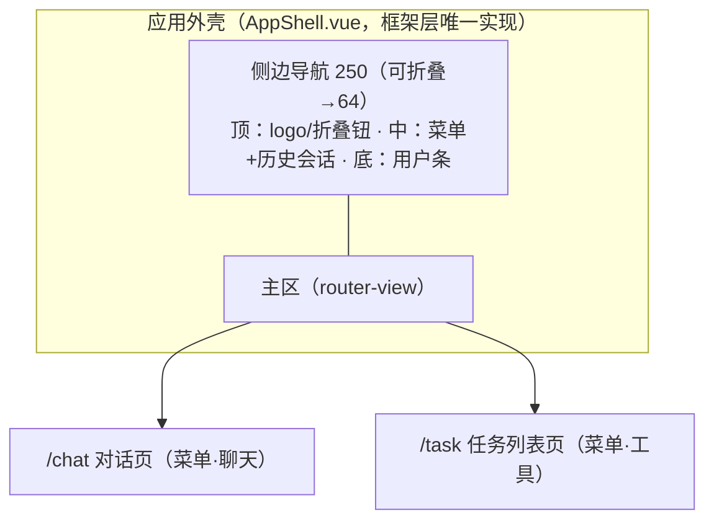
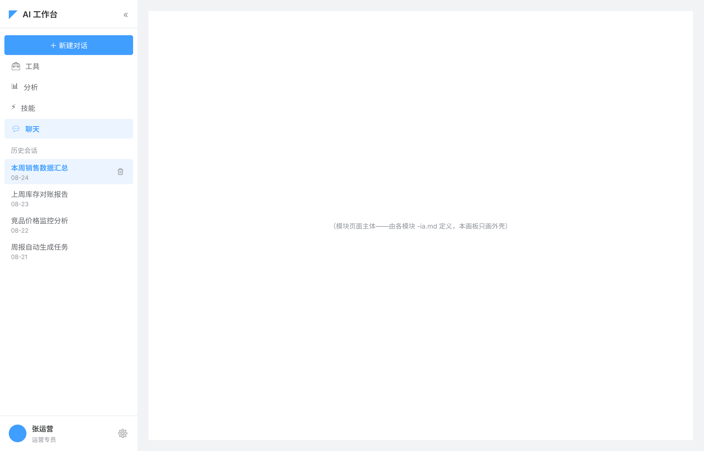
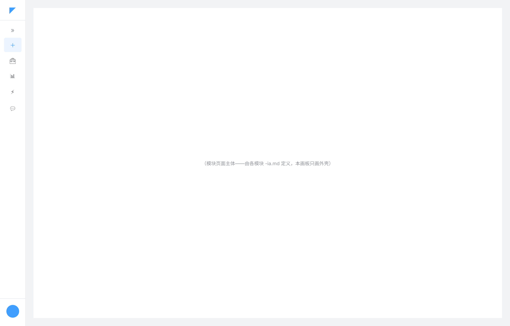

# 01 应用外壳与导航 — 前端全局设计

> 范围：ehub-web 全局（应用外壳、导航、路由、全局布局）｜ 状态：**r1（2026-08-24）**
>
> 本文是**应用外壳的单一事实源**——`designs/ui-baseline.md` §4.1 已约定「外壳不入模块草图/原型，由框架层统一提供」，此前外壳本身无人设计（缺口见 CHANGELOG 2026-08-24）。本文补位：定义外壳结构、导航结构、路由表与全局约定，各模块前端（scheduled-task 及后续 ai-chat / chat-conversation）只做「路由注册 + 外壳内主区渲染」，不再各自描述外壳。

## 1. 外壳结构（全局布局）



### 1.1 整体布局（线框）





> 🖊 草图文件：`app-shell-wireframe.pen`（同目录，两画板 1280×820：展开态 `app-shell-expanded.png` / 折叠态 `app-shell-collapsed.png`）。`.pen` 为唯一源，修改后须重新导出同名 PNG（同 ia.md 约定）。主区内容为占位示意——模块页面主体由各模块 `-ia.md` 定义，本画板只画外壳。

```
┌────────────┬─────────────────────────────────────┐
│ ◤ AI 工作台 «│  主区（router-view，纵向滚动）        │
│────────────│  ┌───────────────────────────────┐  │
│ [＋新建对话] │  │ 内容卡片（模块页面主体）         │  │
│ 🧰 工具     │  └───────────────────────────────┘  │
│ 📊 分析     │
│ ⚡ 技能     │
│ 💬 聊天(选中)│
│ ─ 分割线 ─  │
│ 历史会话    │
│ · 本周销售… │
│ · 上周库存… │
│ （弹性空位） │
│ 共 n 条·分页 │
│────────────│
│ 👤张运营 ⚙ │
└────────────┴─────────────────────────────────┘
```

侧边导航为**上/中/下三段式**，段间以**分割线（border-light）区分**：

| 段 | 内容 | 高度 |
|---|---|---|
| 上 | 顶栏：**space-between**——左（logo + 应用名）/ 右（折叠按钮 «）；下边分割线 | 固定 h56 |
| 中 | **新建对话按钮（primary）→ 菜单（工具/分析/技能/聊天）→ 分割线 → 历史会话区（标题+列表+弹性空位+分页）** | 自适应（内部历史列表滚动） |
| 下 | 用户条：左（头像 + 头衔/名称两行）↔ 右（设置按钮），space-between；上边分割线 | 固定 h64 |

**菜单与历史会话的关系**：「聊天」是**最后一个菜单项**，其下以分割线隔开直接展示历史会话列表——聊天菜单项与历史会话同属侧边栏中段，共同构成对话导航面；工具/分析/技能在聊天之上。

**折叠态（64px 图标栏）**：顶栏仅 logo，中段自上而下为展开按钮 »、＋（新建）、🧰、📊、⚡、💬 图标，底部仅头像；历史会话列表隐藏。

### 1.2 布局规格

| 项 | 规格 | 依据 |
|---|---|---|
| 侧边导航宽度 | 展开态 **250px / 折叠态 64px**，顶栏右侧 « / 中段 » 切换，状态持久化（localStorage） | 本文定义（el-aside） |
| 段间分割线 | 顶栏下边 / 用户条上边 / 菜单与历史会话之间，`--el-border-color-light` | 本文定义 |
| 侧边导航视觉 | el-menu 默认浅色 + 右边框分隔，不自定义主题；菜单项选中 = primary-light 底 + 文字 primary | ui-baseline §1「默认值即规范」 |
| 用户条 | 头衔/名称来自登录态（UserContext 对应字段）；设置按钮 v1 仅占位（无目标页）；折叠态仅头像 | 本文定义 |
| 主区内边距 | **20px（四周）** | 与任务列表草图（wireframe.pen P1 主区）一致 |
| 页面背景 | `--el-bg-color-page` | ui-baseline §2 |
| 内容卡片底 | `--el-fill-color-blank`，边框/圆角随 Element Plus 默认 | ui-baseline §2 |
| 滚动行为 | 侧边导航固定不滚动，**中段历史会话列表内部纵向滚动**；主区独立纵向滚动 | 本文定义 |
| 最小宽度 | 1280px；v1 桌面优先，**不做移动端/响应式断点** | 本文定义 |
| 弹层层级 | 模态/toast 用 Element Plus 默认 z-index 管理，不自建 | ui-baseline §1 |

- **两区式**：侧边导航（可折叠）+ 主区（路由渲染）。v1 不做顶栏、面包屑、多级导航。
- 主区即 `ui-baseline.md` §4.1 语境中的「外壳内主体区」：模块页面（如任务列表三段式）全部落在主区内，**不含**导航。
- 外壳技术实现：Vue 3 + Element Plus 布局组件（`el-container` / `el-aside` / `el-main`），由 ehub-web 框架层唯一实现。

## 2. 导航结构

侧边栏菜单自上而下（§1.1 中段）：

| # | 菜单项 | 图标 | 承载 | v1 状态 |
|---|---|---|---|---|
| — | ＋ 新建对话 | ＋ | 进入 `/chat` 空态新会话（ai-chat P1） | 可用 |
| 1 | 工具 | 🧰 | **定时任务入口**（跳转 `/task`）；其余子项 v2 扩展 | 可用（定时任务） |
| 2 | 分析 | 📊 | 占位（无承载页，点击无动作） | 占位 |
| 3 | 技能 | ⚡ | 占位（无承载页，点击无动作） | 占位 |
| 4 | 聊天 | 💬 | `/chat` 对话页（ai-chat 前端 + chat-conversation 管理面）——**最后一个菜单项** | 可用 |
| — | 历史会话 | — | 聊天项下方分割线后直接列历史会话（选中/悬停行操作/分页），点击进入 `/chat/{conversationId}` | 可用 |

> 历史会话区即 chat-conversation FR-01 会话列表的**外壳承载位**：菜单项「聊天」负责路由高亮，历史会话列表负责直达具体会话；选中会话与「聊天」菜单项同步高亮。

约定：

- 菜单项与路由一一对应；「分析/技能」v1 为占位（无目标页、点击无动作，路由待后续设计）；新模块接入 = 菜单项加一行 + 路由注册。
- 当前菜单高亮跟随路由；无子级菜单（v1 四项均一级）。
- 菜单顺序固定（聊天最后，紧邻历史会话）——聊天是主入口，历史会话是其自然延伸；折叠态仅图标（＋/🧰/📊/⚡/💬）。

## 3. 路由表（v1）

| 路由 | 页面 | 模块 | 设计产物 |
|---|---|---|---|
| `/chat` | 对话页（含会话列表栏 + 历史回看） | ai-chat 前端 + chat-conversation 管理面 | `ai-chat-ia.md` + `chat-conversation-ia.md` + 各自 `-pages.pen`（关卡② 通过） |
| `/chat/:conversationId` | 对话页（定位指定会话，回填历史）——与 `/chat` 同组件，路径参数仅定位差异 | chat-conversation 管理面 + ai-chat 前端 | 同上 |
| `/task` | 任务列表页（P1） | scheduled-task 前端 | `scheduled-task-ia.md` + `-pages.pen`（关卡② 通过） |

- 对话框（P2/P3/P4）是**页面内模态**，不占路由——与 `scheduled-task-ia.md` §2 页面策略一致。
- 会话历史跳转（scheduled-task 列表 → 会话组，凭 `conversationId`）目标为 **`/chat/{conversationId}`**——`conversationId` 直接拼接在路由路径中（非 query 参数），命中会话选中并回填历史（chat-conversation-ia.md §1/§4）。

## 4. 外壳层横切职责

| 职责 | 约定 | 依据 |
|---|---|---|
| 认证 | JWT 携带与失效统一跳转由外壳层拦截器处理，模块页面不各自处理登录态 | `requirements/auth/01-接口认证.md` |
| 全局错误 | HTTP 拦截器统一解包 `code!==0` → toast（danger），NOT_FOUND 文案「xx不存在」句式 | `designs/web/02-前端工程规范.md` §2 |
| 布局 | 主区统一页面背景 `--el-bg-color-page`、内容卡片 `--el-fill-color-blank` | `designs/ui-baseline.md` §2 |

## 5. 演进

- 新模块前端接入：导航表 + 路由表各加一行，模块页面继承 ui-baseline，无需改外壳。
- v2 若出现三级以上信息层级或全局搜索，再评估顶栏/面包屑——v1 明确不做。
