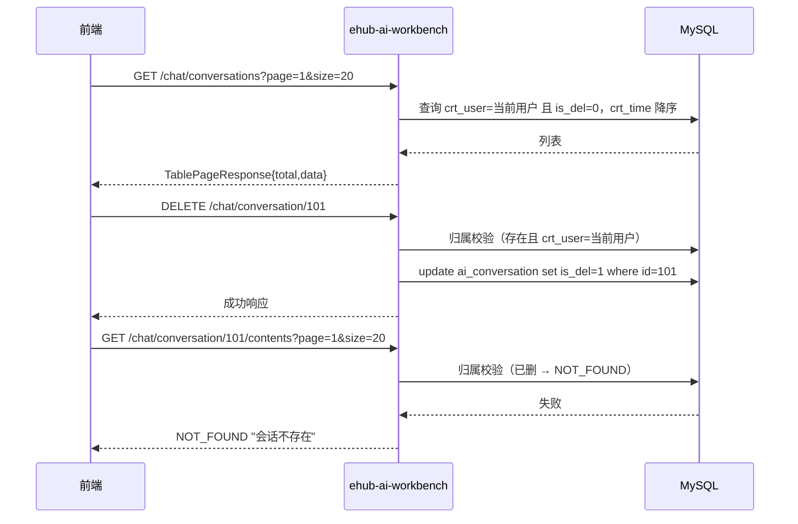

# 03 接口规范 — 会话组与对话内容管理模块

> 模块：chat-conversation ｜ 关联 PRD 母本：`plans/chat-conversation-management-prd.md` (v1.0) ｜ 状态：已定版

## 1. 接口定义

全部接口沿用 `/chat` 前缀（与 `POST /chat/sse` 同域），响应走统一包装（`ResponseType` 免二次包装）。普通 JSON 请求/响应，**非 SSE**。**接口认证遵循全工程统一约定**（见 [`../auth/01-接口认证.md`](../auth/01-接口认证.md)）。

### GET /chat/conversations

| 项 | 值 |
|---|---|
| 完整路径 | `/ai-workbench/chat/conversations` |
| 说明 | 会话组分页列表（当前用户、未逻辑删除、`crt_time` 降序） |

**Query 参数**：

| 字段 | 类型 | 必填 | 说明 |
|---|---|---|---|
| `page` | int | 否 | 页码，`<1` 默认 1 |
| `size` | int | 否 | 页大小，`>50` 截断为 50；非法值 → `PARAM_ERROR` |
| `type` | int | 否 | 会话类型过滤，不传返回全部类型 |

**响应**：`TablePageResponse<ConversationVO>`（`{code,total,data}`）

```json
{
  "code": 0,
  "total": 2,
  "data": [
    { "id": 101, "name": "首轮 prompt 即组名", "type": 0, "crtTime": "2026-08-20T10:00:00" }
  ]
}
```

`ConversationVO` 字段：`id`(long) / `name`(string) / `type`(int) / `crtTime`(date)。**不含最近一条消息摘要**。

### PUT /chat/conversation/{conversationId}/name

| 项 | 值 |
|---|---|
| 完整路径 | `/ai-workbench/chat/conversation/{conversationId}/name` |
| 说明 | 重命名会话组 |

**请求体**：

| 字段 | 类型 | 必填 | 说明 |
|---|---|---|---|
| `name` | string | 是 | 非空白且 ≤100 字符 |

**响应**：成功 → 统一成功响应（如 `ApiResponse.success`）。`name` 空白/超长 → `PARAM_ERROR`；不存在/无归属/已删 → `NOT_FOUND "会话不存在"`。

### DELETE /chat/conversation/{conversationId}

| 项 | 值 |
|---|---|
| 完整路径 | `/ai-workbench/chat/conversation/{conversationId}` |
| 说明 | 删除会话组（逻辑删除 `is_del=1`，内容行保留） |

**响应**：成功 → 统一成功响应。不存在/无归属/已删 → `NOT_FOUND "会话不存在"`。

### GET /chat/conversation/{conversationId}/contents

| 项 | 值 |
|---|---|
| 完整路径 | `/ai-workbench/chat/conversation/{conversationId}/contents` |
| 说明 | 按会话组历史消息分页（`id` 升序） |

**Query 参数**：`page`（默认 1）/ `size`（上限 50），边界同会话组列表。

**响应**：`TablePageResponse<ContentVO>`（`{code,total,data}`）

```json
{
  "code": 0,
  "total": 2,
  "data": [
    {
      "id": 1001,
      "role": "user",
      "content": "帮我分析销售数据",
      "crtTime": "2026-08-20T10:00:00",
      "models": null,
      "inputToken": null,
      "outputToken": null
    },
    {
      "id": 1002,
      "role": "assistant",
      "content": "……",
      "crtTime": "2026-08-20T10:01:00",
      "models": "qwen-max",
      "inputToken": 120,
      "outputToken": 890
    }
  ]
}
```

`ContentVO` 字段：`id`(long) / `role`(string) / `content`(string) / `crtTime`(date) / `models`(string) / `inputToken`(int) / `outputToken`(int)。**不含内部列** `tools/params/media_content`。

## 2. 错误响应（统一异常包装，普通 JSON）

| 场景 | 错误 |
|---|---|
| `name` 空白/超 100 字符、`size` 非法值 | `PARAM_ERROR` |
| 会话组不存在 / 不属于当前用户 / 已逻辑删除 | `NOT_FOUND "会话不存在"`（三者文案一致） |
| 认证失败（无有效 JWT） | 见 [`../auth/01-接口认证.md`](../auth/01-接口认证.md) |

## 3. 接口时序（示例：删除 + 历史查询）


