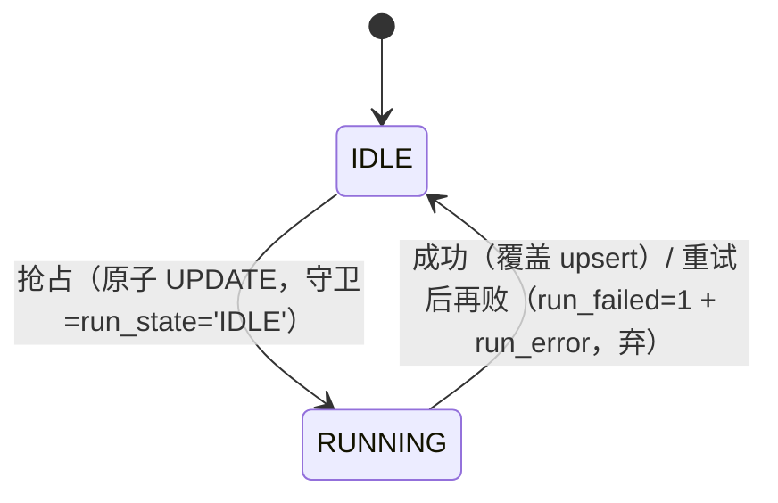

# 04 数据模型 — 用户画像模块（新用户转化）

> 模块：customer-profile ｜ 关联 PRD 母本：[`plans/customer-profile/customer-profile-prd.md`](../../plans/customer-profile/customer-profile-prd.md)（v1.3 草案待审） ｜ 状态：**前置拆解稿**（PRD 终审定稿时复核）
>
> **DDL 边界（Q28）**：仅新增 `ai_customer_profile` 一张表；`customer` / `customer_extend`（下游数据属主）不改 DDL。

## 1. 新表 `ai_customer_profile`（画像存储）

```sql
CREATE TABLE `ai_customer_profile` (
    `id`                bigint       NOT NULL AUTO_INCREMENT COMMENT '主键id',
    `customer_id`       varchar(64)  NOT NULL COMMENT '平台客户ID（PII 不入链路，画像归属键）',
    `profile_json`      json         NOT NULL COMMENT '画像整包（唯一事实源，AI 输出原文，含中文枚举）',
    `lead_quality`      varchar(8)   DEFAULT NULL COMMENT '线索质量投影：HIGH / MEDIUM / LOW',
    `intent_heat`       varchar(8)   DEFAULT NULL COMMENT '意向热度投影：HOT / WARM / COLD',
    `follow_priority`   varchar(4)   DEFAULT NULL COMMENT '跟进优先级投影：P0 / P1 / P2 / P3',
    `info_completeness` int          DEFAULT NULL COMMENT '信息完整度投影：0-100（本服务规则计算，非 AI 输出）',
    `stage`             varchar(16)  DEFAULT NULL COMMENT '转化阶段投影：NOT_BOUND / BOUND_NO_ORDER（实时绑店状态判定）',
    `run_state`         varchar(16)  NOT NULL DEFAULT 'IDLE' COMMENT '分析执行态：IDLE / RUNNING（行级抢占字段）',
    `out_of_pool`       tinyint      NOT NULL DEFAULT 0 COMMENT '出池标记：0池内，1已出池（惰性回写，列表过滤依据）',
    `run_failed`        tinyint      NOT NULL DEFAULT 0 COMMENT '最近一次分析失败标记：0未失败，1失败（重试后再败即弃）',
    `run_error`         varchar(500) DEFAULT NULL COMMENT '最近一次失败原因（≤500，重试后再败摘要）',
    `model`             varchar(64)  DEFAULT NULL COMMENT '分析所用模型（token 审计）',
    `input_token`       bigint       DEFAULT NULL COMMENT '输入 token（token 审计）',
    `output_token`      bigint       DEFAULT NULL COMMENT '输出 token（token 审计）',
    `crt_time`          datetime     DEFAULT NULL COMMENT '创建时间',
    `crt_user`          varchar(64)  DEFAULT NULL COMMENT '创建人id（首次触发生成人）',
    `crt_name`          varchar(64)  DEFAULT NULL COMMENT '创建人姓名快照',
    `crt_host`          varchar(64)  DEFAULT NULL COMMENT '创建主机',
    `upd_time`          datetime     DEFAULT NULL COMMENT '更新时间',
    `upd_user`          varchar(64)  DEFAULT NULL COMMENT '更新人id（最近一次触发人，异步落库 UserContext 快照回填）',
    `upd_name`          varchar(64)  DEFAULT NULL COMMENT '更新人姓名',
    `upd_host`          varchar(64)  DEFAULT NULL COMMENT '更新主机',
    `is_del`            tinyint      NOT NULL DEFAULT 0 COMMENT '逻辑删除：0未删，1已删（v1 画像不删，保留复盘回看）',
    PRIMARY KEY (`id`),
    UNIQUE KEY `uk_customer` (`customer_id`) COMMENT '覆盖式 upsert 键：同客户只留最新',
    KEY `idx_list` (`out_of_pool`, `follow_priority`, `upd_time`) COMMENT '列表过滤+默认排序（池内 + P0在前 + 最近画像在前，时间由 upd_time 承载）'
) ENGINE=InnoDB DEFAULT CHARSET=utf8mb4 COMMENT='AI 客户画像';
```

### 列语义要点

| 列 | 说明 | 对应 PRD 决策 |
|---|---|---|
| `customer_id` | 画像归属键；**平台 ID，非 PII**（决策 7/22）；唯一键支撑覆盖式 upsert（Q28） | 决策 7/18/22/28 |
| `profile_json` | 整包存储（唯一事实源），保留 AI 中文枚举原文；与投影列英文码并存（※D-5） | 决策 18 |
| `lead_quality` / `intent_heat` / `follow_priority` | 三枚举投影列，列表筛选键 | 决策 18/19 |
| `info_completeness` | 规则计算投影（0–100），**非 AI 输出**；入 `idx_list` 前段 | 决策 13/20 |
| `stage` | 转化阶段投影（实时绑店状态判定，不由 AI 猜）；与 `profile_json` 内阶段标签一致性经校验器把关（※D-7） | 决策 15/19 |
| `run_state` | **控制面**：线性状态机 `IDLE→RUNNING→IDLE`，每轮翻转复位；跨请求抢占字段（单语句原子 UPDATE） | 决策 10 |
| `out_of_pool` | 出池标记，惰性回写（触发/详情路径发现出池即写）；列表默认过滤 `out_of_pool=0` | 决策 3/12（※D-6） |
| `run_failed` / `run_error` | 最近一次分析结局：失败标记（重试后再败即弃，不宽松落库）+ 失败原因摘要（≤500，对齐 scheduled-task `last_run_error`）；不承载旧画像丢失（旧画像保留） | 决策 15/25 |
| `model` / `input_token` / `output_token` | token 审计三件套（对齐 scheduled-task 纪律） | 决策 20 |
| `upd_user` / `upd_name` | 最近一次触发人（通用审计字段承载操作人，不设专用字段） | 决策 20 |
| `uk_customer` | 覆盖式 upsert 键：同客户二次分析 ON DUPLICATE KEY UPDATE 整体覆盖 | 决策 18/28 |
| `idx_list` | 列表默认查询（`out_of_pool=0 AND follow_priority 升序 AND upd_time 降序`）；画像时间统一由通用审计 `upd_time` 承载（对齐 scheduled-task `last_run_time` 用法，抢占推进产生的偏差可接受）；其余筛选（质量/热度/完整度/阶段）在此数据量级走过滤即可 | 决策 19 |

### `run_state` 与画像数据面的分离（对齐 scheduled-task 两字段分离理由）

`run_state` 是**控制面**（"这轮在不在跑"，抢占守卫、每轮翻转复位）；画像内容/结局是**数据面**（`profile_json` 整包 + 投影列 + `run_failed`/`run_error` + `upd_time`，每轮覆盖、面向展示）。二者维度不同，不合并为单一 `state` 列——否则结束回 IDLE 时"最近分析结局"从状态列消失，而详情/列表需展示最近画像与失败标记。



## 2. 关键写路径

| 时机 | 操作 |
|---|---|
| 触发抢占 | `UPDATE ai_customer_profile SET run_state='RUNNING', upd_* WHERE customer_id=? AND run_state='IDLE'`（影响行数 0 = 分析进行中，幂等拒绝）；无画像客户首触发先 INSERT 占位行（`run_state='RUNNING'`） |
| 分析成功 | 覆盖式 upsert：`profile_json` + 五投影列 + `model/input_token/output_token` 整体写入（`upd_time` 随通用审计更新），`run_state='IDLE'`，`run_failed/run_error` 清空 |
| 分析失败（重试后再败） | `run_state='IDLE'`, `run_failed=1`, `run_error=<失败原因摘要（≤500）>`；**不落宽松画像**；已有旧画像保留 |
| 出池惰性回写 | 触发/详情路径发现「是否有已支付订单=是」→ `out_of_pool=1`（不删画像，详情可回看） |
| 无画像首触发 | INSERT 占位行（`customer_id` 唯一），进入 RUNNING；成功/失败按上行处理 |

## 3. 完整度五层分值定稿（※D-3，PRD 决策 17 授权）

内部字段名 ↔ 出参文案对应（内部字段名沿用 PRD 决策 17；出参文案见 03 §3.2）：`engaged_time`=DS 经验、`weekly_ad_budget`=周广告预算、`order_volume`=月订单量预期、`niche`=细分市场、`service_interest`=意向服务。

| 层 | 字段/信号 | 分值 |
|---|---|---|
| 问卷五项（合计 60） | `engaged_time` / `weekly_ad_budget` / `order_volume` / `niche` / `service_interest` 非空（各 12） | 60 |
| 联系方式 | `hasContactWay`=是 | 10 |
| 基础档案（合计 10） | `hasFirstName`=是（4）+ `company` 非空（3）+ `country` 非空（3） | 10 |
| 渠道归因 | 渠道来源非 `--`（二级/Medium/Campaign 等细分字段不作填写要求） | 10 |
| 绑店 | `stores` 非空 | 10 |
| **合计** | | **100** |

解析口径（※D-4）：只识别空值标记（`-`/`--`）与布尔形态「是/否」，不解析枚举文案语义。
