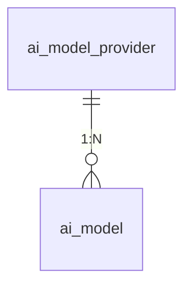

# 04 数据模型 — 模型配置管理

> 模块：model-config（admin 子模块）｜ 关联 PRD 母本：`plans/model-config-prd.md` (v1.0) ｜ 状态：已定版
>
> 本模块为**新建表**，不受 ai-chat「不允许 DDL 变更」约束（该约束仅针对 `ai_conversation` / `ai_conversation_content` 两表）。

## 1. ai_model_provider（模型供应方）

| 列 | 类型 | 说明 |
|---|---|---|
| `id` | bigint PK | 自增 |
| `name` | varchar(50) | Provider 名称 |
| `code` | varchar(32) | 类型枚举：`OPENAI` / `DEEPSEEK` / `CLAUDE` / `CUSTOM`；唯一（未软删除范围内） |
| `base_url` | varchar(500) | 服务地址，合法 HTTP/HTTPS URL |
| `api_key` | varchar(512) | AES 加密后的密文存储 |
| `auth_type` | varchar(32) | 鉴权方式：`API_KEY` / `BEARER` / `NONE` |
| `extra_headers` | varchar(2000) | 自定义请求头 JSON，可为 null |
| `enabled` | tinyint | 0 禁用 / 1 启用，默认 1 |
| `is_del` | tinyint | 逻辑删除：0 未删 / 1 已删（`@TableLogic`） |
| `crt_time` / `crt_user` / `crt_name` / `crt_host` | — | 创建审计 |
| `upd_time` / `upd_user` / `upd_name` / `upd_host` | — | 更新审计 |

**索引**：
- `uk_code`：`code` 唯一索引（注意：软删除后 code 可复用，MySQL 唯一索引与逻辑删除冲突时，应用层校验唯一性，索引可选）

## 2. ai_model（模型）

| 列 | 类型 | 说明 |
|---|---|---|
| `id` | bigint PK | 自增 |
| `provider_id` | bigint | 所属 Provider，逻辑外键（不建物理外键） |
| `name` | varchar(100) | 模型显示名称 |
| `description` | varchar(500) | 模型描述，可为 null |
| `provider_model_id` | varchar(200) | Provider 侧模型标识符（如 `gpt-4o`）；同 Provider 下唯一 |
| `sort_weight` | int | 排序权重，越小越靠前，默认 0 |
| `enabled` | tinyint | 0 禁用 / 1 启用，默认 1 |
| `is_del` | tinyint | 逻辑删除：0 未删 / 1 已删（`@TableLogic`） |
| `crt_time` / `crt_user` / `crt_name` / `crt_host` | — | 创建审计 |
| `upd_time` / `upd_user` / `upd_name` / `upd_host` | — | 更新审计 |

**索引**：
- `idx_provider_id`：`provider_id` 普通索引
- `provider_model_id` 唯一性由应用层校验（同 Provider + 未软删除范围内）

## 3. 关系与约束

| 约束 | 规则 | 实现层 |
|---|---|---|
| Provider code 唯一 | 未软删除范围内 `code` 不可重复 | 应用层 |
| Model 标识唯一 | 同 Provider（未软删除）下 `provider_model_id` 不可重复 | 应用层 |
| Provider 禁用阻断 | Provider 下有 `enabled=1` 的 Model 时不可禁用/删除 | 应用层 |
| 级联软删除 | 删除 Provider 时其下所有 Model 一并 `is_del=1` | 应用层（同一事务） |

## 4. 与百炼的关系

**零交集**。百炼模型不写入本表：
- 百炼模型继续以 yaml 硬编码（modelId → Agent AppId 映射），调用链不变
- 本表仅存储第三方模型配置，服务于未来自研 Agent
- 未来第三方对话（agent-chat 模块，v2）会话将在 `ai_conversation.params` 记录 `{"provider":"...","modelId":"..."}`（本模块不涉及）

## 5. 写入时机

| 时机 | 操作 |
|---|---|
| 新增 Provider | insert `ai_model_provider`（apiKey 先加密） |
| 编辑 Provider | update 非空字段（apiKey 变更时重新加密） |
| 禁用 Provider | 校验无启用 Model → update `enabled` |
| 删除 Provider | 同一事务：update Provider `is_del=1` + 其下 Model 批量 `is_del=1` |
| 新增 Model | 校验 Provider 存在且标识唯一 → insert `ai_model` |
| 编辑 Model | update 非空字段（`provider_model_id` 变更时重校验唯一性） |
| 禁用/启用 Model | update `enabled` |
| 删除 Model | update `is_del=1` |
