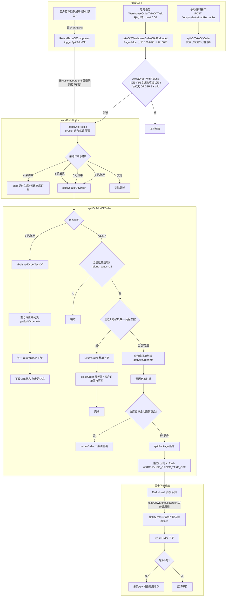

# Spec: 已退款产品自动拆单并下架订单（Bug 修复）

Status: done（2026-09-14 收敛：实现完成并入 develop 分支 commit `0ed750f8ed`，工单 01–03 全部完成，验收以线上观察为准）
Source PRD: 无（TAPD 需求 1136062570001008539，【Bug修复】已退款产品系统下架订单，https://www.tapd.cn/36062570/prong/stories/view/1136062570001008539 ）
Created: 2026-09-11
Revised: 2026-09-14（收敛定稿：①流程图更新为实现级全链路版本——三条触发入口、sendShipNotice 状态分支、splitOrTakeOffOrder 已作废独立路径、已完成幂等重入、PageHelper 分页、异步下架兜底；②扫描状态集实现口径定为 4/5/**6**/8——运输中(6) 纳入扫描（见 Q11 决策记录实现修订）；③Status → done）

## 实现收敛记录（2026-09-14）

- **代码落地**：ehub 仓库 develop 分支 commit `0ed750f8ed`（`refactor(仓库下架)`），6 文件 +258/-48：
  - `OrdersMapper.xml` / `OrdersMapper.java`：`selectOrderOfAllRefunded` 废弃，新增 `selectOrderWithRefund`（状态 4/5/6/8 + `refund_status=12` + 60 天窗口 + `ORDER BY o.id`）
  - `OrderWarehouseCreateOrderImpl`：扫描 PageHelper 分页（100 条/页、上限 100 页）；`sendShipNotice` 放行已作废(8)；`splitOrTakeOffOrder` 放行已完成(7)/已作废(8)，作废走 `abolishedOrderTaskOff` 独立路径（全下架、不改状态）；全退 `closeOrder` 幂等
  - `RefundTakeOffComponent`（新增）：退款成功异步触发，`@Async`、失败不阻退款流
  - `OrdersBiz`：部分退款（`ordersGoodsRefund`）/整单退款（`cancelled`）尾部挂接 `triggerSplitTakeOff`
  - `TempController`：新增 `POST /temp/order/refundReconcile` 临时对账接口
- **工单状态**：01（退款异步触发）、02（扫描扩大）、03（临时对账接口）全部完成
- **TAPD 回写**：改动清单 + 目标流程图已评论至需求 1136062570001008539（评论 ID `1136062570001012396`）
- **测试备注**：单测（`RefundTakeOffComponentTest` / `RefundSweepScanTest` / `ClosedOrderSplitTakeOffTest`）依赖真实订单数据与 JDK 8 编译环境，本机未能执行（Lombok 与默认 JDK 21 不兼容），验证移交开发者测试环境；线上验收以观察退款单自动下架、无卡单复发为准
Workspace: ehub（实现代码库）/ ehub-ai-workbench-prd（本 spec）

## Problem Statement

客户订单退款成功后，系统应对采购侧**已到货**的商品执行拆单，并把原订单在仓库下架，未退款商品照常发货。目前的实际情况是：已退款，但未拆单、未下架，订单滞留在仓库"待发货"状态。

具体表现：

- 订单此前已被拆过单，采购系统无法再次拆单，订单卡死发不走（案例订单 1109965608671248384，sku 500657606800064）。
- 拆单与下架存在时间窗口，窗口期内退款的订单仓库仍把货发了出去（案例 1151443386595540992：采购系统已退款、仓库仍发货；另有 1119971467094654976、1120310365704421376）。
- 此前因"排查不到日志、无法定位"被拒绝，2026-07 补充新案例后重启，现处于开发中。

从运营视角：退款了的货不应继续占用仓储与物流资源，更不应发出去造成资损；订单也不该因拆单次数限制而永久卡死。

### 历史代码核实的根因（2026-09-11 代码考古结论，Q8 修正）

先澄清两条退款链路（Q8）：**本需求说的退款是客户订单退款**，不是 1688 采购退款。客户退款经 ehub-customer Feign 到 tenant 的 `/orders/cancelledByCustomerOrderId`：部分退款走 `OrdersBiz.ordersGoodsRefund`（把 `orders_goods.refund_status` 置 12=STATUS_HAS_REFUND），整单退款走 `OrdersBiz.cancelled`（订单状态 REFUNDING→ABOLISHED）。1688 采购退款（`handleRefundSuccess` 建售后工单那套）是另一条链路，不在本需求触发点范围内。本需求的扫描与临时接口均以**采购订单**（`orders` 表）为入口。

历史代码的设计意图与上述目标流程一致（整单退款→`returnOrder`+`closeOrder`；部分退款→`getSplitOrderInfo` 遍历仓库订单→只含退款项直接下架/混合则 `splitPackage` 拆单后 Redis 异步下架），但存在 4 个缺口：

1. **客户退款不触发拆单/下架链路**（主因）：客户退款处理点（`ordersGoodsRefund` / `cancelled`）只会经 `OrdersLogisticsBiz.returnOrder` **整单下架**仓库订单（且部分退款还依赖 `isTakeOffOrder` 标志与已有 `warehouseOrderId`），从不调用按 SKU 拆单的 `splitOrTakeOffOrder`——部分退款场景要么整单下架误伤未退款商品（不该做时）、要么完全不处理（未触发时）。`splitOrTakeOffOrder` 的现有调用方只有发货接口 `/ship`、改地址、MQ 通知发货、8 小时兜底任务，均与客户退款无必然衔接。退款后若恰无其他触发，订单滞留。
2. **兜底任务只救全退单**：8 小时兜底扫描 `selectOrderOfAllRefunded` 只覆盖"所有商品项均已退款"的订单，**部分退款订单永不重试**，错过触发窗口即永久滞留（对应案例 1109965608671248384）。
3. **已拆过单后逻辑断裂**：仓库订单状态过滤只认待发货(2)/待确认(-20)，拆单产生的新状态单被部分退款分支直接跳过（注：`OrdersLogisticsPackageGoods` 中一个商品项只有一条记录，不随拆单增多，`toMap` 重复键风险已排除——2026-09-11 用户确认）。
4. **异步下架静默丢失**：Redis `WAREHOUSE_ORDER_TAKE_OFF` 的 key 超 2 小时被任务直接删除，部分退款拆出侧的下架动作被静默丢弃。

## Solution

修复并补强现有"退款→拆单→下架"链路（`sendShipNotice → splitOrTakeOffOrder`）。目标流程（用户确认版）：

配套修复（2026-09-11 grilling 修订版，Q1–Q7 见文末）：

1. **客户退款成功即触发（异步）**：在客户订单退款处理点（`OrdersBiz.ordersGoodsRefund` 置 refund_status=12 之后 / `OrdersBiz.cancelled` 整单退款路径）**异步**调用拆单/下架逻辑，不阻塞客户退款流程；漏掉的由定时任务兜底（Q2）。1688 采购退款链路（`handleRefundSuccess`）不挂触发，那是另一条业务线（Q8 澄清）。
2. **仓库订单状态过滤不扩展**：`splitOrTakeOffOrder` 维持只处理仓库状态为待发货(2)/待确认(-20)的仓库订单，其它状态仅打印日志（Q1）。已拆单产生的其它状态仓库单暂不处理。
3. **定时任务扫描调整**：扫描从"仅全退订单"改为"存在已退款商品项"的订单，状态为采购中(4)/在库待发货(5)/**运输中(6)**/已作废(8)（不含已完成(7)——Q11），并限定**最近 60 天创建**的订单（以 `orders.crt_time` 为准——Q12）。原 `selectOrderOfAllRefunded` 查出的全退单已被 `selectOrderWithRefund` 结果集包含，旧查询废弃。已作废单由 `sendShipNotice` 联动放行进入 `splitOrTakeOffOrder`（Q10）。`ORDER BY o.id` 保证 PageHelper 分页结果稳定。
4. **存量修复走指定订单的临时对账接口**：`splitOrTakeOffOrder` 状态门槛放开以支持已完成(7)/已关闭-作废(8) 订单，且二者处理差异化——**已完成(7) 与在库待发货/运输中完全同逻辑、不特判**（Q9）；**已关闭-作废(8) 不区分退款、直接关闭仓库侧所有订单**（Q10）。新增临时 REST 接口按**指定订单**触发对账下架（不做批处理），复用 `splitOrTakeOffOrder` 主链路，不受影响（Q13）。
5. **已到货才拆**：拆单/下架针对采购已到货的商品执行；未到货部分沿用现有流程处理，不在本次范围内改变其行为。
6. **异步下架 2 小时丢弃问题不单独处理**：扫描兜底已能重新收敛被丢弃的下架任务，不为已能兜底的问题单独加机制（Q6）。

## User Stories

1. As a 仓库运营, I want 客户订单退款后采购已到货的商品被自动拆单出来, so that 已退款的货不再占用仓库拣货与发货资源。
2. As a 仓库运营, I want 拆单完成后原订单在仓库自动下架（未退款部分除外）, so that 我不需要人工到仓库系统逐单下架。
3. As a 仓库运营, I want 拆单窗口期内发生退款的订单在发货前被拦截下架, so that 已退款的货不会发出去造成资损。
4. As a 仓库运营, I want 已拆过单的订单在后续退款时仍能继续拆单/下架, so that 订单不会因拆单次数限制卡死在待发货状态。
5. As a 采购运营, I want 退款成功消息到达后系统立即处理对应产品订单, so that 我不需要逐单跟进卡死的采购单。
6. As a 采购运营, I want 退款处理失败时有兜底任务重试收敛, so that 单次消息丢失或瞬时异常不会导致订单永久滞留。
7. As a 平台客服, I want 已退款客户的订单状态自动流转（全部退款→订单完成/待评价）, so that 我不需要向客户解释"退了款订单还挂着"。
8. As a 系统, I want 全部退款与部分退款采用不同策略（全退直接下架关单、部分退拆单后下架退款侧）, so that 未退款商品仍正常发货不受影响。
9. As a 系统, I want 拆单与下架动作对同一订单并发安全（分布式锁）, so that 退款消息、人工操作、定时任务并发触发不产生重复拆单或重复下架。
10. As a 系统, I want 部分退款拆单后未退款侧包裹照常走发货流程, so that 拆单动作不影响正常订单履约。
11. As a 平台管理员, I want 退款触发拆单/下架的处理过程有日志可查, so that 出现争议单时能定位卡在哪一步（针对历史上"排查不到日志"的问题）。

## Implementation Decisions

- **触发点（Q2、Q8）**：客户订单退款处理点——部分退款在 `OrdersBiz.ordersGoodsRefund` 将 `orders_goods.refund_status` 置 12（STATUS_HAS_REFUND）之后，整单退款在 `OrdersBiz.cancelled` 完成订单关闭后——**异步**调用 `OrderWarehouseCreateOrderImpl` 的拆单/下架入口（`@Async`/线程池），失败不阻塞客户退款流程，漏掉的由定时任务兜底。沿用现有分布式锁防并发。1688 采购退款（`handleRefundSuccess`）不挂触发。入口从**采购订单**（`orders` 表）入手：由客户订单号反查名下采购订单（`customerOrderId` 关联）后逐单处理。
- **仓库订单状态过滤维持现状（Q1）**：部分退款分支仍只处理仓库状态为待发货(2)/待确认(-20)的仓库订单；其它状态打印日志后跳过，本次不改动。
- **已完成/已关闭订单处理差异化（Q3、Q4、Q9、Q10）**：`splitOrTakeOffOrder` 的采购订单状态门槛从"仅待发货/运输中，否则抛异常"放开为额外接受已完成(7)/已关闭-作废(8)。二者处理不同：**已完成(7) 与在库待发货(5)/运输中(6) 完全同逻辑、不特判**——全退照常下架 + `closeOrder`（重复置 7 为幂等重入，无害；客户订单照常置待评价），部分退照常拆单/直接下架，入库检查照做；**已关闭-作废(8) 表示整单作废，进入后不区分退款、直接关闭仓库侧对应的所有订单**——与全部退款同款下架动作，遍历 `getSplitOrderInfo` 全部正常仓库订单逐一 `returnOrder`（覆盖已拆单残留），并**跳过 `closeOrder`**（订单已终结，绝不能把作废(8) 改成已完成(7)），入库检查不适用。
- **临时对账接口（Q4、Q13）**：新增指定订单的临时 REST 接口（`TempController` 先例，`POST /temp/order/refundReconcile`），入参为采购订单号，**不做批处理**——已完成/关闭订单量太大，线下发现问题后逐单调用修复，同时兼作 `splitOrTakeOffOrder` 的验证入口。接口走的还是 `splitOrTakeOffOrder`，内部新分支自动生效，不受本次调整影响；仅限已完成(7)/已关闭-作废(8) 订单调用（进行中订单走退款触发/兜底扫描或既有 `/temp/warehouse/split/order`）。前置校验：已完成(7) 单须含已退款商品项（否则无事可做，安全拒绝）；已关闭-作废(8) 单**不要求含退款项**（不区分退款直接全下架——Q10）。
- **一客户单对多仓库单**：处理入口以客户订单为起点，经 `getSplitOrderInfo` 取回其名下**全部**仓库订单/包裹后逐一处理，不以"一个客户单=一个仓库单"为前提。
- **整单退款**：客户订单全部商品项退款时，直接对仓库系统中对应订单执行关闭/下架（`returnOrder`，actionType=1）并走既有关单流程（订单置完成、客户订单置待评价）；已完成(7) 订单照常走完整链路（幂等）；已关闭-作废(8) 订单则只下架不改状态。
- **部分退款**：对客户订单对应的每个仓库订单分别判断——仓库订单**只含退款商品项**→直接关闭；**含退款+未退款混合**→先 `splitPackage` 把退款商品项拆为独立订单，再对拆出的退款订单执行关闭下架（经 Redis `WAREHOUSE_ORDER_TAKE_OFF` 异步执行）。
- **失败可观测**：关键失败不再被静默吞掉，需落 errorRemark 并可追踪日志。
- **已到货边界**：拆单/下架仅针对采购已到货的商品（`sendShipNotice` 中"采购中"状态先 `ship()`/`advanceStorage` 提前入库再建仓库订单的既有行为覆盖此场景，保持不变）；未到货商品不走本链路；已完成(7) 与在库待发货/运输中同逻辑（入库检查照做——Q9）；已关闭-作废(8) 全下架不做入库检查（等同全退下架动作——Q10）。
- **下架异步化沿用**：拆单产生的退款侧下架仍写入现有 Redis Hash（`WAREHOUSE_ORDER_TAKE_OFF`），由 `WarehouseOrderTakeOffTask`（10 分钟周期）消费执行；全退订单直接下架+关单。
- **异步下架丢弃问题不处理（Q6）**：Redis 队列"超 2 小时删除"维持现状——定时任务扫描覆盖部分退款后，被丢弃的下架任务会在下轮扫描中重新拆单/重新入队收敛。
- **定时任务扫描扩大（Q3、Q5、Q11、Q12）**：8 小时兑底扫描从"仅全退订单"改为"存在已退款商品项（`og.refund_status=12`）"的订单，状态为采购中(4)/在库待发货(5)/**运输中(6)**/已作废(8)；**不含已完成(7)**——已完成单由退款触发与临时接口覆盖；运输中(6) 纳入扫描以覆盖退款触发遗漏；`sendShipNotice` 对 6 的支持保留给其它调用方（发货接口、改地址、MQ）。扫描限定**最近 60 天创建**（`orders.crt_time >= NOW() - INTERVAL 60 DAY`）控制量级；`ORDER BY o.id` 保证 PageHelper 分页结果稳定；临时对账接口按订单号指定，不受窗口限制。原 `selectOrderOfAllRefunded` 的全退单已被 `selectOrderWithRefund` 包含，旧查询废弃不单独扫。沿用 `sendShipNotice` 入口复用分布式锁与幂等；`sendShipNotice` 需联动放行已作废(8) 进入 `splitOrTakeOffOrder`（`ship()` 提前入库仅适用于采购中(4)，已作废单不走）。
- **不做链路重构**：本次仅修触发缺失与扫描覆盖两个漏洞，不把同步/异步触发统一重构为新的状态机模型。
- **测试 seam**（用户已确认）：`OrderWarehouseCreateOrderImpl.splitOrTakeOffOrder` / `sendShipNotice` + `WarehouseOrderTakeOffTask`，沿用 `@SpringBootTest` 集成测试风格直接调用 service/task 方法（先例：`PurchasePreAfterSalesTaskTest`）。

## Testing Decisions

- 只测外部行为：对给定退款状态的订单，仓库侧收到的 `returnOrder` / `splitPackage` 调用与订单最终状态；不 mock 内部私有方法分支。
- 测试模块：`ehub-tenant`（拆单/下架逻辑与任务所在模块）。
- 先例：`PurchasePreAfterSalesTaskTest` 的 `@SpringBootTest(classes = TenantBootstrap.class)` + 直接注入调用风格。
- 重点用例：整单退款直接关闭对应仓库订单；部分退款且仓库订单只含退款商品时直接关闭；部分退款混合仓库订单先拆单再关闭退款侧；一客户单对应多个仓库订单时逐一正确处理；仓库订单状态非待发货/待确认时打印日志跳过（Q1 行为锚定）；已完成(7) 订单与待发货/运输中完全同逻辑（全退幂等 `closeOrder` 且客户订单置待评价、部分退照常拆单——Q9）；已关闭-作废(8) 订单不区分退款全下架、含已拆单残留时全部下架、订单状态不变不调 `closeOrder`（Q10）；临时接口对无退款商品的已完成单安全拒绝、对作废单不要求退款项；无残留订单安全返回；部分退款订单进入兜底扫描能被收敛；扫描状态集为 4/5/8 且限 60 天窗口，不含已完成(7)/运输中(6)，旧全退查询废弃不单独扫（Q11、Q12）；并发触发不重复下架；未退款侧包裹不受影响。

## Out of Scope

- 客户侧（平台买家）订单展示与通知逻辑。
- 拆单/下架链路整体架构重构与统一状态机建模。
- 仓库 WMS 侧（`ehub-logistics` 的 `WarehouseController` 及其下游）内部逻辑修改。
- HyperSKU 来源退款生成工单的策略调整。
- 仓库订单状态过滤的扩展（Q1，仅其它状态打印日志，待后续有需要再说）。
- 异步下架队列超时丢弃的机制改造（Q6，由扫描兜底）。
- 已完成/已关闭订单的批量对账（Q4，量太大，线下发现逐单修复）。
- 定时任务扫描已完成(7) 订单（Q11，已完成单由退款触发与临时接口覆盖）。
- 兑底扫描覆盖已完成(7) 订单（Q11，已完成单由退款触发与临时接口覆盖）。
- 超过 60 天窗口订单的自动扫描（Q12，更早存量走临时接口逐单修复）。
- 历史卡单的人工批量清理工具（兜底扫描 + 临时接口覆盖）。

## Further Notes

- TAPD 需求状态 developing，负责人 liangliang.gong、owen.chi；2026-09-10 新增案例 1151443386595540992（退款后仍发货）是"窗口期"洞的直接证据。
- 需求曾因无法定位日志被拒绝（2026-05-19 hansy.chen 评论），实现时应在拆单/下架关键节点补结构化日志，回应"排查不到日志"的历史痛点。
- 组合 SKU 不处理的既有约定（`splitOrTakeOffOrder` 现逻辑）保持不变。

## 决策记录（grilling 2026-09-11，Qn 溯源）

| Q | 决策 | 用户结论 |
|---|---|---|
| Q1 | 已拆单订单的仓库状态过滤是否扩展？ | **不修改**。仅处理仓库状态待发货/待确认，其它状态打印日志即可，暂不改动 |
| Q2 | 退款触发同步还是异步？ | **异步处理** |
| Q3 | 对账接口对已关闭订单+混合包裹怎么处理？ | `splitOrTakeOffOrder` 调整支持已关闭/已完成订单；定时任务侧不支持已关闭/已完成订单（后半句已被 Q11 修订：扫描纳入已关闭-作废8） |
| Q4 | 对账接口形态与范围？ | **指定订单、不做批处理**（已完成/关闭订单量太大），线下发现后经接口逐单修复，兼作验证入口 |
| Q5 | 兑底扫描的量级控制？ | **取消扫描中已关闭/已完成订单**，定时任务仅扫全部退款+部分退款（待发货/运输中）；对账接口需验证订单状态与是否含已退款商品（前半句已被 Q11/Q12 修订：扫描 4/5/6/8 + 60 天窗口） |
| Q6 | 是否为异步下架静默丢失单独加机制？ | **不加**，已能兜底 |
| Q7 | spec 与工单处置？ | **就地演进**（本文件已改版，工单重排） |
| Q8 | 退款指哪条链路？触发点与扫描/接口的入口？ | 指的是**客户订单退款**（`orders_goods.refund_status=12`），不是 1688 采购退款（`handleRefundSuccess` 那套）。扫描与临时接口均从**采购订单**入手 |
| Q9 | 已完成(7) 与待发货/运输中"逻辑一样"的边界？ | **完全同逻辑、不特判**：全退照常 `closeOrder`（重复置 7 幂等无害、客户订单置待评价），部分退照常拆单，入库检查照做 |
| Q10 | 已关闭(作废8) 订单怎么下架？ | **不区分退款，直接关闭仓库侧对应的所有订单**，与全部退款同款下架动作（遍历全部正常仓库订单逐一 `returnOrder`，覆盖已拆单残留）；跳过 `closeOrder`（不得把 8 改成 7）；入口不要求含退款项 |
| Q11 | 定时任务扫描要不要含已完成(7)？ | **不含已完成(7)**。扫描状态集实现 = 采购中(4)/在库待发货(5)/**运输中(6)**/已作废(8)；实现时将运输中(6)纳入扫描以覆盖退款触发遗漏的运输中单（`sendShipNotice` 已支持 6）。原 `selectOrderOfAllRefunded` 的全退单已被 `selectOrderWithRefund` 包含，旧查询废弃 |
| Q12 | 60 天窗口的口径？ | 以 `orders.crt_time`（采购订单创建时间）为准，最近 60 天创建；临时对账接口按订单号指定，不受窗口限制 |
| Q13 | 临时对账接口受影响吗？ | **不受影响**——接口走的还是 `splitOrTakeOffOrder`，内部新分支自动生效 |

### 术语约定（Q9–Q13 澄清）

- **已完成(7)**：订单正常终结的状态，在本链路中与在库待发货(5)/运输中(6) 同类，走完全相同的处理逻辑。
- **已关闭（= 作废8）**：整单作废的终态。下文及工单中"已关闭"专指作废(8)，不再与已完成(7) 混称；需要统称时写"已完成/已关闭"。
