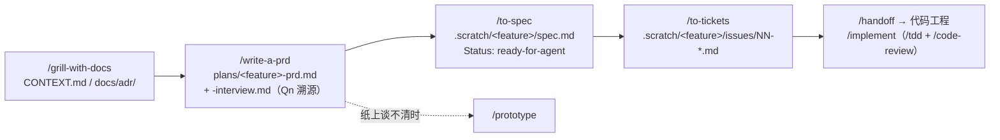

# AGENTS.md — 流程纪律（agent 在本仓库工作前必读）

本仓库按 **skill 原生约束**运行（2026-09-02 定案）：write-a-prd / to-spec / to-tickets / grill-with-docs / domain-modeling 等技能按其原生模板与产物约定工作，**本仓库不另建平行文档体系**。2026-09-02 之前的超集体系（`requirements/` 01–05、`specs/`、`designs/` 含 UI/UX 链与 `-design.md`）已整体迁入 `.scratch/archive/` 只读归档，git 历史可溯。

## Agent skills

### Issue tracker

本地 markdown tracker：spec 与工单落 `.scratch/<feature>/`。见 `docs/agents/issue-tracker.md`。

### Triage labels

沿用五个默认标签（needs-triage / needs-info / ready-for-agent / ready-for-human / wontfix）。见 `docs/agents/triage-labels.md`。

### Domain docs

单上下文（single-context）：`CONTEXT.md` + `GLOSSARY.md` 在仓库根，ADR 落 `docs/adr/`。见 `docs/agents/domain.md`。

## 主线（skill 原生链路）

想法打磨（`grill-with-docs`，沉淀 CONTEXT/ADR）→ PRD（`write-a-prd`：`plans/` 落 PRD + interview）→ spec（`to-spec`：`.scratch/<feature>/spec.md`，ready-for-agent）→ 工单（`to-tickets`：`.scratch/<feature>/issues/NN-*.md`）→ 移交代码工程（`/implement`，内含 `/tdd` + `/code-review`）。

## 产物落点

| 产物 | 落点 | 来源 skill / 说明 |
|---|---|---|
| PRD 母本 | `plans/<feature>-prd.md` | write-a-prd（模板七节原样保留） |
| 访谈记录（Qn 溯源） | `plans/<feature>-interview.md` | write-a-prd：访谈结束立即落盘，编号永不重排 |
| ADR | `docs/adr/NNNN-*.md` | grill-with-docs / domain-modeling，按需懒创建 |
| Spec | `.scratch/<feature>/spec.md` | to-spec，头部 `Status: ready-for-agent` + PRD 互链 |
| 实现工单 | `.scratch/<feature>/issues/NN-<slug>.md` | to-tickets，`Status:` 行记 triage 状态 |
| 域模型 / 术语 | `CONTEXT.md` / `GLOSSARY.md` | domain-modeling（已存在，持续维护） |
| PRD / spec 发布落点 | `docs/agents/work-items.md` | write-a-prd 第 4 步引用 |
| 归档基线 | `.scratch/archive/{requirements,specs,designs}` | **只读**：不新增、不修改、不续写 |

## 硬规则

1. **不再新建** `requirements/` 01–05、`specs/`、`designs/` 任何产物（含 FR-xx/NFR-xx 拆解、`-design.md`、`-ia.md`/`-pages.pen`/`-ui-spec.md` UI/UX 链）——该体系已停用归档。接口契约、数据模型等技术决策写入 PRD 的 **Implementation Decisions** 节或 **ADR**；前端无 skill 链路，视觉/交互决策同样入 PRD/ADR，细节在代码工程实现期处理。
2. 引用旧基线时读 `.scratch/archive/...`，引用处标注「归档基线」；旧基线与 skill 原生产物冲突时**以 skill 原生产物为准**。
3. PRD 版本用 `v主.次`（定版后小改动升次版本）。
4. 用语以 `GLOSSARY.md` 为准，文档间术语保持一致。
5. 需求变更：**先改 PRD / spec 再开发**（母本在 `plans/`，spec 与工单在 `.scratch/`）。
6. FR-xx / NFR-xx / R-xx / D-xx 编号体系随旧体系归档，仅用于解读归档基线；新产物不使用。
