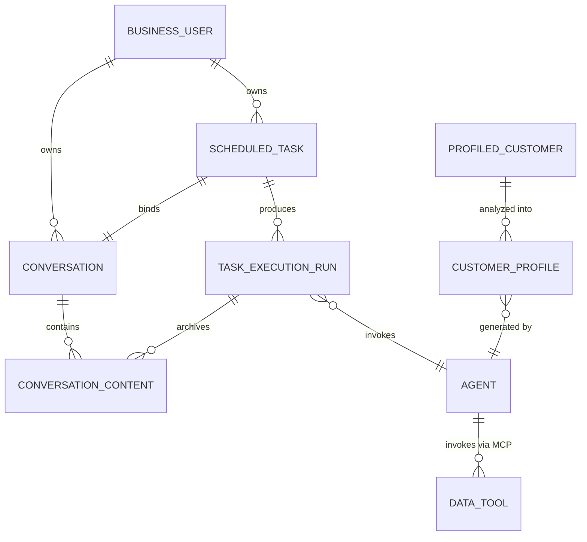
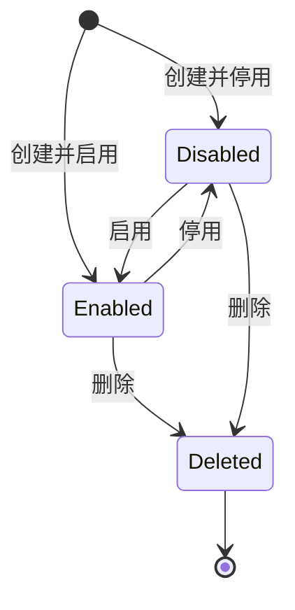
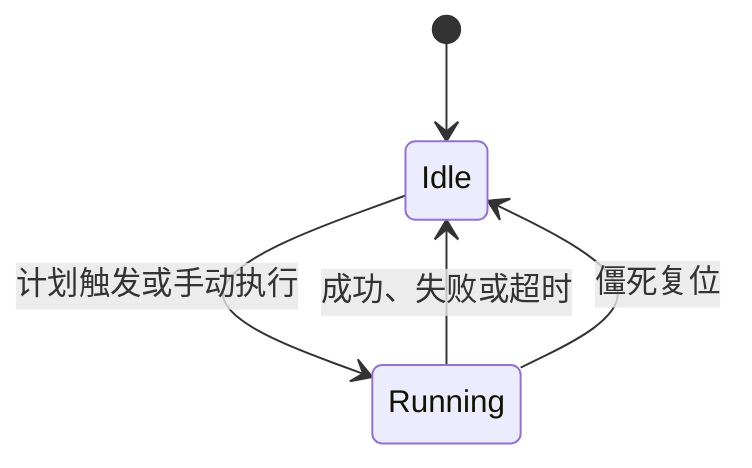
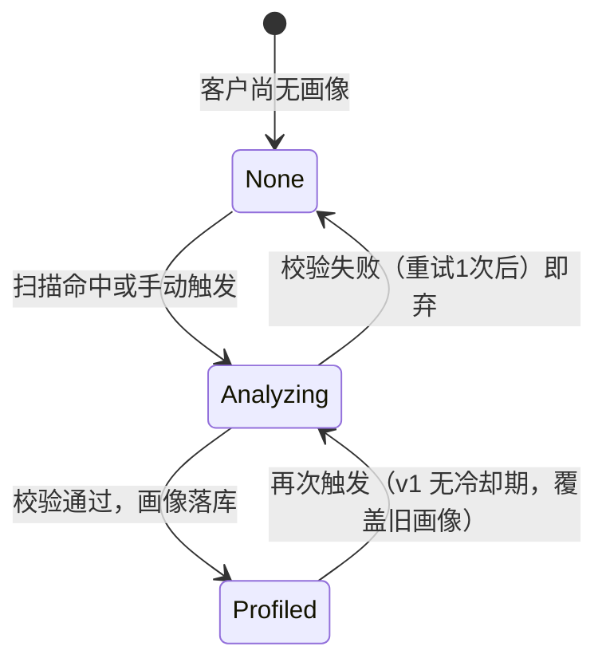

# AI 工作台领域模型

本文是本工程的领域模型与业务语言基准。它描述业务概念、关系、生命周期和不变量，不替代 PRD、接口规范、数据模型或实现设计。

术语的简明定义统一维护在 [GLOSSARY.md](GLOSSARY.md)；本文件记录这些术语之间的关系和业务边界。

## 领域边界

### 会话领域

会话领域负责承载用户与 Agent 的对话主题及其消息内容。

- **会话组**是用户视角的一次完整对话主题，也是内容归属、数据隔离和历史回看的基本单元。
- **对话内容**是会话组中的一条用户或 Agent 消息。
- **一轮对话**由一次输入和对应的完整 Agent 回复过程组成；它可以正常完成、被客户端断连中断，或因 Agent 调用失败而结束。
- 会话组可以由即时对话隐式创建，也可以由定时任务显式绑定创建。

### 定时任务领域

定时任务领域负责把用户配置的周期性工作转化为 Agent 执行轮次，并将产出归档到绑定的会话组。

- **定时任务**是业务用户拥有的一项可管理的周期性工作，包含任务名称、预设提示词、执行计划和绑定会话组。
- **任务执行轮次**是定时任务因一次计划触发或一次手动执行产生的完整过程。
- **执行状态**描述当前是否存在占用该任务的执行轮次：空闲或执行中。
- **最近执行结局**描述上一轮执行如何结束：成功或失败。它是历史事实，不是当前执行状态。
- **僵死任务**是执行状态持续为“执行中”并超过允许的最长残留时间的任务，表示执行实例可能已经终止但没有完成状态清理。
- **僵死复位**是释放僵死任务执行占用的恢复动作；它不是重试，也不产生新的执行轮次。

### 平台与 Agent 边界

- **业务用户**是任务和会话组的唯一业务归属主体。
- **Agent**是提供智能处理能力的外部智能体应用；本领域只关心调用结果和会话连续性，不拥有 Agent 内部编排。
- **sessionId**属于 Agent 侧的会话连续性标识；它服务于上下文延续，不等同于本系统的会话组。
- 认证、用户身份建立和跨线程身份传递属于平台基础设施边界，不属于会话或定时任务领域模型。

### 用户画像领域（原客户画像域）

用户画像领域负责把新用户（已注册且未消费）的画像转化为结构化产出，支撑销售转化。原销售转化画像（customer-profile-sales）与运营画像（customer-profile-ops）两模块已于 2026-08-26 废弃、2026-08-27 删除（git 历史可溯）；现役模块为「用户画像（customer-profile，新用户转化）」，决策见 `plans/customer-profile/customer-profile-interview.md`（Q1–Q28）。

- **画像客户（新用户）**是画像的分析对象：已注册且未消费（无已支付订单）的平台客户。首单支付成功即出池；出池后画像冻结保留可回看。它不是本系统的业务用户，画像不服从业务用户归属隔离（平台级可见）。
- **转化阶段**是画像的硬分流维度：未绑店 / 已绑店未首单，决定策略与话术的生成方向。
- **用户画像**是面向销售转化的一次分析产出：评分面板（质量/热度/优先级 AI 判断 + 完整度规则计算）+ 线索速读 + 转化策略 + 跟进话术。
- **数据工具**是画像的数据获取层：下游 MCP 统计服务暴露的查询工具（新用户信息，两表合并 + 消费状态字段）。统计口径归数据属主，本系统不拥有。v1 仅 1 个工具。
- **画像技能**是画像的分析规则载体：规定数据获取策略、转化阶段分流标准、分析维度判定和输出结构。其单一事实源在本仓库，运行时配置于百炼 Agent 侧。
- **指标包**是逻辑概念：画像所需指标全集，由数据工具结果按画像技能规定的序列拼装而成。
- **双列表架构**：老系统检索列表（找客户 + 触发生成）+ 本服务画像列表（仅已生成客户，五筛选排序）。

## 核心关系

- 一个业务用户可以拥有多个定时任务和会话组。
- 一个定时任务绑定一个专属会话组；该会话组用于保存该任务的连续执行上下文和产出。
- 一个定时任务可以产生多个执行轮次；v1 只在任务上保留最近一轮的结局摘要，完整执行历史留作后续演进。
- 一个执行轮次调用一个 Agent，并把本轮输入和输出归档为绑定会话组中的对话内容。
- 会话组和内容的可见性服从业务用户归属；客户端不能通过传入其他用户标识改变归属。
- 一个平台画像客户至多有一份当前画像（v1 覆盖式）；画像生成经由 Agent 调用数据工具完成，指标包不落库、只以画像产出形态留存。
- 数据工具属于下游 MCP 统计服务，本系统只消费其契约，不定义统计口径。

## 生命周期与不变量

### 定时任务生命周期

启停生命周期与执行生命周期相互独立：任务可以停用，但一次已经开始的执行轮次仍然属于该任务并允许完成；删除任务后不再产生新的计划触发，但在途执行仍按既定规则完成。

### 执行生命周期

### 画像生成生命周期

画像领域核心不变量：

1. 画像属于平台画像客户，不属于任何业务用户；全体内部用户可见。
2. 一份画像必须通过固定 schema 强校验后才能落库；校验失败（含重试）的产出必须丢弃，严禁宽松落库。
3. v1 任何时刻一个客户至多一份当前画像；覆盖不保留历史（v2 演进项）。
4. 终端消费者 PII 不进入任何分析链路；数据工具一律以平台 ID 与统计形态提供数据。
5. 无降级落库形态：冷启动/数据稀少客户照常分析（速读中声明数据有限），不存在 FALLBACK 画像；同一时刻一个客户至多一个分析占用（行级抢占）。

核心不变量：

1. 同一任务同一时刻至多存在一个执行中的轮次。
2. 只有任务归属用户可以管理任务、触发手动执行或查看其绑定会话内容。
3. 手动执行是一次独立执行轮次，不改变任务原有的计划语义。
4. 停用任务不接受新的计划触发，但允许按产品规则进行手动执行。
5. 失败或超时是执行轮次的结局，不等同于僵死；僵死表示当前执行占用没有被可靠释放。
6. 僵死复位只释放执行状态，不补跑被放弃的轮次，也不覆盖已经写入的最近执行结局。
7. 任务删除不删除绑定会话组及其历史内容，保证审计和成本核算连续。

## 关键业务场景

### 计划触发

任务到达计划时间后产生一个执行轮次。错过多个计划点时，v1 将它们合并为一次执行，不按错过的点逐次补跑。

### 多实例同时触发

多个服务实例可能同时发现同一个到期任务，但领域结果只能有一个执行中的轮次；未取得执行资格的实例不产生执行轮次。

### 执行超时

Agent 调用超过允许时限时，本轮以失败结局结束，任务恢复为空闲状态，下一计划点仍按原计划等待，不自动重试。

### 僵死复位

当任务长时间保持执行中，且超过僵死判定阈值时，系统把它视为可能的实例终止残留并释放执行占用。该动作不证明原实例一定死亡，因此阈值必须显著大于正常调用时限；若未来需要消除这类不确定性，应引入可验证的租约或心跳模型。

### 删除执行中的任务

用户删除任务时，任务停止后续计划触发，但已经开始的执行轮次不被强制取消；本轮产出仍归档到原绑定会话组。

## 当前明确的演进边界

以下概念暂不属于 v1 的完整领域能力：

- 独立的执行历史记录与执行看板
- 失败重试、退避和幂等策略
- 每轮执行独立记忆的任务级开关
- 多实例执行负载的均匀分配策略
- 执行结果的外部通知
