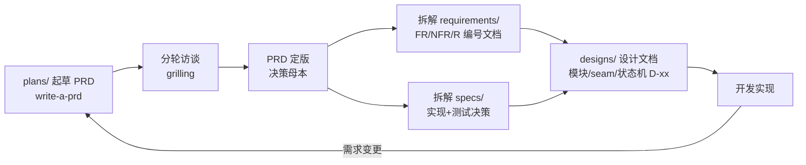

# ehub-ai-workbench PRD 文档工程

本工程是 [`ehub-ai-workbench`](../ehub-dev/ehub-ai-workbench) 服务（AI 工作台，对百炼大模型平台做二次封装）的**产品需求文档库**，与代码工程分离维护。

核心约定：**变更先改 PRD 再开发**。

## 目录结构

```
ehub-ai-workbench-prd/
├── README.md                # 本文件：项目说明、目录导航、文档约定
├── CHANGELOG.md             # 文档变更日志（按日期倒序）
├── GLOSSARY.md              # 领域术语表（全工程统一用语）
├── plans/                   # PRD 母本（write-a-prd 流程产出，访谈决策记录）
│   ├── ai-chat-sse-prd.md   #   AI Chat v1 PRD（已定版 v1.0）
│   ├── chat-conversation-management-prd.md # 会话组与对话内容管理 PRD（已定版 v1.0）
│   └── chat-conversation-content-prd.md # 会话内容管理（只读查询）PRD（已定版 v1.0）
├── requirements/            # 需求文档集（按功能模块组织）
│   ├── auth/                #   全工程通用约定（单一事实源）
│   │   └── 01-接口认证.md   #   接口认证：JWT / UserContext / 跨线程 / 失败错误
│   ├── web/                 #   全工程 Web 层通用约定（单一事实源）
│   │   ├── 01-响应包装.md   #   统一响应包装：SuccessResponse/TablePageResponse/FailedResponse/SkipWrapper
│   │   └── 02-错误与异常.md #   错误码 ErrorCodeEnum / ApiException / BaseException / ApiAssert
│   ├── ai-chat/             #   AI 对话模块
│   │   ├── 01-产品概述.md   #   问题、方案、用户、用户故事
│   │   ├── 02-功能需求.md   #   FR-xx 功能需求 + 验收标准
│   │   ├── 03-接口规范.md   #   POST /chat/sse 接口与 SSE 事件协议
│   │   ├── 04-数据模型.md   #   ai_conversation / ai_conversation_content
│   │   └── 05-非功能需求与风险.md # NFR-xx + R-xx
│   └── chat-conversation/   #   会话组与对话内容管理模块
│       ├── 01-产品概述.md   #   问题、方案、用户、用户故事
│       ├── 02-功能需求.md   #   FR-01~04 管理接口
│       ├── 03-接口规范.md   #   列表/重命名/删除/历史查询四接口
│       ├── 04-数据模型.md   #   逻辑删除语义、内容行保留
│       └── 05-非功能需求与风险.md # NFR-xx + R-xx
├── specs/                   # 实现 spec（约束实现的技术决策）
│   ├── ai-chat-spec.md      #   实现决策、测试决策、现状差距清单
│   └── chat-conversation-spec.md # 管理接口实现决策、测试决策、差距清单
└── designs/                 # 设计文档（模块/seam/状态机/线程模型）
    ├── ai-chat-design.md    #   模块设计、轮次状态机、线程模型、设计决策 D-xx
    └── chat-conversation-design.md # 管理模块设计（HTTP 接口定义独立章节）、归属校验状态机、D-xx
```

## 文档流程



1. **起草**：新功能用 `write-a-prd` 流程在 `plans/<feature>-prd.md` 起草
2. **访谈**：用 `grilling` 分轮拷问，结论逐轮回填
3. **定版**：PRD 定版后作为**决策母本**保留在 `plans/`
4. **拆解**：内容拆解到 `requirements/<feature>/`（需求视角）与 `specs/`（实现约束）
5. **设计**：模块划分、接口/seam、状态机、线程模型落 `designs/<feature>-design.md`，决策编号 `D-xx`
6. **实现**：按 spec 差距清单 + design 开发；需求变更先改文档再动代码，记 `CHANGELOG.md`

## 约定

| 约定项 | 规则 |
|---|---|
| 需求编号 | `FR-xx` 功能需求 / `NFR-xx` 非功能需求 / `R-xx` 风险，模块内全局递增不复用 |
| 设计编号 | `D-xx` 设计决策，`designs/` 内递增；访谈溯源用母本问题号 `Qxx` |
| 版本 | PRD 用 `v主.次`（定版后小改动升次版本）；文档集整体演进记入 CHANGELOG |
| 用语 | 以 `GLOSSARY.md` 为准，文档间术语保持一致 |
| 文件名 | 需求文档用 `序号-中文名.md`；spec 用 `<feature>-spec.md`；design 用 `<feature>-design.md` |
| 决策可追溯 | 关键决策标注访谈问题号（如 Q5），母本 `plans/` 可查上下文 |

## 当前文档索引

| 模块 | PRD 母本 | 需求文档 | Spec | Design | 状态 |
|---|---|---|---|---|---|
| 接口认证（全工程通用） | — | `requirements/auth/01-接口认证.md` | — | — | 已定版（单一事实源） |
| Web 层约定（全工程通用） | — | `requirements/web/01~02` | — | — | 已定版（单一事实源，实现规则见代码工程 skill `web-conventions`） |
| AI 对话 v1 | `plans/ai-chat-sse-prd.md` (v1.0) | `requirements/ai-chat/01~05` | `specs/ai-chat-spec.md` | `designs/ai-chat-design.md` | 已定版，待开发 |
| 会话组与对话内容管理 v1 | `plans/chat-conversation-management-prd.md` (v1.0) | `requirements/chat-conversation/01~05` | `specs/chat-conversation-spec.md` | `designs/chat-conversation-design.md` | 已定版，待开发 |
| 会话内容管理（只读查询）v1 | `plans/chat-conversation-content-prd.md` (v1.0) | —（与上 FR-04 同一接口） | — | `designs/chat-conversation-design.md` §7.1（承接） | 已定版，待开发（并入上实现） |
