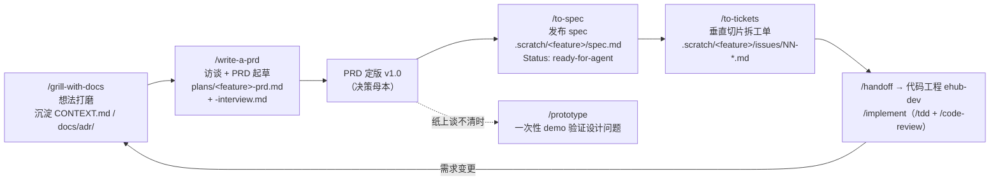

# ehub-ai-workbench PRD 文档工程

本工程是 [`ehub-ai-workbench`](../ehub-dev/ehub-ai-workbench) 服务（AI 工作台，对百炼大模型平台做二次封装）的**产品需求文档库**，与代码工程分离维护。

核心约定：**变更先改 PRD 再开发**；文档流程**严格按 skill 原生约束执行**。

## 目录结构

```
ehub-ai-workbench-prd/
├── README.md                # 本文件：项目说明、目录导航、文档约定
├── AGENTS.md                # 流程纪律（agent 必读：skill 原生链路 / tracker 配置 / 硬规则）
├── CONTEXT.md               # 领域模型（核心概念、关系、生命周期、不变量）
├── GLOSSARY.md              # 领域术语表（全工程统一用语）
├── plans/                   # PRD 母本 + 访谈记录（write-a-prd 原生产出）
│   ├── ai-chat-sse-prd.md   #   AI Chat v1 PRD（已定版 v1.2）
│   ├── chat-conversation-management-prd.md # 会话组与对话内容管理 PRD（v1.0）
│   ├── chat-conversation-content-prd.md    # 会话内容管理（只读查询）PRD（v1.0）
│   ├── scheduled-task-prd.md #   定时任务 PRD（v1.0）
│   ├── model-config-prd.md  #     模型配置管理 PRD（v1.0）+ model-config-interview.md（Q1–Q34）
│   └── customer-profile/    #   用户画像域（PRD v1.3 草案待审 + interview Q1–Q28）
│   （每个 feature 另有 <feature>-interview.md：Qn 问题原文/选项/推荐/用户答案，Qn 溯源单一事实源）
├── docs/
│   ├── agents/              # skill 配置（issue tracker / triage 标签 / 域文档 / work items）
│   └── adr/                 # ADR（跨模块持久技术决策，按需懒创建；当前尚无）
└── .scratch/                # 本地 markdown issue tracker（见 docs/agents/issue-tracker.md）
```

## 文档流程（skill 原生链路）



1. **想法打磨**：`/grill-with-docs` 拷问 + 沉淀 `CONTEXT.md` / ADR（仓库内一律用它，不用无状态的 `/grill-me`）
2. **PRD**：`/write-a-prd` 访谈 → `plans/<feature>-prd.md`（模板七节原样保留：Problem Statement / Solution / User Stories / Implementation Decisions / Testing Decisions / Out of Scope / Further Notes）；**访谈结束立即落盘** `plans/<feature>-interview.md`（Qn 溯源单一事实源，编号永不重排）
3. **技术决策**：接口契约、数据模型、架构取舍写入 PRD 的 Implementation Decisions 节；跨模块持久决策另落 ADR（`docs/adr/NNNN-*.md`），与 PRD/Qn 互链
4. **Spec**：`/to-spec` 把已对齐的对话综合成 spec，发布 `.scratch/<feature>/spec.md`（纯综合，不再访谈），`Status: ready-for-agent`
5. **工单**：`/to-tickets` 拆垂直切片工单，`.scratch/<feature>/issues/NN-<slug>.md`，阻塞关系 `Blocked by: NN`
6. **实现**：`/handoff` 压缩上下文交接到代码工程 `ehub-dev`，`/implement`（内含 `/tdd` + `/code-review`）；**实现类 skill 在代码工程目录下运行，本文档工程只承载需求**

> 前端 UI：无 skill 链路。视觉/交互决策进 PRD/ADR；细节在代码工程实现期处理。

## Skills 使用指南

本工程 `.agents/skills/` 部署了一整套 agent 工作流技能（Matt Pocock 系列）。**按情境选，不按命令记**——在对话里直接描述场景即可触发。

### 情境速查表

| 我处于什么情境 | 用哪个 skill | 说明 |
|---|---|---|
| 有个想法要打磨（在仓库里） | `/grill-with-docs` | 拷问 + 沉淀 `CONTEXT.md`/ADR，留纸面轨迹。**仓库内优先用它** |
| 有个想法要打磨（无仓库） | `/grill-me` | 同样拷问但无状态、不落盘 |
| 拷问收敛，出 PRD | `/write-a-prd` | 产出 `plans/<feature>-prd.md` 母本 + interview 落盘 |
| 某问题纸上谈不清（状态机/交互逻辑/UI 雏形） | `/prototype` | 一次性 demo 回答一个设计问题，结论回收进 PRD/ADR |
| 把当前对话直接定成 spec | `/to-spec` | 不再访谈，纯综合；发布 `.scratch/<feature>/spec.md` |
| 大活拆工单 | `/to-tickets` | 垂直切片 + 阻塞关系，适合多会话实现 |
| 按 spec/工单写代码 | `/implement` | 内部驱动 `/tdd`，收尾自动 `/code-review` 再提交（代码工程运行） |
| 只想测试先行写个行为 | `/tdd` | 红-绿-重构，不走全流程（代码工程运行） |
| 疑难 bug / 间歇性 flake / 回归 | `/diagnosing-bugs` | 先建"一条命令必红"反馈环再谈理论（代码工程运行） |
| 审查分支/PR 改动 | `/code-review` | 双轴（规范 + spec）并行评审（代码工程运行） |
| 正在 merge/rebase 冲突中 | `/resolving-merge-conflicts` | 按意图逐 hunk 解决，永不 `--abort` |
| 换会话/交接给同事 | `/handoff` | 压缩当前会话为交接文档 |
| 卡点在别人脑子里 | `/to-questionnaire` | 生成问卷发给对方填 |
| 阅读调研委托后台 | `/research` | 产出带引用的 md，边等边干 |
| 刚才那条没看懂 | `/wait-what` | 换平实语言 + 术语表重讲 |
| 跨会话学一个主题 | `/teach` | 当前目录作为教学工作区 |
| 只有我能做的步骤（密钥/控制台/割接） | `/wizard` | 生成交互式脚本带我走完 |
| 空闲做代码库保养 | `/improve-codebase-architecture` | 找"值得加深的模块"（代码工程运行） |
| 设计/评审模块形状 | `/codebase-design` | 深模块/seam/接口词汇（代码工程运行） |
| 术语混乱 / 要记重大决策 | `/domain-modeling` | 挑战模糊术语、记 ADR、维护 CONTEXT.md |
| 写给 agent 看的文档 | `/writing-for-agents` | skill/AGENTS.md 写作规范 |
| 处理别人提的 issue/PR | `/triage` | 分类 + 状态机 + agent-ready 工单 |
| 首次使用前配置 tracker | `/setup-matt-pocock-skills` | 已配置完成（本地 markdown tracker），通常无需重跑 |

## 约定

| 约定项 | 规则 |
|---|---|
| PRD 版本 | `v主.次`（定版后小改动升次版本） |
| 用语 | 以 `GLOSSARY.md` 为准，文档间术语保持一致 |
| 文件名 | PRD `plans/<feature>-prd.md`；访谈 `<feature>-interview.md`；ADR `docs/adr/NNNN-*.md`；spec `.scratch/<feature>/spec.md`；工单 `.scratch/<feature>/issues/NN-<slug>.md` |
| 决策可追溯 | 关键决策标注访谈问题号（如 Q5），问题原文见 `plans/<feature>-interview.md` |
| Tracker | 本地 markdown：`.scratch/<feature>/`（`docs/agents/issue-tracker.md` 为单一事实源） |
| 需求变更 | 先改 PRD / spec 再开发（母本在 `plans/`，spec 与工单在 `.scratch/`） |

## 当前文档索引

| 模块 | PRD 母本 | 状态 |
|---|---|---|
| AI 对话 v1 | `plans/ai-chat-sse-prd.md`（v1.2） | 已定版 |
| 会话组与对话内容管理 v1 | `plans/chat-conversation-management-prd.md`（v1.0） | 已定版 |
| 会话内容管理（只读查询）v1 | `plans/chat-conversation-content-prd.md`（v1.0） | 已定版，并入上模块实现 |
| 定时任务 v1 | `plans/scheduled-task-prd.md`（v1.0） | 已定版 |
| 模型配置管理 v1 | `plans/model-config-prd.md`（v1.0）+ `model-config-interview.md`（Q1–Q34） | 已定版 |
| 用户画像（新用户转化）v1 | `plans/customer-profile/customer-profile-prd.md`（v1.3 草案待审）+ `customer-profile-interview.md`（Q1–Q28） | PRD 草案待审 |
| 自研 Agent 对话（agent-chat） | —（启动时经 grill-with-docs + write-a-prd 起草） | v2 规划 |
