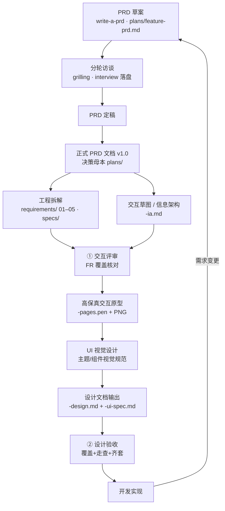
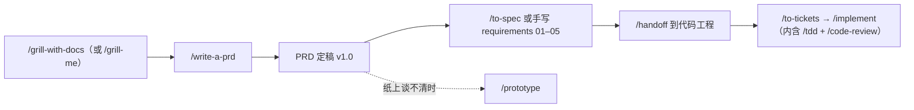

# ehub-ai-workbench PRD 文档工程

本工程是 [`ehub-ai-workbench`](../ehub-dev/ehub-ai-workbench) 服务（AI 工作台，对百炼大模型平台做二次封装）的**产品需求文档库**，与代码工程分离维护。

核心约定：**变更先改 PRD 再开发**。

## 目录结构

```
ehub-ai-workbench-prd/
├── README.md                # 本文件：项目说明、目录导航、文档约定
├── CHANGELOG.md             # 文档变更日志（按日期倒序）
├── GLOSSARY.md              # 领域术语表（全工程统一用语）
├── CONTEXT.md               # 领域模型（核心概念、关系、生命周期、不变量）
├── plans/                   # PRD 母本（write-a-prd 流程产出，访谈决策记录）
│   ├── ai-chat-sse-prd.md   #   AI Chat v1 PRD（已定版 v1.0）
│   ├── chat-conversation-management-prd.md # 会话组与对话内容管理 PRD（已定版 v1.0）
│   ├── chat-conversation-content-prd.md # 会话内容管理（只读查询）PRD（已定版 v1.0）
│   ├── scheduled-task-prd.md #  定时任务 PRD（已定版 v1.0；负载不均匀边界 + v2 看板计划见 r3）
│   ├── model-config-prd.md #    模型配置管理 PRD（已定版 v1.0）
│   └── customer-profile/  #   客户画像域（roadmap：sales 一期基础版本 / ops 二期，见 customer-profile-roadmap-interview.md）
│       ├── customer-profile-roadmap-interview.md # 排期决策 Q1–Q18 溯源（2026-08-26）
│       ├── ops/           #     运营画像 customer-profile-ops（定版 v1.3，二期排期）
│       │   ├── customer-profile-ops-prd.md
│       │   └── customer-profile-ops-interview.md # Q1–Q39 溯源
│       └── sales/         #     销售转化画像（定版 v1.3，客户画像一期基础版本）
│           ├── customer-profile-sales-prd.md
│           └── customer-profile-sales-interview.md # Q1–Q29 溯源（含 r2 修订）
│   （每个 feature 另有 <feature>-interview.md 访谈记录：Qn 问题原文/选项/推荐/用户答案，Qn 溯源的单一事实源）
├── requirements/            # 需求文档集（按功能模块组织）
│   ├── auth/                #   全工程通用约定（单一事实源）
│   │   └── 01-接口认证.md   #   接口认证：JWT / UserContext / 跨线程 / 失败错误
│   ├── web/                 #   全工程 Web 层通用约定（单一事实源）
│   │   ├── 01-响应包装.md   #   统一响应包装：SuccessResponse/TablePageResponse/FailedResponse/SkipWrapper
│   │   └── 02-错误与异常.md #   错误码 ErrorCodeEnum / ApiException / BaseException / ApiAssert
│   ├── ai-chat/             #   AI 对话模块
│   │   ├── 01-产品概述.md   #   问题、方案、用户、用户故事
│   │   ├── 02-功能需求.md   #   FR-xx 功能需求 + 验收标准
│   │   ├── 03-接口规范.md   #   POST /chat/sse 接口与 SSE 事件协议
│   │   ├── 04-数据模型.md   #   ai_conversation / ai_conversation_content
│   │   └── 05-非功能需求与风险.md # NFR-xx + R-xx
│   └── chat-conversation/   #   会话组与对话内容管理模块
│       ├── 01-产品概述.md   #   问题、方案、用户、用户故事
│       ├── 02-功能需求.md   #   FR-01~04 管理接口
│       ├── 03-接口规范.md   #   列表/重命名/删除/历史查询四接口
│       ├── 04-数据模型.md   #   逻辑删除语义、内容行保留
│       └── 05-非功能需求与风险.md # NFR-xx + R-xx
│   └── scheduled-task/      #   定时任务模块（已全量拆解）
│       ├── 01-产品概述.md   #   问题、方案、用户、用户故事、术语
│       ├── 02-功能需求.md   #   FR-01~08（六接口 + 调度行为 + type 过滤修正）
│       ├── 03-接口规范.md   #   /task 六接口契约与示例
│       ├── 04-数据模型.md   #   ai_scheduled_task 建表 + 既有表扩展用法
│       └── 05-非功能需求与风险.md # NFR-xx + R-xx（多实例、池满、成本）
├── specs/                   # 实现 spec（约束实现的技术决策）
│   ├── ai-chat-spec.md      #   实现决策、测试决策、现状差距清单
│   └── chat-conversation-spec.md # 管理接口实现决策、测试决策、差距清单
├── designs/                 # 设计产物（交互 + UI + 模块设计，见「文档流程」，按模块分目录）
│   ├── architecture.md      #   后端总体架构一页纸：模块组装/共享枢纽/部署视图/新模块接入清单
│   ├── ui-baseline.md       #   工程 UI 基线（founding）：token/状态色规则/布局范式/治理，各模块 ui-spec 必须继承
│   ├── web/                 #   前端全局设计（与 requirements/web/ 后端横切约定呼应）
│   │   ├── 01-应用外壳与导航.md # 外壳结构/导航表/路由表/布局规格（外壳唯一事实源，内嵌 app-shell-wireframe.pen+PNG 草图）
│   │   └── 02-前端工程规范.md # API client 解包/错误码段处理/SSE 消费/状态管理（构建与目录随 ehub-web 现有工程）
│   ├── <feature>/           #   模块设计目录（与 requirements/<feature> 对应）
│   │   ├── <feature>-ia.md  #     交互草图/信息架构 + 交互评审结论
│   │   ├── <feature>-pages.pen #  高保真交互原型（Element Plus 风格，附 PNG 预览）
│   │   ├── <feature>-ui-spec.md # UI 设计文档（主题/组件视觉规范）
│   │   └── <feature>-design.md #  模块设计文档（模块/seam/状态机/线程模型，D-xx + 设计验收小节）
│   ├── ai-chat/             #   AI 对话模块设计（-design.md：轮次状态机、线程模型、设计验收；
│   │                        #   -ia.md 交互草图三态画板+关卡①；-pages.pen 高保真原型 3 画板 + page-p*.png；
│   │                        #   -ui-spec.md 继承工程 UI 基线；关卡②已过，可进开发）
│   ├── chat-conversation/   #   管理模块设计（-design.md：归属校验状态机、设计验收；
│   │                        #   -ia.md 列表栏/重命名/删除/历史回看+关卡①；-pages.pen 3 画板 + page-p*.png；
│   │                        #   -ui-spec.md 继承工程 UI 基线；关卡②已过，可进开发）
│   └── scheduled-task/      #   任务模块设计（-design.md：调度状态机、抢占时序、线程模型、D-xx、设计验收小节；
                             #   -ia.md 信息架构+关卡①结论；-ui-spec.md UI 设计文档（继承工程 UI 基线）；
                             #   -wireframe.pen 低保真草图 5 画板 + 同名导出 PNG（ia.md 内嵌引用）；
                             #   -pages.pen 高保真原型 5 画板 + page-p*.png；关卡②已过，可进开发；
                             #   prototype-*.html 状态机验证原型）
│   └── model-config/       #   模型配置管理（纯后端 admin 模块，无前端设计链路）
│   └── agent-chat/         #   自研 Agent 对话（v2 规划，未启动；目录待 write-a-prd 创建）
```

## 文档流程（标准链路，2026-08-22 定案）

**主线**：PRD草案 → PRD定稿 → 正式PRD文档 → 【产品交互设计】→【UI设计文档】→ 设计验收 → 开发实现；两段【】展开为设计子链：**交互草图/信息架构 → 交互评审 → 高保真交互原型 → UI视觉设计 → 设计文档输出**。



1. **PRD 草案**：新功能用 `write-a-prd` 流程在 `plans/<feature>-prd.md` 起草 PRD 草案
2. **PRD 定稿**：`grilling` 分轮拷问、结论逐轮回填；访谈结束即落盘 `plans/<feature>-interview.md`（问答原文，Qn 溯源的单一事实源）；终审通过即定稿
3. **正式 PRD 文档**：定版 `v1.0`，作为决策母本保留在 `plans/`
4. **交互草图/信息架构**：页面清单、信息架构、任务流与低保真线框落 `designs/<feature>/<feature>-ia.md`
5. **交互评审（关卡①）**：对照 `requirements/` FR-xx 逐条核对页面/流程覆盖，评审结论回填 `-ia.md` 后方可进入高保真
6. **高保真交互原型**：Element Plus 风格 `designs/<feature>/<feature>-pages.pen`，导出 PNG 预览供评审
7. **UI 视觉设计**：主题变量、色彩/字体/间距、组件状态与视觉稿，素材沉淀进 UI 设计文档
8. **设计文档输出**：模块设计 `designs/<feature>/<feature>-design.md`（D-xx）+ UI 设计文档 `designs/<feature>/<feature>-ui-spec.md`
9. **设计验收（关卡②）**：FR/NFR 覆盖检查 + 原型走查 + 文档齐套（PRD / requirements / ia / 原型 / ui-spec / design），验收结论回填 `design.md` 验收小节，通过后进入开发
10. **开发实现**：按 spec 差距清单 + design + 交互/UI 设计开发；需求变更先改文档再动代码，记 `CHANGELOG.md`

> 工程拆解（requirements 01–05 / specs）在正式 PRD 后与交互设计**并行**推进：拆解产出的 FR-xx 是关卡①的核对清单，模块设计文档（`-design.md`）在「设计文档输出」阶段一并定稿。

## Skills 使用指南

本工程 `.agents/skills/` 部署了一整套 agent 工作流技能（Matt Pocock 系列）。**按情境选，不按命令记**——在对话里直接描述场景即可触发。与「文档流程」的咬合关系见文末。

### 情境速查表

| 我处于什么情境 | 用哪个 skill | 说明 |
|---|---|---|
| 有个想法要打磨（在仓库里） | `/grill-with-docs` | 拷问 + 沉淀 `CONTEXT.md`/ADR，留纸面轨迹。**仓库内优先用它** |
| 有个想法要打磨（无仓库） | `/grill-me` | 同样拷问但无状态、不落盘 |
| 拷问收敛，出 PRD | `/write-a-prd` | 产出 `plans/<feature>-prd.md` 母本 + interview 落盘 |
| 某问题纸上谈不清（状态机/交互逻辑/UI 雏形） | `/prototype` | 一次性 demo 回答一个设计问题，结论回收进正式文档 |
| 把当前对话直接定成 spec | `/to-spec` | 不再访谈，纯综合；模板与 requirements 01–05 高度重合 |
| 大活拆工单 | `/to-tickets` | 垂直切片 + 阻塞关系，适合多会话实现 |
| 按 spec/工单写代码 | `/implement` | 内部驱动 `/tdd`，收尾自动 `/code-review` 再提交 |
| 只想测试先行写个行为 | `/tdd` | 红-绿-重构，不走全流程 |
| 绿地项目/巨型模糊工程 | `/wayfinder` | 先画决策地图再谈实现，最重慎用 |
| 疑难 bug / 间歇性 flake / 回归 | `/diagnosing-bugs` | 先建"一条命令必红"反馈环再谈理论 |
| 审查分支/PR 改动 | `/code-review` | 双轴（规范 + spec）并行评审 |
| 正在 merge/rebase 冲突中 | `/resolving-merge-conflicts` | 按意图逐 hunk 解决，永不 `--abort` |
| 换会话/交接给同事 | `/handoff` | 压缩当前会话为交接文档 |
| 卡点在别人脑子里 | `/to-questionnaire` | 生成问卷发给对方填 |
| 阅读调研委托后台 | `/research` | 产出带引用的 md，边等边干 |
| 刚才那条没看懂 | `/wait-what` | 换平实语言 + 术语表重讲 |
| 跨会话学一个主题 | `/teach` | 当前目录作为教学工作区 |
| 只有我能做的步骤（密钥/控制台/割接） | `/wizard` | 生成交互式脚本带我走完 |
| 空闲做代码库保养 | `/improve-codebase-architecture` | 找"值得加深的模块" |
| 设计/评审模块形状 | `/codebase-design` | 深模块/seam/接口词汇——design 文档用语来源 |
| 术语混乱 / 要记重大决策 | `/domain-modeling` | 挑战模糊术语、记 ADR、维护 CONTEXT.md |
| 写给 agent 看的文档 | `/writing-for-agents` | skill/AGENTS.md 写作规范 |
| 处理别人提的 issue/PR | `/triage` | 分类 + 状态机 + agent-ready 工单 |
| 首次使用前配置 tracker | `/setup-matt-pocock-skills` | `/to-spec`、`/to-tickets`、`/triage` 的前置 |

### 与文档流程的咬合



要点：

1. **拷问入口统一走 `/grill-with-docs`**（本工程即工作目录）——同一拷问原语，但沉淀 `CONTEXT.md`/ADR，与「决策可追溯」约定契合；`/grill-me` 留给无仓库场景
2. **`/prototype` 垫在交互草图之前**——cron 交互、状态机这类说不清的问题先做一次性 demo 验证，结论再进 `-ia.md`/`-pages.pen`
3. **`/to-spec` 模板 ≈ requirements 01–05**——下次拆解可直接用它生成，再按序号归档
4. **进入开发后**：在代码仓库（`ehub-dev`）用 `/to-tickets` → `/implement`，自动 tdd + code-review + 提交，形成闭环
5. 实现类 skill（`/implement` `/tdd` `/code-review` `/diagnosing-bugs`）在**代码工程**目录下运行，本文档工程只承载需求与设计

## 约定

| 约定项 | 规则 |
|---|---|
| 需求编号 | `FR-xx` 功能需求 / `NFR-xx` 非功能需求 / `R-xx` 风险，模块内全局递增不复用 |
| 设计编号 | `D-xx` 设计决策，`designs/` 内递增；访谈溯源用母本问题号 `Qxx` |
| 版本 | PRD 用 `v主.次`（定版后小改动升次版本）；文档集整体演进记入 CHANGELOG |
| 用语 | 以 `GLOSSARY.md` 为准，文档间术语保持一致 |
| 文件名 | 需求文档用 `序号-中文名.md`；spec 用 `<feature>-spec.md`；信息架构 `-ia.md`、原型 `-pages.pen`、UI 设计文档 `-ui-spec.md`、模块设计 `-design.md` |
| 决策可追溯 | 关键决策标注访谈问题号（如 Q5），问题原文见 `plans/<feature>-interview.md` |

## 当前文档索引

| 模块 | PRD 母本 | 需求文档 | Spec | Design | 状态 |
|---|---|---|---|---|---|
| 接口认证（全工程通用） | — | `requirements/auth/01-接口认证.md` | — | — | 已定版（单一事实源） |
| Web 层约定（全工程通用） | — | `requirements/web/01~02` | — | — | 已定版（单一事实源，实现规则见代码工程 skill `web-conventions`） |
| AI 对话 v1 | `plans/ai-chat-sse-prd.md` (v1.0) | `requirements/ai-chat/01~05` | `specs/ai-chat-spec.md` | `designs/ai-chat/`：`-design.md`（关卡②通过）+ `-ia.md`（关卡①通过）+ `-pages.pen`（高保真 3 画板）+ `-ui-spec.md`（继承 `designs/ui-baseline.md`） | **已定版，设计链路全部通过，可进开发** |
| 会话组与对话内容管理 v1 | `plans/chat-conversation-management-prd.md` (v1.0) | `requirements/chat-conversation/01~05` | `specs/chat-conversation-spec.md` | `designs/chat-conversation/`：`-design.md`（关卡②通过）+ `-ia.md`（关卡①通过）+ `-pages.pen`（高保真 3 画板）+ `-ui-spec.md`（继承 `designs/ui-baseline.md`） | **已定版，设计链路全部通过，可进开发** |
| 会话内容管理（只读查询）v1 | `plans/chat-conversation-content-prd.md` (v1.0) | —（与上 FR-04 同一接口） | — | `designs/chat-conversation/chat-conversation-design.md` §7.1（承接） | 已定版，待开发（并入上实现） |
| 定时任务 v1 | `plans/scheduled-task-prd.md` (v1.0) | `requirements/scheduled-task/`（01–05 全量） | —（决策内嵌 design D1–D10） | `designs/scheduled-task/`：`-design.md`（关卡②通过）+ `-ia.md`（关卡①通过）+ `-ui-spec.md`（继承 `designs/ui-baseline.md`）+ `-wireframe.pen`（草图 5 画板）+ `-pages.pen`（高保真原型 5 画板） | **已定版，设计链路全部通过，可进开发** |
| 模型配置管理 v1 | `plans/model-config-prd.md` (v1.0) + `plans/model-config-interview.md`（Q1–Q34） | `requirements/model-config/`（01–05） | — | —（纯后端 CRUD，无前端设计链路） | **已定版，可进开发**（仅后端接口与表结构） |
| 客户画像（销售转化画像）**一期基础版本** | `plans/customer-profile/sales/customer-profile-sales-prd.md` (v1.3，含 r4 排期修订) + `customer-profile-sales-interview.md`（Q1–Q29）+ [roadmap 访谈](plans/customer-profile/customer-profile-roadmap-interview.md) | `requirements/customer-profile/sales/`（01–05） | — | `designs/customer-profile/sales/sales-profile-ia.md`（v1.3）+ `customer-profile-ia.pen`（高保真三画板 + PNG ×3，交付宿主方）+ skill 镜像位 | **PRD 已定版（客户画像一期）**；下一步：契约定稿（03 §3 与 MCP 团队，含字段弃用/新增对齐）；前端不挂钩 ehub-web，由宿主业务系统承载；一期 MCP 仅交付 3 数据工具 |
| 客户画像（运营画像）**二期** | `plans/customer-profile/ops/customer-profile-ops-prd.md` (v1.3，r5 改名+二期排期) + `customer-profile-ops-interview.md`（Q1–Q39） | `requirements/customer-profile/ops/`（01–05，**二期冻结基线**） | — | `designs/customer-profile/ops/`（画像技能镜像 `profiling-skill.md` 待二期重启后落盘） | **二期排期（2026-08-26 roadmap）**；启动双条件：运营侧认领 + MCP 统计服务立项；重启时按 PRD 复核清单逐项复核（T2 档位/规则阈值/窗口） |
| 自研 Agent 对话（agent-chat） | —（v2 启动时经 write-a-prd + grilling 起草） | — | — | — | **v2 规划**（独立模块：第三方模型对话接口、Provider 适配器；依赖 model-config v1 基础设施；`GET /chat/models` 届时迁移并入） |

> 标准链路（2026-08-22 定案，此后所有新模块照此执行）：**PRD草案 → PRD定稿 → 正式PRD文档 → 交互草图/信息架构 → 交互评审 → 高保真交互原型 → UI视觉设计 → 设计文档输出 → 设计验收 → 开发实现**；工程拆解（requirements/specs）在正式 PRD 后并行。定时任务 v1 初版原型跳过了草图/评审两步，2026-08-24 废弃重启并已全链路补齐：草图（ia.md + wireframe.pen）✅、关卡① ✅、UI 基线（`designs/ui-baseline.md`，自 scheduled-task-ui-spec 提炼）✅、高保真原型（pages.pen）✅、关卡② ✅、**可进开发**；ai-chat / chat-conversation 前端设计链路已于 2026-08-24 按新链路补齐（草图 ia.md ✅、关卡① ✅、高保真 pages.pen ✅、ui-spec ✅、关卡② ✅，均继承 `designs/ui-baseline.md` UI 基线），**可进开发**——三模块前端全部就绪。
