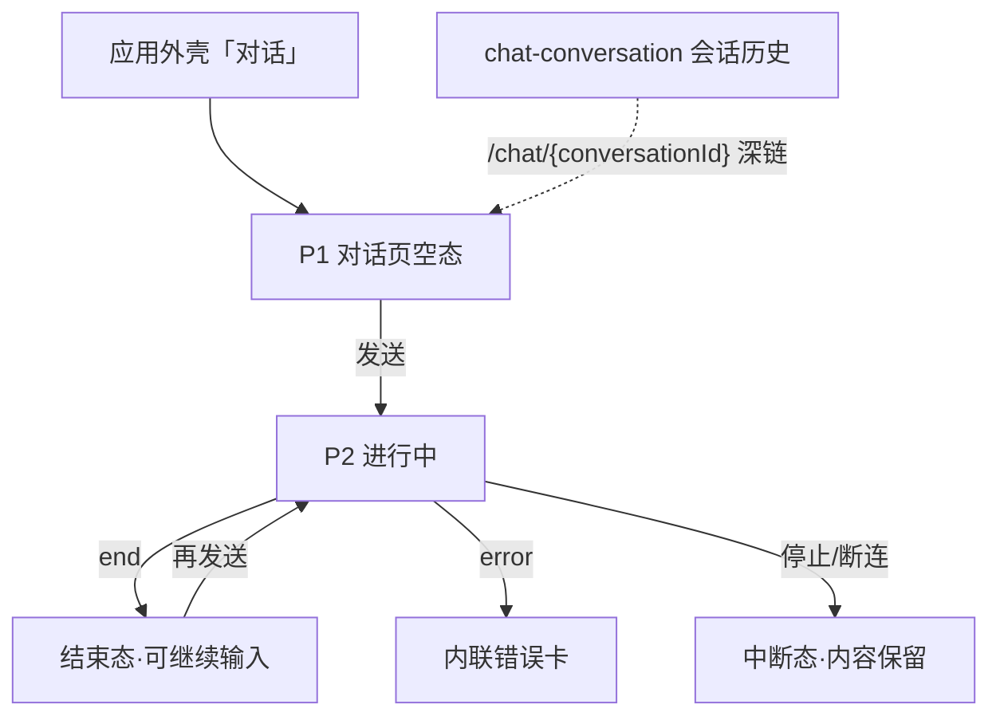

# AI 对话 — 交互草图 / 信息架构

> 模块：ai-chat ｜ 关联：PRD 母本 `plans/ai-chat-sse-prd.md`（v1.0）｜ 需求 `requirements/ai-chat/01~05` ｜ 状态：**定稿 r1（2026-08-24，关卡①通过）**
>
> 🖊 **草图文件**：`ai-chat-wireframe.pen`（同目录）——P1/P2/P3 + 错误 toast 四画板，与本文 §3 一一对应；色彩 token 遵循 `../ui-baseline.md` §2。
>
> 🖌 **高保真原型**（已产出）：`ai-chat-pages.pen`（同目录）——导出 PNG（`page-p1-empty.png` / `page-p2-streaming.png` / `page-p3-error-interrupted.png`，scale 2）；「`.pen` 为唯一源，修改后须重导同名 PNG」。
>
> 边界承接：PRD Out of Scope 会话组列表/重命名/删除/历史查询接口属 chat-conversation 模块——本模块页面**不含**管理面，仅对话面；断线重连/续传不做（v1），中断即终局。

## 1. 设计定位

- 对话页是应用外壳导航第一项「对话」（`../web/01-应用外壳与导航.md` §2），全屏单页对话界面。
- 流式体验核心：输入即发、增量渲染、三事件分支（`message`/`error`/`end`）——交互侧不感知百炼，只消费 SSE 事件协议（`specs/ai-chat-spec.md` §2.4）。
- 用户角色单一（业务用户），无角色分支。

## 2. 页面清单

| # | 页面/状态 | 形态 | 承载 FR | 草图 |
|---|---|---|---|---|
| P1 | 对话页（空态/新会话） | 独立页面（外壳内 `/chat`） | FR-01/02/09 | §3.1 |
| P2 | 对话页（进行中） | 同页消息流 + 输入区 | FR-01/03/04 | §3.2 |
| P3 | 对话页（错误/中断态） | 同页内联错误 | FR-06/07/08 | §3.3 |
| — | 入参错误 toast | toast（非页面） | FR-09 | §3.3 |

**页面策略**：单页三态（空态→进行中→结束/错误），无独立子路由——续聊深链为 `/chat/{conversationId}`（`conversationId` 拼在路由路径中，与 `/chat` 同组件仅定位差异；外壳 01 §3），v1 由跳转方拼接。

## 3. 线框

### 3.1 P1 对话页（空态/新会话）

```
┌──────────────────────────────────────────────────┐
│                                                  │
│              （居中引导区）                        │
│         你好，我是 AI 助手，有什么可以帮你？          │
│                                                  │
│ ┌──────────────────────────────────────────────┐ │
│ │ [输入框：输入你的问题，Enter 发送 / Shift+Enter 换行] │ │
│ │                                [发送按钮]      │ │
│ └──────────────────────────────────────────────┘ │
└──────────────────────────────────────────────────┘
```

要点：

- 空态无历史消息：居中欢迎文案 + 底部输入区（吸底，max-width 居中）
- 不传 `conversationId` 发送 = 隐式建组（FR-02），组名取首条 prompt——用户无感知
- `prompt` 空白/超 8000 字时发送禁用（前置），服务端 PARAM_ERROR 兜底 toast（FR-09）

### 3.2 P2 对话页（进行中）

```
┌──────────────────────────────────────────────────┐
│ ↑ 消息流（纵向滚动，自动滚底）                      │
│ ┌─ 用户气泡（右侧，primary 底）────────────────┐   │
│ │ 帮我汇总本周的销售数据                          │   │
│ └─────────────────────────────────────────────┘   │
│ ┌─ 助手气泡（左侧，blank 底）──────────────────┐   │
│ │ 本周销售数据如下：▌（增量渲染，光标闪烁）        │   │
│ └─────────────────────────────────────────────┘   │
│ ╴╴╴ 流结束后：助手气泡尾部 token 汇总（次要文本）╴╴  │
│ [输入框（流式期间禁用）]                  [停止]    │
└──────────────────────────────────────────────────┘
```

要点：

- 首个 `message` 分片携带 `conversationId`，前端立即纳入当前会话上下文（FR-01 验收 3）
- 流式期间输入区禁用、发送变「停止」（abort 主动中断，FR-06/08 语义：中断即终局，已收内容保留渲染）
- `end` 事件后：流式光标消失，助手气泡尾部展示 `inputToken/outputToken` 汇总（FR-01 验收 2）
- 续聊（FR-03/04）：从会话历史进入（`/chat/{conversationId}`）时消息流回填历史，上下文由百炼 sessionId 维持，前端不组装

### 3.3 P3 错误/中断态 + 入参 toast

```
┌─ 助手气泡（错误态）────────────────────────┐
│ ⚠ 回复出错，请稍后重试                       │
│ （服务端 error 事件：{code,message}）        │
└───────────────────────────────────────────┘
  ⚠ toast: 请输入内容后再发送（PARAM_ERROR 例）
```

- `error` 事件 → 助手位内联错误卡（danger 边框），流终止；错误 toast 规则走 `../web/02-前端工程规范.md` §3
- 断连/主动停止：已收部分保留、无错误卡（区别于百炼失败），气泡尾部标注「已中断」

## 4. 信息架构



- 单页状态机：空态 → 进行中 ⇄ 结束态；错误/中断为进行中的终局分支
- 会话历史深链入口由 chat-conversation 模块提供（本模块只消费参数）

## 5. 状态展示表

| 流状态 | 触发 | 呈现 |
|---|---|---|
| streaming | 发送后收到分片 | 助手气泡增量渲染 + 流式光标 ▌ + 输入区禁用 + 「停止」 |
| done | `end` 事件 | 光标消失 + token 汇总（secondary）+ 输入区恢复 |
| error | `error` 事件 | 内联错误卡（danger 边框）+ 输入区恢复 |
| interrupted | abort/断连 | 已收内容保留 + 「已中断」标注 + 输入区恢复 |
| empty | 无历史且未发送 | 居中欢迎文案 |

## 6. 关卡① — 交互评审（FR 覆盖核对）

> 评审基准：`requirements/ai-chat/02-功能需求.md` FR-01~09。

| FR | 草图覆盖 | 结论 |
|---|---|---|
| FR-01 流式回复 | P2 增量渲染 + end 汇总 | ✅ |
| FR-02 隐式建组 | P1 空态直发（无建组步骤） | ✅ |
| FR-03 续聊归属 | 深链回填 + NOT_FOUND toast 承接 | ✅ |
| FR-04 百炼记忆 | 非界面可观察（服务端域） | ➖ 正确排除 |
| FR-05/06/07 落库 | 非界面可观察；中断/错误以终局态呈现 | ➖ 正确排除（呈现见 P3） |
| FR-08 断连回收 | 「停止」按钮 = 主动 abort；被动断连同终局 | ✅ |
| FR-09 入参校验 | 发送禁用前置 + toast 兜底 | ✅ |

**评审结论：通过。**

随图设计决策：

1. 单页三态状态机（空态/进行中/终局），无子路由
2. 流式期间输入区禁用 + 发送⇄停止切换
3. 中断与错误分呈现：中断无错误卡、错误有内联卡
4. token 汇总随 end 事件展示于助手气泡尾部
