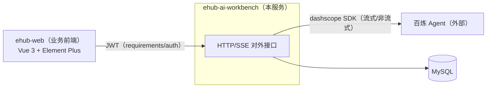
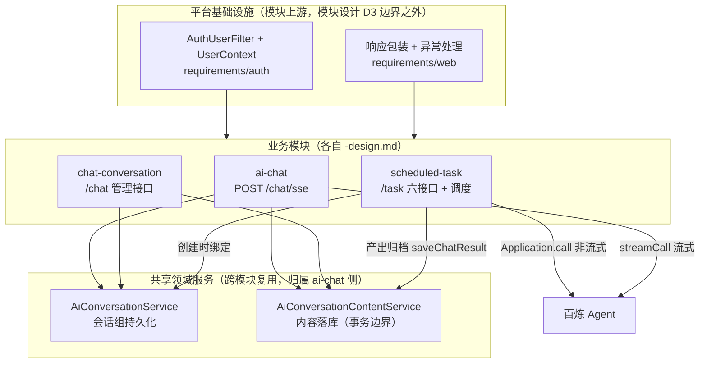
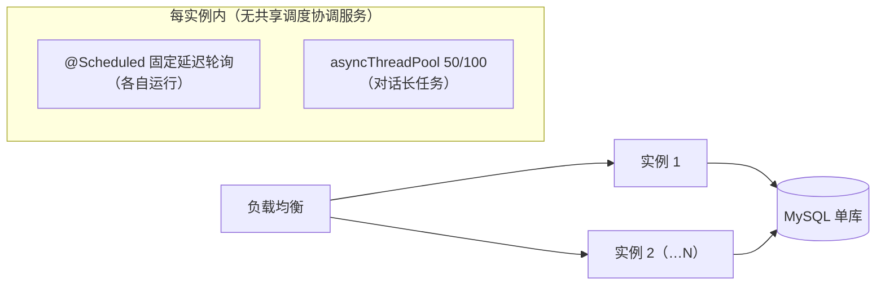

# 后端总体架构 — 一页纸

> 范围：ehub-ai-workbench 服务整体 ｜ 状态：**r1（2026-08-24）**
>
> 本文是**服务级总体架构的单一事实源**：模块组装、共享基础设施、部署视图。此前这些信息散在各模块设计的「设计总览」（ai-chat §1 / chat-conversation §1 / scheduled-task §1），无全局参照——本文收拢，**不改变任何模块设计**，冲突时以模块设计为准并回改本文。模块内部（状态机/线程模型/决策）不在本文重复，见各 `-design.md`。

## 1. 系统上下文

- 单服务 `ehub-ai-workbench`；智能能力全部经百炼 Agent（本服务不拥有 Agent 编排）。
- 前端工程规范与外壳见 `designs/web/01/02`（前端侧不属于本服务）。

## 2. 模块组装

要点：

- **两个复用枢纽**：`AiConversationService`（会话组）与 `AiConversationContentService`（内容 + 事务边界）由 ai-chat 建立，chat-conversation 与 scheduled-task 原样复用，**不新增平行服务**——这是三模块设计的共同决策（各 -design.md 模块清单）。
- **百炼两种调用形态**：流式 `streamCall`（ai-chat，对话）、非流式 `Application.call`（scheduled-task，任务执行）；SDK 直连，无统一 agent 网关层（v1 量级不需要）。
- 定时任务的会话组绑定发生在**创建时**（TaskService 内校验归属并绑定），执行侧只写内容。

## 3. 数据存储

| 表 | 模块 | 说明 |
|---|---|---|
| `ai_conversation` | 共享（ai-chat 建） | 会话组；定时任务创建时插入专属组 |
| `ai_conversation_content` | 共享（ai-chat 建） | 对话内容；任务产出经 `saveChatResult` 归档 |
| `ai_scheduled_task` | scheduled-task | 任务 + 执行状态 + 最近结局摘要 |

- 单库 MySQL，无跨库事务；内容归档的事务边界收敛在 `AiConversationContentService`。
- 逻辑删除语义统一（is_del），见 `CONTEXT.md` 与各 04-数据模型。

## 4. 部署视图（多实例）

- **水平多实例是默认部署形态**：对话（SSE）与任务（调度）在任何实例上均可服务。
- **多实例互斥不靠中央协调**：任务到期抢占用**行级原子 UPDATE 守卫**（单语句、影响行数判定），谁抢到谁执行（scheduled-task-design §4 抢占时序）——调度器无需 leader 选举/分布式锁中间件。
- **执行不受实例生命周期绑定**：实例崩溃时在途任务靠**僵死复位**（超时释放执行占用，CONTEXT.md）恢复，不迁移任务。
- 对话长任务跑在实例内 `asyncThreadPool`（50/100），断连由 SSE 回调回收（ai-chat-design §3/§4）；跨线程用户上下文按「捕获-重建」（requirements/auth §3）。

## 5. 技术栈基线（后端）

- Java + Spring Boot；HTTP/SSE 同服务暴露；dashscope SDK；MySQL；`@Scheduled` 内建调度。
- 认证/包装/错误码基础设施已成型（`requirements/auth`、`requirements/web`，对应代码工程 `core.web` 等）。
- v1 无消息队列、无缓存层、无独立调度服务——量级依据见各 PRD（每用户 ≤20 任务等）。

## 6. 新模块接入清单

1. 走标准链路（PRD → requirements → 设计子链）产出模块产物
2. 对外接口经统一认证/包装/错误码（不另建）
3. 会话/内容相关需求优先复用两个共享枢纽，不建平行服务
4. 百炼调用按需选流式/非流式，SDK 直连
5. 本文 §2/§3 增补一行登记
