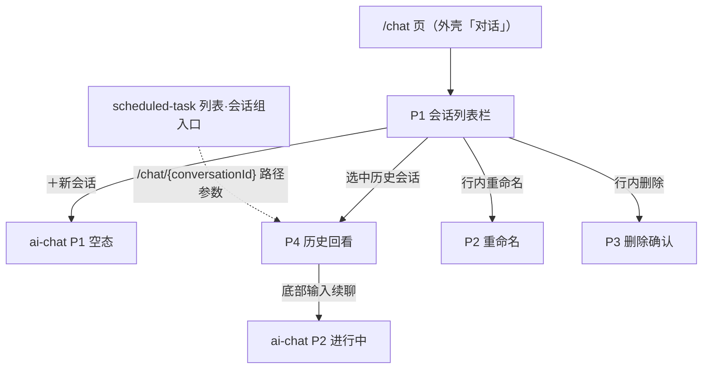

# 会话组与对话内容管理 — 交互草图 / 信息架构

> 模块：chat-conversation ｜ 关联：PRD 母本 `plans/chat-conversation-management-prd.md`（v1.0）｜ 需求 `requirements/chat-conversation/01~05` ｜ 状态：**定稿 r1（2026-08-24，关卡①通过）**
>
> 🖌 **高保真原型**（已产出）：`chat-conversation-pages.pen`（同目录）——导出 PNG（`page-p1-list-history.png` / `page-p2-rename.png` / `page-p3-delete.png`，scale 2；P4 历史回看与 P1 同画板呈现——同页嵌合）；「`.pen` 为唯一源，修改后须重导同名 PNG」。
>
> 边界承接：本模块为对话**管理面**（列表/重命名/删除/历史回看），对话面属 ai-chat；两模块共用 `/chat` 前缀与 `ai_conversation` 两表，前端在导航上合并为「对话」入口（外壳 01 §2：对话=ai-chat 前端 + 本模块管理界面）。

## 1. 设计定位

- 管理界面挂载于 `/chat` 页内（非独立导航项）：对话页左侧**会话列表栏**承载 FR-01/02/03，选中会话的主区即历史回看（FR-04）。
- 查看历史会话的路由形态为 **`/chat/{conversationId}`（路径参数）**：选中会话即把 `conversationId` 写入路由路径（非 query 参数），刷新/深链直达定位；`/chat`（无参）= 新会话空态。
- 与 ai-chat 前端同页协作：选中新会话/历史会话 → 主区切换对话面（ai-chat P1/P2）；本模块只负责列表与内容展示，SSE 交互全部复用 ai-chat 前端。
- v1 列表不含「最近一条消息摘要」（Out of Scope）、无置顶/搜索。

## 2. 页面清单

| # | 页面/组件 | 形态 | 承载 FR | 
|---|---|---|---|
| P1 | 会话列表栏（含空态） | `/chat` 页左侧栏 | FR-01 |
| P2 | 重命名对话框 | 行内弹窗 | FR-02 |
| P3 | 删除确认 | 确认对话框 | FR-03 |
| P4 | 历史消息回看 | 选中会话的主区 | FR-04 |

## 3. 线框

### 3.1 P1 会话列表栏

```
┌──────────────┬─────────────────────────────┐
│ [＋新会话]    │  主区（ai-chat 对话面 / 历史） │
│──────────────│                             │
│ 会话A（选中）  │  FR-04 历史回看：            │
│ 会话B        │  ┌─ 用户气泡（右）────────┐   │
│ 会话C        │  │ …                     │   │
│ （空态：      │  └───────────────────────┘   │
│  还没有会话，  │  ┌─ 助手气泡（左）+token──┐   │
│  点击新会话）  │  └───────────────────────┘   │
│──────────────│  （分页加载更多）              │
│ 共 n 条 ‹ 1 › │                             │
└──────────────┴─────────────────────────────┘
```

要点：

- 列表项仅元信息（name/type/crt_time），无消息摘要（Out of Scope）
- 行操作：悬停浮现「重命名 / 删除」（text button）；选中项高亮
- 空列表 total=0 呈现空态引导而非错误（FR-01 验收 4）

### 3.2 P2 重命名

```
┌─ 重命名会话 ──────────────┐
│ 会话名称 [____________]    │
│ （≤100，必填；行内校验）     │
│           [取消] [保存]    │
└──────────────────────────┘
```

### 3.3 P3 删除确认

```
┌─ 删除会话 ─────────────────────────┐
│ 确认删除「会话A」？                  │
│ · 仅从列表移除，历史内容仍保留可追溯  │
│ · 若该会话正在对话，不受影响          │
│                    [取消] [删除]     │
└───────────────────────────────────┘
```

- 文案=语义后果声明（基线 §4.3）：逻辑删除不物理清内容（FR-03 验收 2）、进行中 SSE 不取消（Out of Scope）

### 3.4 P4 历史回看

- 选中会话主区按 `id` 升序渲染完整历史（user/assistant 气泡，assistant 含 token 用量，secondary 尾注）
- 分页向上加载更多（size ≤50）；内部列（tools/params/media）不展示（FR-04 验收 3）
- 历史尾部 = ai-chat 输入区：**续聊入口**（FR-03 续聊语义的消费端）——直接输入即在该组继续（透传 sessionId，上下文由百炼维持）

## 4. 信息架构



- 与 ai-chat 前端同页嵌合：本模块出列表栏与历史渲染，ai-chat 出输入区与 SSE 消费
- 定时任务列表的「会话组入口」深链在此激活（`scheduled-task-ia.md` §4 预留位兑现），形态 `/chat/{conversationId}`——`conversationId` 拼在路由路径中（非 query）

## 5. 状态展示表

| 状态 | 呈现 |
|---|---|
| 会话选中 | 列表项 primary 背景高亮 |
| 空列表 | 空态引导（total=0 非错误） |
| 重命名校验失败 | 行内红字（空白/超长），PARAM_ERROR toast 兜底 |
| 删除中会话被引用 | NOT_FOUND「会话不存在」toast（归属校验统一口径） |

## 6. 关卡① — 交互评审（FR 覆盖核对）

| FR | 草图覆盖 | 结论 |
|---|---|---|
| FR-01 列表 | P1（分页/元信息/空态/type 过滤） | ✅ |
| FR-02 重命名 | P2（行内校验 + PARAM_ERROR 兜底） | ✅ |
| FR-03 删除 | P3（语义后果两条） | ✅ |
| FR-04 历史查询 | P4（升序/分页/token/续聊入口） | ✅ |
| 归属口径 | NOT_FOUND toast 统一承接 | ✅ |

**评审结论：通过。**

随图设计决策：

1. 管理面与对话面同页嵌合（列表栏 + 主区），不设独立导航项
2. 历史回看尾部即续聊入口（两模块交互无缝拼接的唯一胶点）
3. 行操作悬停浮现，选中态 primary 高亮
4. 删除确认文案对齐逻辑删除语义（内容保留、在途不取消）
