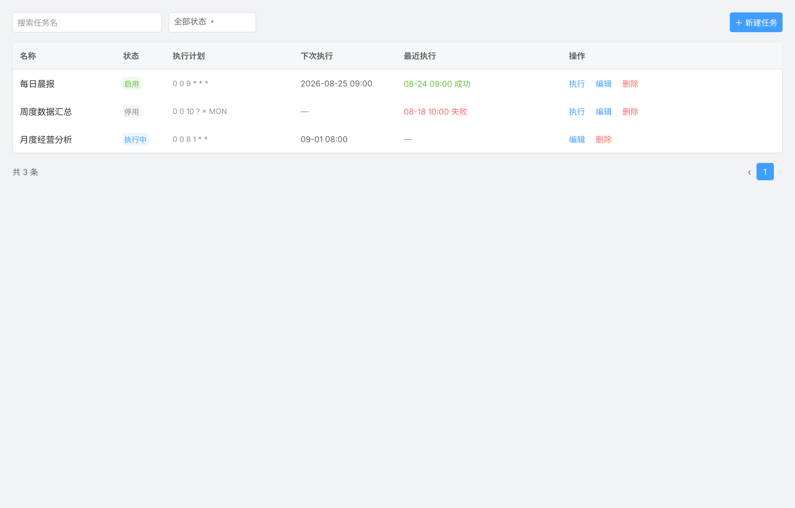
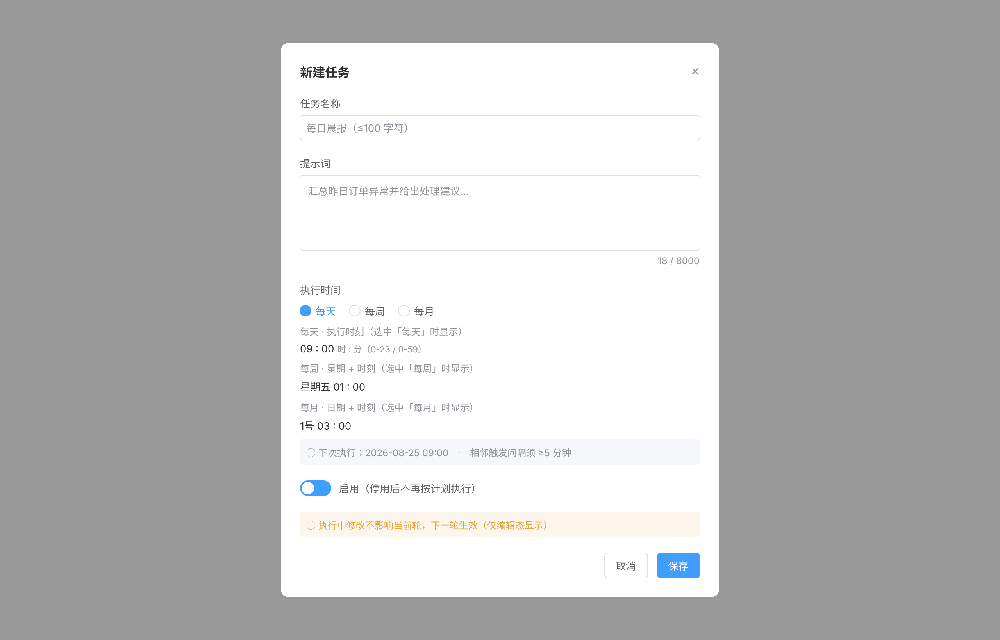
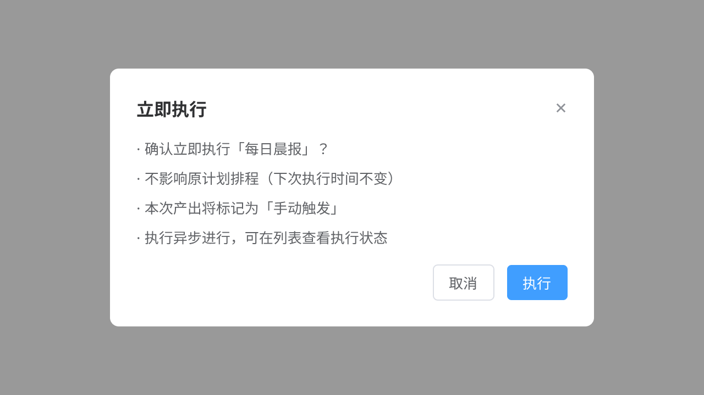
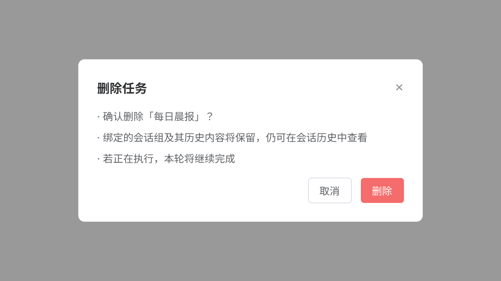
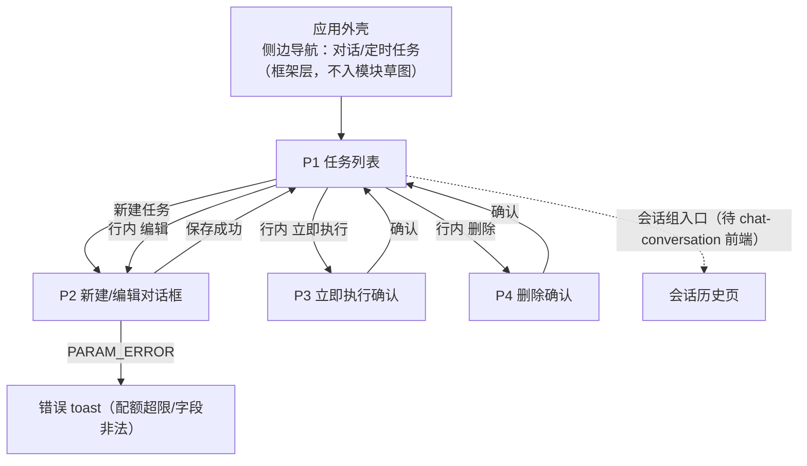

# 定时任务 — 交互草图 / 信息架构

> 模块：scheduled-task ｜ 关联：PRD 母本 `plans/scheduled-task-prd.md`（v1.0）｜ 需求 `requirements/scheduled-task/01~05` ｜ 状态：**定稿 r1（2026-08-24，草图评审通过；含同日两处修订：cron 独立成列、P2 执行时间两段式）**
>
> 2026-08-22 产出的初版原型（`.pen` + PNG）因跳过草图/评审两步已于 2026-08-24 废弃删除；本文件为标准链路正向重启后的交互草图基线。
>
> 🖊 **草图文件**：`scheduled-task-wireframe.pen`（同目录）——P1/P2/P3/P4 + 配额 toast 五画板，与本文 §3 ASCII 线框一一对应；色彩 token 遵循 `../ui-baseline.md` §2（工程 UI 基线）。
>
> 🖌 **高保真原型**（已产出）：`scheduled-task-pages.pen`（同目录）——以本文档 + 草图为蓝本、按 ui-baseline/ui-spec 规范绘制，同名导出 PNG（`page-p1-list.png` … `page-p5-quota-toast.png`，scale 2）；同样遵循「`.pen` 为唯一源，修改后须重导同名 PNG」。
>
> 🖼 **草图图片**：各小节内嵌 PNG（`wireframe-p1-*.png` …）由 `.pen` 对应画板导出（scale 2）；**`.pen` 为唯一源，草图修改后须重新导出同名 PNG**，否则图文不一致。

## 1. 设计定位

- 本模块是 AI 工作台**首个带前端界面的模块**，其信息架构与布局模式即工程后续模块（ai-chat、chat-conversation 前端）的基准。
- PRD 母本 §Out of Scope 声明「前端 UI 另行安排」——本设计不改变该边界：此处产出**交互与 UI 规范**（归文档工程），前端实现仍由 ehub-web 承接。
- 用户角色单一（业务用户），无角色分支界面。

## 2. 页面清单（低保真）

| # | 页面 | 形态 | 承载 FR | 草图 |
|---|---|---|---|---|
| P1 | 任务列表 | 独立页面（应用外壳内） | FR-02；FR-03/04/05 的操作入口 | §3.1 + wireframe.pen |
| P2 | 新建/编辑任务 | 模态对话框（创建与编辑复用同一对话框） | FR-01、FR-03（含启停） | §3.2 + wireframe.pen |
| P3 | 立即执行确认 | 确认对话框 | FR-05 | §3.3 + wireframe.pen |
| P4 | 删除确认 | 确认对话框 | FR-04 | §3.4 + wireframe.pen |
| — | 配额超限提示 | toast（非页面） | FR-01 验收 3 | §3.4 + wireframe.pen |

**页面策略**：单页 + 三对话框——任务量级小（每用户 ≤20），无独立详情页；FR-06 详情数据在 P2 编辑回填中呈现。此为有意简化，若 v2 出现任务量级增长再评估详情页。

## 3. 低保真线框（ASCII 草图）

### 3.1 P1 任务列表



> 草图范围：仅模块自身内容；侧边导航属应用外壳（全局导航），不入模块草图，也不入高保真原型——前端实现时由应用框架层提供。

```
┌────────────────────────────────────────────────────────────┐
│ [搜索任务名____] [状态▾ 全部/启用/停用] [＋新建任务]           │ ← 工具条
├────────────────────────────────────────────────────────────┤
│ 名称        │ 状态  │ 执行计划        │ 下次执行 │ 最近执行  │ 操作          │
│ （单行）    │ [tag]│ cron 表达式     │         │ 时间+结局 │ 执行 编辑 删除 │
│ ──────────────────────────────────────────────────────────── │
│ （空列表 → 空态插画 + 「新建第一个任务」引导）                  │
├────────────────────────────────────────────────────────────┤
│                        共 n 条  ‹ 1 ›                        │ ← 分页
└────────────────────────────────────────────────────────────┘
```

要点：

- **cron 独立成列（执行计划）**——它是可扫读的结构化配置，不与任务名混排；名称列单行呈现
- 状态列 tag 语义见 §5 状态展示表；「最近执行」列 = 时间 + 结局（成功/失败/未执行）
- 操作列三动作：执行（FR-05）/ 编辑（FR-03）/ 删除（FR-04）
- 「执行」动作在 `run_state=RUNNING` 时禁用（守卫前置到交互层，服务端 PARAM_ERROR 兜底）

### 3.2 P2 新建/编辑任务对话框



```
┌─ 新建任务 / 编辑任务 ──────────────────────┐
│ 任务名称  [________________]  (≤100)        │
│ 提示词    [                ]               │
│           [                ]     n / 8000   │ ← textarea + 右下字数统计
│ 执行时间  (●每天  ○每周  ○每月)              │ ← 频率单选（无自定义）
│ 每天：执行时刻 [ 09 : 00 ]（时:分，精确到分钟）│ ← 随频率联动
│ 每周：星期 [星期五▾] + 时刻 [ 01 : 00 ]      │
│ 每月：日期 [ 1 号▾] + 时刻 [ 03 : 00 ]      │
│           下次执行: 2026-08-25 09:00 (预览)  │
│           ⓘ 相邻触发间隔须 ≥5 分钟           │
│ 启停      [开关●]  停用后不再按计划执行        │ ← 开关旁标注语义后果
│ ⓘ 执行中修改不影响当前轮，下一轮生效（编辑时）  │
│                    [取消]  [保存]           │
└────────────────────────────────────────────┘
```

要点：

- 编辑模式回填全量四字段（`{name, prompt, cronExpression, enabled}` 全量必填，缺一 PARAM_ERROR——前置必填校验）
- **执行时间 = 频率单选 + 条件时刻选择**（两段式）：每天 → 仅时刻；每周 → 星期 + 时刻；每月 → 日期 + 时刻；时刻精确到**分钟**（时:分），不暴露 cron 表达式输入——前端组装为 cronExpression 提交，后端仍按 cron 语义校验（间隔 ≥5 分钟）
- 「下次执行预览」让用户在保存前看到排程后果；间隔 <5 分钟规则前置提示
- 创建/编辑共用对话框，标题与按钮文案随模式切换

### 3.3 P3 立即执行确认



```
┌─ 立即执行 ────────────────────────────┐
│ 确认立即执行「每日晨报」？              │
│ · 不影响原计划排程（下次执行时间不变）    │
│ · 本次产出将标记为「手动触发」          │
│ · 执行异步进行，可在列表查看执行状态      │
│                  [取消]  [执行]         │
└──────────────────────────────────────┘
```

### 3.4 P4 删除确认 + 配额超限 toast




```
┌─ 删除任务 ──────────────────────────────────┐
│ 确认删除「每日晨报」？                      │
│ · 绑定的会话组及其历史内容将保留，           │
│   仍可在会话历史中查看                      │
│ · 若正在执行，本轮将继续完成                │
│                    [取消]  [删除]           │
└────────────────────────────────────────────┘

配额超限（创建第 21 个任务时）：
  ⚠ toast: 任务数量已达上限（20 个），请先删除不再需要的任务
```

## 4. 信息架构



- 一级仅 P1；三个对话框全部模态、完成后回列表刷新（量级 ≤20，不做局部行更新）
- 跨模块出口（凭 `conversationId` 跳会话历史，FR-06 验收 1）：跳转目标为 `/chat/{conversationId}`（chat-conversation 前端已补齐，路径参数形态见其 ia.md §1），**本版在列表行预留入口位**（占位不实现），激活时按此目标拼接

## 5. 状态展示表（status × run_state × last_run_status）

| status | run_state | last_run_status | 列表行呈现 |
|---|---|---|---|
| ENABLED | IDLE | SUCCESS | 启用（绿）+ 下次执行 + 最近执行成功（绿） |
| ENABLED | IDLE | FAILED | 启用（绿）+ `lastRunError` 摘要（红，悬停全文） |
| ENABLED | IDLE | null（从未执行） | 启用（绿）+ 下次执行 + 「—」（灰） |
| ENABLED | RUNNING | （上轮结局保留） | 执行中（蓝）+ 执行动作禁用 |
| DISABLED | IDLE | 任意 | 停用（灰）+ 下次执行「—」（next_fire_time=null） |
| 已删 | — | — | 不出现在列表（is_del 过滤） |

状态语义依据：`scheduled-task-design.md` §3 状态机（status 与 run_state 正交、停用置 next_fire_time=null、删除在途跑完）。

## 6. 关卡① — 交互评审（FR 覆盖核对）

> 评审基准：`requirements/scheduled-task/02-功能需求.md` FR-01~08 + §3 归属口径，逐条核对草图页面/任务流覆盖。

| FR | 草图覆盖 | 结论 |
|---|---|---|
| FR-01 创建 | P2（字段/上限/间隔提示）+ 配额 toast + 开关承接「创建即启用/停用」 | ✅ |
| FR-02 列表 | P1（分页/字段/空态/筛选） | ✅ |
| FR-03 更新 | P2 编辑模式（全量必填、启停重算、执行中无效提示） | ✅ |
| FR-04 删除 | P4（会话组保留、在途跑完两条语义文案） | ✅ |
| FR-05 手动执行 | P3（三条语义明示）+ RUNNING 禁用守卫 | ✅ |
| FR-06 详情 | P2 编辑回填即详情呈现（有意简化，见 §2 页面策略） | ✅ |
| FR-07 调度行为 | 非界面可观察（单测验证域） | ➖ 正确排除 |
| FR-08 type 过滤 | chat-conversation 模块接口修正 | ➖ 正确排除 |
| §3 归属口径 | NOT_FOUND「任务不存在」经错误 toast 承接 | ✅ |

**评审结论：通过。** 草图可进入高保真原型阶段。

**随图登记的设计决策（供原型与实现遵循）**：

1. 单页 + 三对话框、无独立详情页（量级依据：每用户 ≤20）
2. RUNNING 守卫前置到操作列（按钮禁用），服务端 PARAM_ERROR 兜底
3. 会话组跳转入口预留位、暂不实现（依赖 chat-conversation 前端）
4. 确认框文案 = 领域语义后果声明（非通用「确定吗」）
5. 编辑对话框含「执行中修改下一轮生效」提示（FR-03 验收 4 的交互承接）
