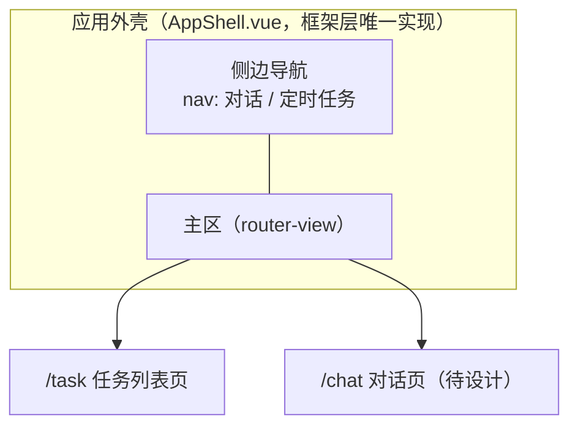
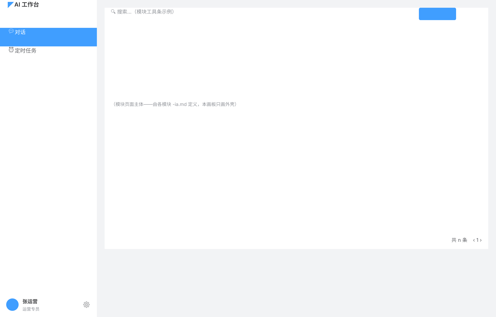

# 01 应用外壳与导航 — 前端全局设计

> 范围：ehub-web 全局（应用外壳、导航、路由、全局布局）｜ 状态：**r1（2026-08-24）**
>
> 本文是**应用外壳的单一事实源**——`designs/ui-baseline.md` §4.1 已约定「外壳不入模块草图/原型，由框架层统一提供」，此前外壳本身无人设计（缺口见 CHANGELOG 2026-08-24）。本文补位：定义外壳结构、导航结构、路由表与全局约定，各模块前端（scheduled-task 及后续 ai-chat / chat-conversation）只做「路由注册 + 外壳内主区渲染」，不再各自描述外壳。

## 1. 外壳结构（全局布局）



### 1.1 整体布局（线框）



> 🖊 草图文件：`app-shell-wireframe.pen`（同目录，单画板 1280×820）。`.pen` 为唯一源，修改后须重新导出同名 PNG（同 ia.md 约定）。主区内容为占位示意——模块页面主体由各模块 `-ia.md` 定义，本画板只画外壳。

```
┌────────────┬──────────────────────────────────────────┐
│ 上：品牌区   │  主区（router-view，纵向滚动）             │
│ logo+名称   │  ┌────────────────────────────────────┐  │
│            │  │ 内容卡片（模块页面主体，如任务列表）     │  │
│ 中：导航菜单 │  │ 底 blank · 边框/圆角随 EP 默认          │  │
│ 对话/定时任务│  └────────────────────────────────────┘  │
│            │  页面背景 page · 主区 padding 20            │
│ 弹性空位     │                                          │
│            │                                          │
│ 下：用户条   │                                          │
│ 头像+头衔名称│                                          │
│    ⚙ 设置  │                                          │
└────────────┴──────────────────────────────────────────┘
```

侧边导航为**上/中/下三段式**：

| 段 | 内容 | 高度 |
|---|---|---|
| 上 | 品牌区：logo + 应用名 | 固定 h64 |
| 中 | 导航菜单（导航表 §2）+ 下方弹性空位 | 自适应（撑满剩余） |
| 下 | 用户条：左（头像 + 头衔/名称两行）↔ 右（设置按钮），space-between | 固定 h64 |

### 1.2 布局规格

| 项 | 规格 | 依据 |
|---|---|---|
| 侧边导航宽度 | **250px 固定**，v1 不可折叠；内部上/中/下三段式（§1.1 表） | 本文定义（el-aside） |
| 侧边导航视觉 | el-menu 默认浅色 + 右边框分隔，不自定义主题 | ui-baseline §1「默认值即规范」 |
| 用户条 | 头衔/名称来自登录态（UserContext 对应字段）；设置按钮 v1 仅占位（无目标页） | 本文定义 |
| 主区内边距 | **20px（四周）** | 与任务列表草图（wireframe.pen P1 主区）一致 |
| 页面背景 | `--el-bg-color-page` | ui-baseline §2 |
| 内容卡片底 | `--el-fill-color-blank`，边框/圆角随 Element Plus 默认 | ui-baseline §2 |
| 滚动行为 | 侧边导航固定不滚动；主区独立纵向滚动 | 本文定义 |
| 最小宽度 | 1280px；v1 桌面优先，**不做移动端/响应式断点** | 本文定义 |
| 弹层层级 | 模态/toast 用 Element Plus 默认 z-index 管理，不自建 | ui-baseline §1 |

- **两区式**：侧边导航（固定）+ 主区（路由渲染）。v1 不做顶栏、面包屑、多级导航——模块量级（2 个）不需要。
- 主区即 `ui-baseline.md` §4.1 语境中的「外壳内主体区」：模块页面（如任务列表三段式）全部落在主区内，**不含**导航。
- 外壳技术实现：Vue 3 + Element Plus 布局组件（`el-container` / `el-aside` / `el-main`），由 ehub-web 框架层唯一实现。

## 2. 导航结构

| # | 导航项 | 路由 | 模块 | 状态 |
|---|---|---|---|---|
| 1 | 对话 | `/chat` | ai-chat 前端 | 待设计（PRD Out of Scope，按标准链路后补） |
| 2 | 定时任务 | `/task` | scheduled-task 前端 | 设计完成（关卡② 通过，可进开发） |

约定：

- 导航项与路由一一对应、命名与模块名一致（对话=ai-chat、定时任务=scheduled-task）；新模块接入 = 导航表加一行 + 路由注册。
- 当前导航项高亮跟随路由；无子级菜单（v1 两项均一级）。
- v1 导航顺序固定（对话在前）——对话是主入口，定时任务是派生配置面。

## 3. 路由表（v1）

| 路由 | 页面 | 模块 | 设计产物 |
|---|---|---|---|
| `/chat` | 对话页 | ai-chat 前端 | 待产出 |
| `/task` | 任务列表页（P1） | scheduled-task 前端 | `scheduled-task-ia.md` + `-pages.pen`（关卡② 通过） |

- 对话框（P2/P3/P4）是**页面内模态**，不占路由——与 `scheduled-task-ia.md` §2 页面策略一致。
- 会话历史跳转（scheduled-task 列表 → 会话组，凭 `conversationId`）目标属 chat-conversation 前端，路由待其设计定（预留 `/chat?conversationId=` 形态，见 ia.md §4 留白）。

## 4. 外壳层横切职责

| 职责 | 约定 | 依据 |
|---|---|---|
| 认证 | JWT 携带与失效统一跳转由外壳层拦截器处理，模块页面不各自处理登录态 | `requirements/auth/01-接口认证.md` |
| 全局错误 | HTTP 拦截器统一解包 `code!==0` → toast（danger），NOT_FOUND 文案「xx不存在」句式 | `designs/web/02-前端工程规范.md` §2 |
| 布局 | 主区统一页面背景 `--el-bg-color-page`、内容卡片 `--el-fill-color-blank` | `designs/ui-baseline.md` §2 |

## 5. 演进

- 新模块前端接入：导航表 + 路由表各加一行，模块页面继承 ui-baseline，无需改外壳。
- v2 若出现三级以上信息层级或全局搜索，再评估顶栏/面包屑——v1 明确不做。
