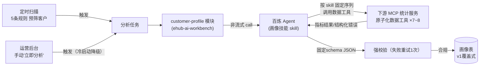

# Grilling 决策记录 — 客户画像 AI 分析

> 日期：2026-08-25（r2 修订同日）
> 模块：customer-profile-ops（原 customer-profile，2026-08-26 roadmap 更名）
> 状态：已确认（四轮主访谈 27 个决策点 + r2 修订轮 8 个决策点 + r3 修订轮 3 个决策点）
> r2 修订：**部分推翻 Q13/Q19 中"粗粒度单工具"决策**——改为"原子化数据工具 + skill 编排"，详见第五轮 Q28–Q35。
> r3 修订：**GMV 分位数 v1 不可用**（MCP 侧能力缺失，计划 v2）——valueTier 改绝对值档位表、初始化改绝对阈值筛选、契约字段留位可选，详见第六轮 Q36–Q38。
> 背景：B2B 代发电商平台，海外客户绑定店铺 → 平台自动拉单 → 代采购并发货。目标：AI 为客户建立画像，支撑客户分层与差异化服务，提升转化、降低流失。

## 完整决策树

### 第一轮：需求与数据基础

| # | 决策点 | 选项 | 用户选择 | 推荐答案 |
|---|---|---|---|---|
| Q1 | 业务目的 | A)采购优化 B)客户分层+流失预警 C)风控 D)营销 E)多目标 | B（提升转化、降低流失风险） | B |
| Q2 | 数据可用性 | 12 项数据清单逐项盘点 | 具备：客户基础信息、绑定店铺、订单、商品品类、采购、物流、售后、资金；不具备：店铺经营评分、终端收货国分布、客户行为、客服沟通记录 | — |
| Q3 | 表现形式 | A)结构化标签 B)评分 C)AI摘要 D)分层桶 E)看板 | A+C（标签 + 自然语言摘要） | A+C |
| Q4 | 客户规模与密度 | 四档规模 × 单量密度 | 1万~10万客户；中等活跃客户月单量几百~上千 | — |
| Q5 | 数据合规 | A)无限制 B)脱敏 C)严格限制 | 订单/经营数据可用；终端用户 PII 不提供，一律以平台 id 展示 | B |

> Q4 规模结论（硬约束）：原始订单数据不可能直接进 AI，必须是**统计预计算 → AI 解读**两段式。

### 第二轮：架构分工

| # | 决策点 | 选项 | 用户选择 | 推荐答案 |
|---|---|---|---|---|
| Q6 | 统计特征来源 | A)主平台接口 B)直读主库 C)独立服务 | **MCP 工具形式提供给 Agent，skill 方式赋能** | — |
| Q7 | 规则与 AI 分工 | A)AI全判 B)规则算硬指标+AI软判断 C)规则全算 | B | B |
| Q8 | 标签体系 | A)固定schema B)AI自由生成 C)混合 | A 固定 schema | A |
| Q9 | 更新频率 | A)实时 B)每日 C)每周 D)事件触发 | D 事件触发 | D(周期+事件组合) |
| Q10 | 画像存储 | A)本服务新表 B)回写主平台 C)双写 | A 本服务 | A |
| Q11 | 流失预警出口 | A)被动查询 B)主动推送 | A 被动（先验证准确率） | A |
| Q12 | 冷启动客户 | A)跳过 B)降级画像 C)照常 | 扫描触发自动规避；手动触发降级画像 | B |

### 第三轮：Agent 形态

| # | 决策点 | 选项 | 用户选择 | 推荐答案 |
|---|---|---|---|---|
| Q13 | MCP 服务归属 | A)数据属主实现 B)本服务封装 | **独立下游 MCP 服务**（本服务为上游调用方） | A |
| Q14 | Agent 宿主 | A)百炼 B)自建 | A 百炼（非流式 Application.call） | — |
| Q15 | 触发机制 | A)主平台事件通知 B)本服务周期扫描 C)MQ | **本服务定时任务周期扫描预筛（非全量）+ 页面手动触发指定客户** | B |
| Q16 | 存量初始化 | A)全量跑 B)按价值分层 C)不初始化 | B 按价值分层初始化 | B |
| Q17 | v1 触发规则 | 5 条规则草案 | 按草案（硬编码，不做配置化） | A |
| Q18 | 手动触发入口 | A)REST API B)对话式 C)两者 | A 运营后台 REST API（客户详情"立即分析"） | A |
| Q19 | 画像 Schema | 指标包 + 输出 schema 草案 | 按草案（含 suggestedAction 固定枚举） | A |

**Q17 v1 触发规则（5 条，硬编码）：**

1. GMV 环比下滑 ≥ 30%（近 30 天 vs 前 30 天）
2. 订单量连续 3 个周环比衰减
3. 退款率 / 纠纷率超平台基线 2 倍
4. 历史活跃（月均 50+ 单）但近 30 天 0 订单（疑似流失/转移）
5. GMV 环比增长 ≥ 50%（快速增长客户，重点经营，不只盯坏消息）

### 第四轮：落地收尾

| # | 决策点 | 选项 | 用户选择 | 推荐答案 |
|---|---|---|---|---|
| Q20 | 模块归属 | A)新独立模块 B)塞进 scheduled-task | A 新独立模块 customer-profile（复用其 @Scheduled 轮询+行级抢占**模式**，不共表） | A |
| Q21 | 画像历史版本 | A)只留最新覆盖 B)全量保留+is_latest | **v1 覆盖式只留最新；v2 全量保留** | B |
| Q22 | valueTier 计算 | A)MCP 返回 tier B)返回分位数、本服务规则映射 | **修订：AI 根据 skill 决策**（MCP 提供分位数等指标，AI 综合判断） | B |
| Q23 | 输出不合规处理 | A)弃 B)校验+自动重试1次 C)宽松接受 | B 校验 + 自动重试 1 次，再失败即弃 | B |
| Q24 | 重复分析冷却期 | A)7天冷却 B)不设 | **v1 不设**（上线初期需频繁修改 prompt/skill 调试优化） | A |
| Q25 | 可见性与权限 | A)平台级可见 B)角色控制 | A 平台级可见；手动触发加操作审计（谁/何时/哪个客户） | A |
| Q26 | 摘要语言与成本记录 | 中文/英文；是否记 token | 中文；画像表记录 model + input/output_token（对齐既有审计纪律） | A |
| Q27 | 验收标准 | 5 条草案 | 按草案 | A |

### 第五轮（r2 修订）：原子化数据工具 + Skill 编排

> 背景：用户提出"提供原子化的数据获取工具，通过 skill 告诉 agent 分析规则、输出结构、数据获取方式"——**部分推翻 Q13/Q19 的粗粒度单工具决策**。动机：画像质量 + 为对话式分析铺路（C）。

| # | 决策点 | 选项 | 用户选择 | 推荐答案 |
|---|---|---|---|---|
| Q28 | 数据工具粒度 | A)按指标切30+ B)按业务问题切约7-8个（带时间窗口参数） | B | B |
| Q29 | 画像路径调用序列 | A)skill 写死固定必调序列 B)Agent 全自主 | A（对话式路径 v2 自主，不另立决策） | A |
| Q30 | 原子化动机 | A)画像质量 B)对话式分析 C)两者 | C（将来接入对话式分析） | C |
| Q31 | 轮次/成本护栏 | A)仅服务层超时，轮次交 skill 软约束 B)服务层硬限轮次 C)无护栏 | A（百炼不暴露轮次计数，无法硬限；skill 约束"必须依次调用"，Agent 是否遵守不做强要求） | A |
| Q32 | 工具失败语义 | A)结构化错误返回 Agent，按 skill 指引重试1次或跳过+声明缺失 B)一失败整体作废 | A | A |
| Q33 | Skill 版本管理 | A)百炼控制台 B)本仓库镜像单一事实源，PR review，手动同步 | B（关联 PRD 开放问题3） | B |
| Q34 | 历史回溯上限 | A)365天 B)180天 | A 365 天（契约级约束：所有数据工具窗口参数上限；存量事实如注册天数不受限） | A |
| Q35 | 术语定名 | 数据工具/画像技能/指标包（逻辑概念） | 按建议定名（见 GLOSSARY） | 按建议 |

### 第六轮（r3 修订）：GMV 分位数不可用的替代

> 背景：MCP 统计服务确认 v1 无法提供 GMV 分位数（含排名/TOP N 能力），计划 v2 上线。波及：valueTier 判定输入、存量初始化筛选、验收标准 1。

| # | 决策点 | 选项 | 用户选择 | 推荐答案 |
|---|---|---|---|---|
| Q36 | 存量初始化筛选 | A)MCP TOP N 清单 B)绝对值阈值 C)砍掉初始化 | **B**（分位数/排名当前做不了，计划 v2） | A（不可得则 B） |
| Q37 | valueTier 判定输入 | A)绝对值档位表 B)订单量分层 | **A** 绝对值档位表 | A |
| Q38 | 契约留位 | A)gmvPercentile 可选字段 B)彻底删除 | **A** | A |

**绝对档位表草案（近 90 天 GMV，USD；定稿于 skill 镜像首个 PR）**：

| 档位 | 近90天 GMV 下限（草案） |
|---|---|
| T1 | ≥ $50,000 |
| T2 | ≥ $20,000 |
| T3 | ≥ $8,000 |
| T4 | ≥ $2,000 |
| T5 | < $2,000 |

> 初始化阈值 = T2 下限（$20k 草案）。档位数值属 skill 资产，随版本化管理调整；v2 分位数上线后 skill 切回"优先分位数、缺失走绝对档位"，两侧零契约变更。

**Q27 v1 验收标准（5 条）：**

1. 初始化覆盖：T1/T2（GMV 前 20%）客户 100% 有画像 ~~→ r3 改写：近 90 天 GMV ≥ T2 档位下限（绝对口径，见第六轮）~~
2. 准确率：人工抽检 50 个客户，lifecycle 与 churnRisk 判断与资深运营一致率 ≥ 80%
3. 失败率：AI 输出校验失败（重试后仍失败）占比 < 5%
4. 成本：单客户单次分析 token 成本有记录（v1 观测不设硬指标）
5. 冷启动客户：手动触发输出降级画像（仅 NEW 标签+基础摘要，无趋势结论），扫描规则自动跳过

### 第七轮（r4 修订）：画像存储形态——整包 JSON + 检索投影列

> 背景：用户指出 AI 分析输出指标后续会新增/变更，固定列不适合；"只保留需要检索的指标"。波及：04 表结构（列语义/写路径/查询承载）、02 FR-09（skill_version 配置注入）、PRD 决策 23。

| # | 决策点 | 选项 | 用户选择 | 推荐答案 |
|---|---|---|---|---|
| Q39 | 画像列存储形态 | A)整包 `profile_json`（唯一事实源）+ 仅检索键投影列 B)全部指标固定列 C)JSON 列 + 全部指标虚拟列 | **A**（指标演进零 DDL；只保留检索指标） | A |

**关键设计**：

- 五个检索投影列（value_tier/lifecycle/churn_risk_level/suggested_action/traits）对应 FR-06 五个筛选键，写时由同一提取函数在同一 UPDATE 内赋值——不存在第二事实源
- 伴生列 `skill_version`：应用配置 `profile.skill-version` 注入（服务不解析镜像文件，FR-09.3 不破）；schema 演进下存量画像可追溯产自哪版技能
- 占位行语义修复：首次分析 RUNNING 中/首跑失败的行画像列全 NULL，**不参与筛选列表**（此前草案的"标签字段默认占位值"会污染 T5/NEW 筛选结果）
- traits LIKE 安全：8 枚举两两互不为子串，精确匹配无误召回

## 数据流架构



## 数据工具清单（v1 初稿，7~8 个，按业务问题切分）

| # | 工具 | 回答的业务问题 | 关键参数 |
|---|---|---|---|
| 1 | 客户基础信息 | 这个客户是谁？ | customerId |
| 2 | 订单规模与趋势 | 近期经营规模如何、方向如何？ | customerId, window（默认90d，上限365d） |
| 3 | 品类分布 | 卖什么？ | customerId, window |
| 4 | 履约售后 | 履约表现如何？ | customerId, window |
| 5 | 资金状况 | 资金健康度如何？ | customerId |
| 6 | 平台基线 | 全平台基准是什么？ | 无（或 metric 维度） |
| 7 | 规则筛选客户列表 | 哪些客户命中预警规则？ | ruleId, 阈值参数 |

> 工具 6 解决 PRD 开放问题 2（基线来源）；工具 7 解决开放问题 1（扫描数据来源）。此清单为契约初稿，正式契约在 requirements/03 阶段与 MCP 服务对齐定稿。

## AI 输出 Schema（固定枚举，强校验）

```json
{
  "valueTier": "T1",                              // AI 经 skill 决策（Q22修订）
  "lifecycle": "DECLINING",                       // NEW/GROWING/MATURE/DECLINING/DORMANT
  "churnRisk": {
    "level": "HIGH",                              // HIGH/MEDIUM/LOW
    "signals": ["GMV环比-32%", "退款率6%超基线2倍"] // 必须引用指标证据
  },
  "topCategories": [{"name": "宠物用品", "share": 0.41}],
  "traits": ["PRICE_SENSITIVE", "CATEGORY_FOCUS"],// 固定枚举多选（8个初稿）
  "suggestedAction": "INTERVENE",                 // 固定枚举：介入/激励/观察/无
  "summary": "≤200字中文经营摘要"
}
```

**traits 枚举初稿（8 个）**：品类集中 / 多品类分散 / 低价高频 / 高客单 / 快速增长 / 收缩中 / 季节性 / 品质敏感

**输入侧指标包（MCP 工具返回，代码预计算）**：

| 组 | 指标 |
|---|---|
| 基础 | 注册天数、店铺数/平台类型/绑定天数、客户国家 |
| 规模 | 近30/90/365天订单量、GMV、客单价（GMV 分位数 v2 提供，Q36；契约留位可选字段，Q38） |
| 趋势 | GMV/订单量环比、近6月趋势方向、活跃月数 |
| 品类 | TOP5 品类及占比、价格带 |
| 履约 | 平均采购周期、退款率、纠纷率、物流投诉率 |
| 资金 | 充值频率、余额水位、账期使用情况 |

## 架构总结

```
v1 交付物：
├── 上游依赖：独立下游 MCP 统计服务
│   └── 原子化数据工具 ×7~8（按业务问题切分，带时间窗口参数，上限365天）
├── 画像技能（profiling skill，本仓库镜像为单一事实源）
│   ├── 取数策略：画像路径固定必调序列（1→2→…→6）
│   ├── 分析规则：valueTier 判定标准 / lifecycle / churnRisk / traits / suggestedAction
│   ├── 输出结构：固定 schema JSON + ≤200字中文摘要
│   └── 失败语义：工具失败结构化返回，重试1次或跳过+summary声明缺失
├── 新模块 customer-profile（新表，不与 scheduled-task 共表）
│   ├── 定时扫描：内置 5 条规则，命中客户触发（非全量，自动规避数据不足客户）
│   ├── 手动触发：REST API + 操作审计；冷启动客户降级画像
│   ├── 百炼调用：非流式 Application.call，skill + MCP 数据工具赋能
│   ├── 输出处理：固定 schema 强校验 + 失败自动重试 1 次 + 记录 model/token
│   └── 画像落库：本服务新表，v1 覆盖式只留最新
├── 初始化：绝对 GMV 阈值筛选（对齐 skill 档位表 T2 下限，r3）；v2 分位数上线后切回前 20% 口径
└── 验收：5 条标准（核心：人工抽检一致率 ≥ 80%）

v2 预留（本记录显式规划）：
├── 画像全量保留 + is_latest（含指标快照，支撑复盘）
├── 冷却期（7 天，稳定运行后启用）
├── 高风险主动推送（准确率验证后）
└── 对话式分析入口（数据工具按业务问题切分正是为其铺路，Q30）
```

## 遗留风险（显式记录）

| 风险 | 来源 | 缓解 |
|---|---|---|
| valueTier 由 AI 判断，分层一致性依赖 skill 质量 | Q22 修订 | 抽检验收需覆盖分层一致性；skill 迭代后对比 |
| 无冷却期 → 上线初期 token 成本波动大 | Q24 | v1 接受（调试需要）；观测成本记录，稳定后启用冷却 |
| 覆盖式存储 → 无法复盘 AI 历史判断 | Q21 | prompt 迭代对比依赖人工抽检；v2 全量保留解决 |
| 多轮工具调用 → 单次画像成本/延迟高于单工具，且轮次仅 skill 软约束（百炼不暴露轮次计数） | Q31 | 超时兜底（对齐 scheduled-task 120s 模式）+ token 记录观测；skill 迭代收敛序列 |
| 串行调用失败率乘法效应（每工具99%可用→7工具链≈93%） | Q32 | 工具失败结构化返回+Agent 跳过降级，而非整体作废 |
| 绝对档位漂移：平台增长/季节波动使 T1~T5 边界失真（相对分层缺失） | Q36/Q37 r3 | 档位表随 skill 版本化管理（PR review 可追溯）；定期 review 档位；v2 分位数切回相对分层 |
| 投影列与 profile_json 不一致（提取函数 bug） | Q39 r4 | 同一提取函数在同一 UPDATE 内单点赋值；不一致视为实现 bug，v1 不做对账任务 |
