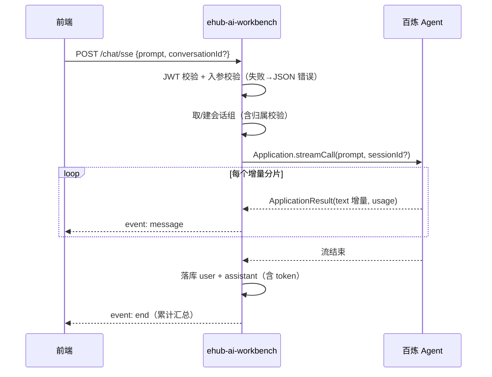

# 03 接口规范 — AI 对话模块

> 模块：ai-chat ｜ 关联 PRD 母本：`plans/ai-chat-sse-prd.md` (v1.0) ｜ 状态：已定版

## 1. 接口定义

### POST /chat/sse

| 项 | 值 |
|---|---|
| 完整路径 | `/ai-workbench/chat/sse` |
| 认证 | 全工程统一约定（见 [`../auth/01-接口认证.md`](../auth/01-接口认证.md)） |
| 请求 Content-Type | `application/json` |
| 响应 Content-Type | `text/event-stream`（`@SkipWrapper`，不走统一响应包装） |
| 说明 | SSE 流式对话。需求原文 `/sse/chat` 已更正为本路径 |

**请求体（ChatParam）**：

| 字段 | 类型 | 必填 | 说明 |
|---|---|---|---|
| `prompt` | string | 是 | 用户输入，非空白且 ≤8000 字符 |
| `conversationId` | long | 否 | 不传 → 隐式创建会话组；传则校验归属后续聊 |
| `name` | string | 否 | 新建会话组名称，默认取 `prompt` |
| `type` | int | 否 | 默认 CHAT=0；v1 仅接受 0 |

**错误响应（流式开始前，普通 JSON）**：

| 场景 | 错误 |
|---|---|
| `prompt` 空白/超长、`type` 非 CHAT | `PARAM_ERROR` |
| `conversationId` 不存在/无归属 | `NOT_FOUND "会话不存在"` |
| 认证失败（无有效 JWT） | 见 [`../auth/01-接口认证.md`](../auth/01-接口认证.md) |

## 2. SSE 事件协议

三类事件，均以标准 SSE 帧下发（`event:` + `data:`）。`data` 均为 JSON 字符串。

### event: message（增量分片）

每个百炼增量分片一条事件，前端按序拼接。

```json
{
  "role": "assistant",
  "conversationId": 123,
  "message": "增量文本片段",
  "models": ["qwen-max"],
  "inputToken": 120,
  "outputToken": 35
}
```

| 字段 | 说明 |
|---|---|
| `conversationId` | 首个分片即携带，前端据此建立会话 |
| `message` | 本次增量文本（非全量） |
| `models` / `inputToken` / `outputToken` | 该分片携带的 usage（有则带；最终以 `end` 汇总为准） |

### event: end（正常结束）

```json
{
  "conversationId": 123,
  "models": ["qwen-max"],
  "inputToken": 120,
  "outputToken": 890
}
```

整轮累计值（修正分片累加误差），随后服务端关流。

### event: error（异常）

```json
{
  "code": "BAILIAN_ERROR",
  "message": "Agent 开小差了，请稍后再试"
}
```

百炼调用失败或空回复时下发，随后服务端关流。`message` 为可配置兜底文案（`WorkbenchProperties`），不再使用硬编码 `:::agent-error`。

## 3. 事件时序



客户端断连场景见 [02-功能需求](02-功能需求.md) FR-08。
