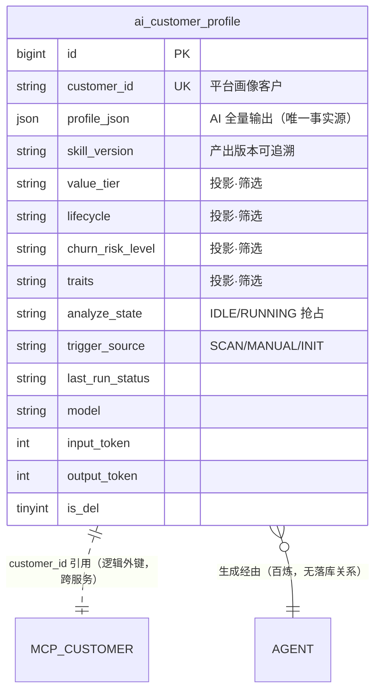

# 04 数据模型 — 客户画像模块

> 模块：customer-profile ｜ 关联 PRD 母本：`plans/customer-profile-prd.md`（v1.3 已定版） ｜ 状态：已定版
>
> **DDL 边界（Q20）**：仅新增 `ai_customer_profile` 一张表；不与 scheduled-task 共表；不改动既有任何表。画像存储不含指标快照（Q21：v2 全量保留时引入）。
>
> **存储形态（Q39，r4）**：AI 分析输出**整包存 `profile_json`**（原生 json 类型）——指标后续新增/变更零 DDL；仅 FR-06 五个筛选键设检索投影列（见「投影与一致性」）。

## 1. 新表 `ai_customer_profile`（客户画像，v1 覆盖式）

```sql
CREATE TABLE `ai_customer_profile` (
    `id`               bigint        NOT NULL AUTO_INCREMENT COMMENT '主键id',
    `customer_id`      varchar(64)   NOT NULL COMMENT '平台画像客户 ID（MCP 侧标识，非本系统用户）',
    -- 检索投影列：写时从 profile_json 提取，仅承载 FR-06 五个筛选键（见「投影与一致性」）
    `value_tier`       varchar(8)    DEFAULT NULL COMMENT '投影·价值分层：T1~T5（筛选键）',
    `lifecycle`        varchar(16)   DEFAULT NULL COMMENT '投影·生命周期：NEW/GROWING/MATURE/DECLINING/DORMANT（筛选键）',
    `churn_risk_level` varchar(8)    DEFAULT NULL COMMENT '投影·流失风险：HIGH/MEDIUM/LOW（筛选键）',
    `suggested_action` varchar(16)   DEFAULT NULL COMMENT '投影·建议动作：INTERVENE/INCENTIVE/OBSERVE/NONE（筛选键）',
    `traits`           varchar(256)  DEFAULT NULL COMMENT '投影·经营特征枚举 JSON 数组（筛选键；LIKE 匹配，8 枚举两两互不为子串）',
    -- AI 分析全量输出（schema 随画像技能演进，新增/变更指标零 DDL；占位行为 NULL）
    `profile_json`     json          DEFAULT NULL COMMENT 'AI 分析全量输出（强校验后整包存储，唯一事实源）：valueTier/lifecycle/churnRisk{level,signals}/topCategories/traits/suggestedAction/summary + 未来新增指标；NULL=尚未产出画像（占位行）',
    `skill_version`    varchar(32)   DEFAULT NULL COMMENT '产出本画像的画像技能版本（应用配置注入，随百炼同步更新；schema 演进下输出可追溯）',
    `analyze_state`    varchar(16)   NOT NULL DEFAULT 'IDLE' COMMENT '分析态：IDLE/RUNNING（行级抢占字段）',
    `trigger_source`   varchar(16)   DEFAULT NULL COMMENT '触发来源：SCAN/MANUAL/INIT',
    `trigger_rules`    varchar(64)   DEFAULT NULL COMMENT '命中规则 JSON 数组（R1~R5；MANUAL/INIT 空）',
    `last_run_time`    datetime      DEFAULT NULL COMMENT '本次分析开始时间；兼作 RUNNING 起算（僵死复位依据）',
    `last_run_status`  varchar(16)   DEFAULT NULL COMMENT '最近结局：SUCCESS/FAILED',
    `last_run_error`   varchar(500)  DEFAULT NULL COMMENT '失败摘要（≤500）',
    `model`            varchar(64)   DEFAULT NULL COMMENT '分析所用模型标识',
    `input_token`      int           NOT NULL DEFAULT 0 COMMENT '输入 token（缺失记 0）',
    `output_token`     int           NOT NULL DEFAULT 0 COMMENT '输出 token（缺失记 0）',
    `trigger_user`     varchar(64)   DEFAULT NULL COMMENT '手动触发操作人 id（操作审计，仅 MANUAL）',
    `trigger_name`     varchar(64)   DEFAULT NULL COMMENT '手动触发操作人姓名快照',
    `crt_time`          datetime      DEFAULT NULL COMMENT '创建时间',
    `crt_user`          varchar(64)   DEFAULT NULL COMMENT '创建人id（扫描/初始化无 UserContext 时为 SYSTEM）',
    `crt_name`          varchar(64)   DEFAULT NULL COMMENT '创建人姓名',
    `crt_host`          varchar(64)   DEFAULT NULL COMMENT '创建主机',
    `upd_time`          datetime      DEFAULT NULL COMMENT '更新时间',
    `upd_user`          varchar(64)   DEFAULT NULL COMMENT '更新人id',
    `upd_name`          varchar(64)   DEFAULT NULL COMMENT '更新人姓名',
    `upd_host`          varchar(64)   DEFAULT NULL COMMENT '更新主机',
    `is_del`            tinyint       NOT NULL DEFAULT 0 COMMENT '逻辑删除：0未删，1已删',
    PRIMARY KEY (`id`),
    UNIQUE KEY `uk_customer` (`customer_id`, `is_del`) COMMENT 'v1 一客户至多一条当前画像（覆盖式 upsert 依据）',
    KEY `idx_filter` (`value_tier`, `lifecycle`, `churn_risk_level`) COMMENT '筛选列表：分层×生命周期×风险组合',
    KEY `idx_upd` (`upd_time`) COMMENT '筛选列表默认排序：最近分析时间降序（upd_time 即最近成功分析时间）'
) ENGINE=InnoDB DEFAULT CHARSET=utf8mb4 COMMENT='AI 客户画像';
```

### 列语义要点

| 列 | 说明 | 对应决策 |
|---|---|---|
| `customer_id` | 平台画像客户标识（MCP 侧），唯一约束 + 覆盖式 upsert 实现"一客户一画像"（v1） | Q10/Q21 |
| **检索投影列**（value_tier/lifecycle/churn_risk_level/suggested_action/traits） | `profile_json` 的**写时投影**，仅承载 FR-06 五个筛选键；非检索指标（churnSignals/topCategories/summary 等）不设列 | Q39 |
| `profile_json` | **AI 输出唯一事实源**：强校验后整包存储；原生 json 类型保证 DB 层合法性；指标新增/变更零 DDL，内容基准随画像技能镜像同步演进（§3 + FR-09） | Q19/Q39 |
| `skill_version` | 产出本画像的技能版本，应用配置注入（服务不解析镜像文件，FR-09.3 不破）；schema 演进下凭此追溯存量画像产自哪版技能 | Q39 |
| `analyze_state` | **控制面**：IDLE/RUNNING 线性翻转，行级原子抢占字段（复用 scheduled-task 模式）；多实例/扫描与手动并发至多一个分析进行中 | Q20/FR-01.7 |
| `last_run_*` 三件套 | **数据面**：最近一轮结局报告（成功/失败/摘要），面向排查 | 对齐 scheduled-task 两字段分离设计 |
| `trigger_source` + `trigger_user/name` | 触发来源、命中规则与操作审计——系统元数据而非 AI 指标，保持独立小列不进 JSON | Q25 |
| `model` + `input_token`/`output_token` | 成本归因（对齐 `ai_conversation_content.models`/token 纪律） | Q26 |
| `uk_customer` | 唯一约束防并发插入重复；覆盖式语义靠 upsert（先占位后更新）实现 | Q21 |
| `idx_upd` | 筛选列表默认排序（`analyze_time` 降序）以 `upd_time` 承载——成功分析必然更新本行，`upd_time` 即最近分析时间 | FR-06.2 |

### 投影与一致性（profile_json ↔ 检索列）

1. **事实源唯一**：AI 输出只存 `profile_json` 一份；五个检索列是写时提取的投影，由**同一提取函数在同一 UPDATE 内**赋值——不存在第二事实源，投影与 JSON 不一致视为实现 bug（代码单点保证，v1 不做对账任务）
2. **投影列仅服务检索**：FR-06 五个筛选键命中 `idx_filter` + traits LIKE；`profile_json` 内字段**不参与 SQL 检索**（v1 不依赖 JSON 函数 / 虚拟列索引）
3. **schema 演进路径**：画像技能新增/变更输出指标 → 只改校验基准（§3）与技能镜像（FR-09 同 PR 维护），**DDL 零变更**；某新指标将来需要检索 → 加投影列 + 一次性回填迁移，不预置
4. **NULL 语义（占位行）**：五个投影列 + `profile_json` 允许 NULL——首次分析 RUNNING 中或首跑失败的占位行**不参与筛选列表**（查询条件投影列 IS NOT NULL，或索引等价排除）；成功落库后投影列必有值
5. **traits LIKE 安全性**：8 枚举两两互不为子串，`LIKE '%X%'` 精确匹配枚举值，无误召回
6. **列类型说明**：`profile_json` 用原生 `json` 类型（MySQL 5.7+，DB 层拒收非法 JSON 是双保险）；若目标库版本不支持则退化 `longtext`，合法性完全由应用层校验承担

### 为什么没有指标快照列

Q21 显式决策：v1 覆盖式只留最新，指标快照随 v2"全量保留 + is_latest"一并引入。届时新增历史表（如 `ai_customer_profile_history`）而非在本表加列，避免热表膨胀。

## 2. 与既有表的关系



- **零改动**：`ai_conversation` / `ai_conversation_content` / `ai_scheduled_task` 均不动——画像不落会话体系（非对话产物，结构化标签 + 摘要直接存表）
- **逻辑外键**：`customer_id` 指向 MCP 侧客户，无物理外键（跨服务边界，引用完整性由 MCP 工具 1 的存在性校验承担）

## 3. 画像 schema（校验基准）

```json
{
  "valueTier": "T1",
  "lifecycle": "DECLINING",
  "churnRisk": {
    "level": "HIGH",
    "signals": ["GMV环比-32%", "退款率6%超基线2倍"]
  },
  "topCategories": [{"name": "宠物用品", "share": 0.41}],
  "traits": ["PRICE_SENSITIVE", "CATEGORY_FOCUS"],
  "suggestedAction": "INTERVENE",
  "summary": "≤200字中文经营摘要"
}
```

**校验规则（强校验，失败重试 1 次，Q23）**：

| 字段 | 约束 |
|---|---|
| `valueTier` | 枚举 T1/T2/T3/T4/T5 |
| `lifecycle` | 枚举 NEW/GROWING/MATURE/DECLINING/DORMANT |
| `churnRisk.level` | 枚举 HIGH/MEDIUM/LOW |
| `churnRisk.signals` | 字符串数组；HIGH/MEDIUM 时非空（LOW 可空） |
| `topCategories` | 数组 ≤5 项；`share` ∈ [0,1]；按 share 降序 |
| `traits` | 8 枚举多选：PRICE_SENSITIVE/CATEGORY_FOCUS/MULTI_CATEGORY/HIGH_AOV/FAST_GROWING/CONTRACTING/SEASONAL/QUALITY_SENSITIVE |
| `suggestedAction` | 枚举 INTERVENE/INCENTIVE/OBSERVE/NONE |
| `summary` | 非空，≤200 字 |
| 整体 | 必须为纯 JSON 对象——markdown 代码块包裹（```json）剥壳后仍需通过以上全部校验；剥壳失败亦为校验失败 |

**存储口径（Q39）**：校验通过的 JSON **整包**写入 `profile_json`（§1 存储形态）——上表即 `profile_json` 的内容基准；画像技能演进新增/变更输出指标时，本节与技能镜像**同 PR 更新**（FR-09），DDL 零变更。

**traits 枚举 ↔ 中文名对照**：PRICE_SENSITIVE=低价高频 / CATEGORY_FOCUS=品类集中 / MULTI_CATEGORY=多品类分散 / HIGH_AOV=高客单 / FAST_GROWING=快速增长 / CONTRACTING=收缩中 / SEASONAL=季节性 / QUALITY_SENSITIVE=品质敏感

**降级画像约束**（冷启动 MANUAL，FR-08）：`lifecycle=NEW`、`churnRisk={level:"LOW",signals:[]}`、`traits=[]`、`suggestedAction=OBSERVE`、summary 为基础摘要（无趋势结论）。

## 4. 关键写路径（与调度/触发语义对应）

| 时机 | 操作 |
|---|---|
| 触发分析（任一来源） | 原子 UPDATE：`SET analyze_state='RUNNING', last_run_time=NOW() WHERE customer_id=? AND (analyze_state='IDLE' OR last_run_time < NOW()-INTERVAL 30 MINUTE)`——无画像客户先 insert 占位行（`analyze_state='RUNNING'`，画像列全部 NULL）再抢占，唯一约束防并发重复插入 |
| 分析成功 | `profile_json` 整包写入 + 同一 UPDATE 提取投影列 + `skill_version` + `trigger_source/trigger_rules` + `model/input_token/output_token` + `last_run_status='SUCCESS', analyze_state='IDLE'`（v1 覆盖式，upsert） |
| 校验失败（重试后） | 更新 `last_run_status='FAILED', last_run_error=<摘要>, analyze_state='IDLE'`；**`profile_json` 与投影列均不写**（保留上一版画像——若存在）；首次分析即失败的客户保留 NULL 占位行供排查 |
| 僵死复位 | `UPDATE ... SET analyze_state='IDLE' WHERE customer_id=? AND analyze_state='RUNNING' AND last_run_time < NOW()-INTERVAL 30 MINUTE`（多实例至多一个成功，不补跑；阈值沿用 `runningStaleMinutes` 模式） |
| 冷启动（SCAN/INIT） | 不 insert、不更新——仅扫描日志记跳过 |
| 冷启动（MANUAL） | 正常抢占 → 降级画像落库（FR-08.3） |

## 5. 筛选列表的查询承载

- 组合筛选（valueTier × lifecycle × churnRiskLevel × suggestedAction × trait）全部命中**检索投影列**（`idx_filter` + `idx_upd`）；`profile_json` 内字段不参与 SQL 检索（见「投影与一致性」第 2 条）
- **列表排除占位行**：基础条件含投影列 IS NOT NULL（RUNNING 中/首跑失败未出画像的客户不出现）
- `trait` 筛选：投影列 `traits` LIKE 匹配（8 枚举两两互不为子串，精确无歧义）；性能不足时 v2 再议标签位图列
- 列表项的 summary/churnSignals 等展示字段由应用层从 `profile_json` 解析（页深 ≤50，解析成本可忽略）
