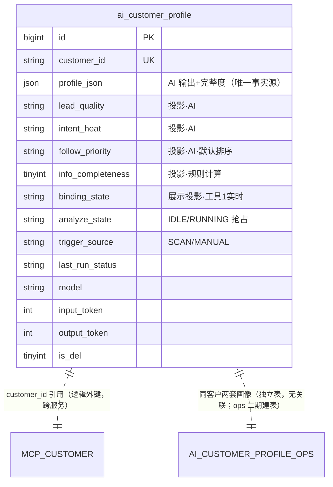

# 04 数据模型 — 销售转化画像模块

> 模块：customer-profile-sales（销售转化画像，**客户画像一期基础版本**） ｜ 关联 PRD 母本：`plans/customer-profile/sales/customer-profile-sales-prd.md`（v1.3 已定版） ｜ 状态：已定版（2026-08-26 随 roadmap 同步：ops 表改名引用更新）
>
> **DDL 边界（Q8；2026-08-26 roadmap 补充：表名占基名 `ai_customer_profile`）**：仅新增 `ai_customer_profile` 一张表；不与 ops 的 `ai_customer_profile_ops`（二期建表，带后缀）共表；不改动既有任何表。
>
> **存储形态（Q21，对齐 ops Q39 整包模式）**：AI 分析输出**整包存 `profile_json`**（原生 json 类型）——指标后续新增/变更零 DDL；四个筛选键（Q7/Q24）设检索投影列（见「投影与一致性」）。

## 1. 新表 `ai_customer_profile`（销售画像，v1 覆盖式；基名归一期基础版本，ops 二期用 `ai_customer_profile_ops`）

```sql
CREATE TABLE `ai_customer_profile` (
    `id`               bigint        NOT NULL AUTO_INCREMENT COMMENT '主键id',
    `customer_id`      varchar(64)   NOT NULL COMMENT '活跃/绑定客户 ID（MCP 侧标识，非本系统用户）',
    -- 检索投影列：写时从 profile_json 提取，仅承载 FR-05 四个筛选键
    `lead_quality`     varchar(8)    DEFAULT NULL COMMENT '投影·线索质量：HIGH/MEDIUM/LOW（筛选键，AI）',
    `intent_heat`      varchar(8)    DEFAULT NULL COMMENT '投影·意向热度：HOT/WARM/COLD（筛选键，AI）',
    `follow_priority`  varchar(4)    DEFAULT NULL COMMENT '投影·跟进优先级：P0~P3（筛选键，AI；默认排序键）',
    `info_completeness` tinyint      DEFAULT NULL COMMENT '投影·信息完整度：0~100（筛选键，本服务规则计算，FR-08）',
    -- AI 分析全量输出 + 规则计算字段（schema 随技能演进，新增/变更零 DDL）
    `profile_json`     json          DEFAULT NULL COMMENT '销售画像全量输出（强校验后整包存储，唯一事实源）：leadQuality/intentHeat/followPriority/reading/strategy/script + 本服务写入的 infoCompleteness + 未来新增指标；NULL=尚未产出画像（占位行）',
    `binding_state`    varchar(32)   DEFAULT NULL COMMENT '展示投影·绑定状态（分析时取工具 1 实时值写时投影，列表项展示用；不参与筛选）',
    `analyze_state`    varchar(16)   NOT NULL DEFAULT 'IDLE' COMMENT '分析态：IDLE/RUNNING（行级抢占字段）',
    `trigger_source`   varchar(16)   DEFAULT NULL COMMENT '触发来源：SCAN/MANUAL（无 INIT）',
    `last_run_time`    datetime      DEFAULT NULL COMMENT '本次分析开始时间；兼作 RUNNING 起算（僵死复位依据）',
    `last_run_status`  varchar(16)   DEFAULT NULL COMMENT '最近结局：SUCCESS/FAILED/STALE_RESET（僵死复位）',
    `last_run_error`   varchar(500)  DEFAULT NULL COMMENT '失败摘要（≤500）',
    `model`            varchar(64)   DEFAULT NULL COMMENT '分析所用模型标识',
    `input_token`      int           NOT NULL DEFAULT 0 COMMENT '输入 token（缺失记 0）',
    `output_token`     int           NOT NULL DEFAULT 0 COMMENT '输出 token（缺失记 0）',
    `crt_time`          datetime      DEFAULT NULL COMMENT '创建时间',
    `crt_user`          varchar(64)   DEFAULT NULL COMMENT '创建人id（扫描无 UserContext 时为 SYSTEM）',
    `crt_name`          varchar(64)   DEFAULT NULL COMMENT '创建人姓名',
    `crt_host`          varchar(64)   DEFAULT NULL COMMENT '创建主机',
    `upd_time`          datetime      DEFAULT NULL COMMENT '更新时间',
    `upd_user`          varchar(64)   DEFAULT NULL COMMENT '更新人id',
    `upd_name`          varchar(64)   DEFAULT NULL COMMENT '更新人姓名',
    `upd_host`          varchar(64)   DEFAULT NULL COMMENT '更新主机',
    `is_del`            tinyint       NOT NULL DEFAULT 0 COMMENT '逻辑删除：0未删，1已删',
    PRIMARY KEY (`id`),
    UNIQUE KEY `uk_customer` (`customer_id`, `is_del`) COMMENT 'v1 一客户至多一条当前画像（覆盖式 upsert 依据）',
    KEY `idx_filter` (`follow_priority`, `lead_quality`, `intent_heat`) COMMENT '筛选列表：优先级×质量×热度组合（默认排序 follow_priority 在前）',
    KEY `idx_upd` (`upd_time`) COMMENT '筛选列表次序排序 + 僵死复位扫描'
) ENGINE=InnoDB DEFAULT CHARSET=utf8mb4 COMMENT='AI 销售转化画像';
```

### 列语义要点

| 列 | 说明 | 对应决策 |
|---|---|---|
| `customer_id` | 客户标识（MCP 侧），唯一约束 + 覆盖式 upsert 实现"一客户一画像"（v1） | Q8/Q21 |
| **检索投影列**（lead_quality/intent_heat/follow_priority/info_completeness） | `profile_json` 的**写时投影**，仅承载 FR-05 四个筛选键；非检索字段（reading/strategy/script）不设列 | Q7/Q24 |
| `binding_state` | **展示投影**（非筛选键）：分析成功时取工具 1 实时值写时投影，仅服务列表项 `bindingState` 展示（避免列表页逐行实时调工具 1）；非检索字段，无索引 | r3 实现 \u8865（2026-08-26） |
| `profile_json` | **画像唯一事实源**：AI 输出（三评分+速读+策略+话术）强校验后整包存储；`infoCompleteness` 由本服务计算后**并入整包**（同一 UPDATE）——对外响应从整包取值，投影列不构成第二事实源 | Q13/Q21 |
| `analyze_state` | **控制面**：IDLE/RUNNING 线性翻转，行级原子抢占字段；多实例/扫描与手动并发至多一个分析进行中 | Q24 |
| `last_run_*` 三件套 | **数据面**：最近一轮结局报告，面向排查 | 对齐 ops 两字段分离设计 |
| `trigger_source` | 触发来源：SCAN/MANUAL；**手动触发操作人不设专用列**（Q29）——由通用审计字段 `upd_user`/`upd_name` 承载（异步落库时以 UserContext 快照回填，捕获-重建模式），扫描路径无 UserContext 时为 SYSTEM | Q25 沿用/Q29 |
| `model` + token 两列 | 成本归因（对齐既有 token 纪律） | Q26 沿用 |
| `uk_customer` | 唯一约束防并发插入重复 | Q21 |
| `idx_filter` | 四筛选键中三枚举的组合索引；`info_completeness` 为 tinyint 区间筛选（`infoCompletenessMin/Max`，关卡①复核 F-2 修订），单列选择性低不单独设索引（组合 v2 视查询表现补） | Q24 |
| `idx_upd` | 列表次序排序（generated_time 降序以 `upd_time` 承载，成功分析必然更新本行）+ 僵死复位轮询扫描 | FR-05.2/NFR-03 |

### 与 ops 表的差异

| 维度 | `ai_customer_profile_ops`（ops，二期） | `ai_customer_profile`（本表） |
|---|---|---|
| 投影列 | 五键（含 traits JSON 数组列） | 四键（三枚举 + tinyint 完整度；无 traits） |
| `trigger_rules` | 有（R1~R5 命中记录） | **无**（命中条件单一：近 7 天消费，FR-03.6） |
| `trigger_source` 枚举 | SCAN/MANUAL/INIT | SCAN/MANUAL |
| 完整度计算 | —（无此字段） | 本服务规则计算并入整包（FR-08） |

### 投影与一致性（profile_json ↔ 检索列）

对齐 ops Q39 纪律，逐条适用：

1. **事实源唯一**：AI 输出 + 本服务计算的 `infoCompleteness` 只存 `profile_json` 一份；四个检索列是写时提取的投影，由**同一提取函数在同一 UPDATE 内**赋值——投影与 JSON 不一致视为实现 bug
2. **投影列仅服务检索**：FR-05 四筛选键命中 `idx_filter`；`profile_json` 内字段**不参与 SQL 检索**（v1 不依赖 JSON 函数/虚拟列索引）
3. **schema 演进路径**：技能新增/变更输出指标 → 只改校验基准（§3）与技能镜像（FR-07 同 PR），DDL 零变更；新指标需检索 → 加投影列 + 一次性回填
4. **NULL 语义（占位行）**：投影列 + `profile_json` 允许 NULL——首跑 RUNNING 中或失败的占位行**不参与筛选列表**（查询条件投影列 IS NOT NULL）
5. **列类型**：`profile_json` 原生 `json` 类型；目标库不支持则退化 `longtext`，合法性由应用层校验承担

## 2. 与既有表的关系



- **零改动**：`ai_customer_profile_ops`（ops，二期建表）/ `ai_conversation` / `ai_scheduled_task` 等均不动——两套画像**不共表、不建物理关联**（Q23 独立演进；同 `customer_id` 仅逻辑对应，由 MCP 侧标识体系保证一致）
- **逻辑外键**：`customer_id` 指向 MCP 侧客户，无物理外键（跨服务边界，引用完整性由数据工具 1 的存在性校验承担）

## 3. 画像 schema（校验基准）

```json
{
  "leadQuality": "HIGH",
  "intentHeat": "HOT",
  "followPriority": "P0",
  "reading": "（≤300 字中文线索速读；数据稀少客户须含"数据有限，结论仅供参考"声明）",
  "strategy": "（≤300 字中文转化策略）",
  "script": "（≤500 字中文可复制话术，合规约束见 FR-06.2）"
}
```

**校验规则**（强校验器逐条断言，任一不过即失败）：

| # | 规则 | 失败处理 |
|---|---|---|
| 1 | `leadQuality` ∈ {HIGH, MEDIUM, LOW} | 拒收 → 重试 1 次 → 仍失败即弃 |
| 2 | `intentHeat` ∈ {HOT, WARM, COLD} | 同上 |
| 3 | `followPriority` ∈ {P0, P1, P2, P3} | 同上 |
| 4 | `reading`/`strategy` ≤300 字、`script` ≤500 字、三者非空 | 同上 |
| 5 | 输出不得含 markdown 代码块包裹 | 同上 |
| 6 | **输出不得含 `infoCompleteness` 字段**（本服务计算，FR-08.2） | 同上 |
| 7 | 字段全集封闭：仅允许上述 5 字段（多余字段拒收，防 schema 漂移） | 同上 |

落库时本服务将 `infoCompleteness`（FR-08 计算）并入整包后存储——存储态 schema = 上述 5 字段 + `infoCompleteness`。
