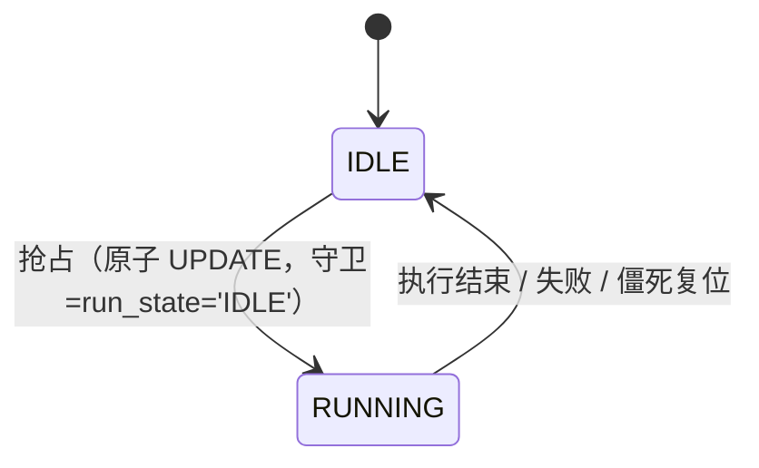
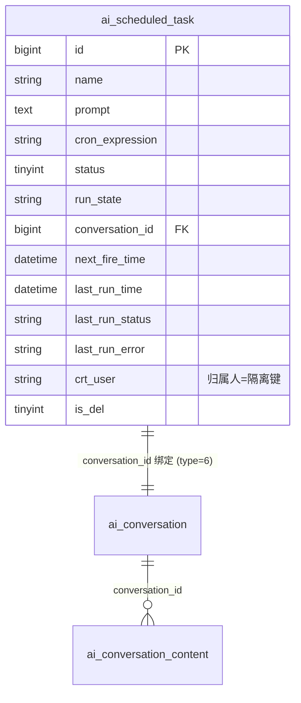

# 04 数据模型 — 定时任务模块

> 模块：scheduled-task ｜ 关联 PRD 母本：`plans/scheduled-task-prd.md`（草案 r2，待终审） ｜ 状态：随草案拆解
>
> **DDL 边界（Q6）**：仅新增 `ai_scheduled_task` 一张表；`ai_conversation` / `ai_conversation_content` **不改 DDL**——新类型走 `type` 新枚举值，来源标记走 `params` JSON。

## 1. 新表 `ai_scheduled_task`（任务定义）

```sql
CREATE TABLE `ai_scheduled_task` (
    `id`               bigint       NOT NULL AUTO_INCREMENT COMMENT '主键id',
    `name`             varchar(100) NOT NULL COMMENT '任务名称（非空白，≤100）',
    `prompt`           text         NOT NULL COMMENT '预设 prompt（应用层校验非空白，≤8000 字符）',
    `cron_expression`  varchar(64)  NOT NULL COMMENT 'Spring 6 段 cron（应用层校验相邻触发≥5分钟）',
    `status`           tinyint      NOT NULL DEFAULT 1 COMMENT '启停：1=ENABLED，0=DISABLED',
    `run_state`        varchar(16)  NOT NULL DEFAULT 'IDLE' COMMENT '执行态：IDLE / RUNNING（行级抢占字段）',
    `conversation_id`  bigint       DEFAULT NULL COMMENT '绑定会话组 id（ai_conversation.id，type=6）',
    `next_fire_time`   datetime     DEFAULT NULL COMMENT '下次触发时间；停用置 NULL；到期判定用 DB NOW()',
    `last_run_time`    datetime     DEFAULT NULL COMMENT '最近一轮执行开始时间；兼作 RUNNING 起算（僵死复位依据）',
    `last_run_status`  varchar(16)  DEFAULT NULL COMMENT '最近一轮结局：SUCCESS / FAILED',
    `last_run_error`   varchar(500) DEFAULT NULL COMMENT '最近一次失败摘要（≤500）',
    `crt_time`         datetime     DEFAULT NULL COMMENT '创建时间',
    `crt_user`         varchar(64)  DEFAULT NULL COMMENT '创建人id（数据隔离键=任务归属人）',
    `crt_name`         varchar(64)  DEFAULT NULL COMMENT '创建人姓名快照',
    `crt_host`         varchar(64)  DEFAULT NULL COMMENT '创建主机',
    `upd_time`         datetime     DEFAULT NULL COMMENT '更新时间',
    `upd_user`         varchar(64)  DEFAULT NULL COMMENT '更新人id',
    `upd_name`         varchar(64)  DEFAULT NULL COMMENT '更新人姓名',
    `upd_host`         varchar(64)  DEFAULT NULL COMMENT '更新主机',
    `is_del`           tinyint      NOT NULL DEFAULT 0 COMMENT '逻辑删除：0未删，1已删',
    PRIMARY KEY (`id`),
    KEY `idx_sched` (`status`, `next_fire_time`) COMMENT '调度扫描：status=1 AND is_del=0 AND next_fire_time<=NOW()',
    KEY `idx_user` (`crt_user`, `is_del`) COMMENT '列表分页与配额计数（crt_user=归属人）'
) ENGINE=InnoDB DEFAULT CHARSET=utf8mb4 COMMENT='AI 定时任务';
```

### 列语义要点

| 列 | 说明 | 对应 PRD 决策 |
|---|---|---|
| `run_state` | **控制面**：线性状态机 `IDLE→RUNNING→IDLE`，每轮翻转复位；跨实例抢占字段（可读字符串便于原子 UPDATE 与日志排查），见下方「两字段分离理由」 | 决策 3（r2） |
| `next_fire_time` | 停用置 NULL；重新启用 / cron 变更时重算；到期比较在 SQL 用 `NOW()` | 决策 2/6/15 |
| `last_run_time` | 随**抢占**写入（执行开始），兼作 RUNNING 起算时间，无需额外 `running_since` 列 | 决策 5 |
| `last_run_status` | **数据面**：与 `last_run_time`/`last_run_error` 同组的"最近一轮结果报告"三件套，每次执行覆盖、面向列表展示；`SUCCESS`/`FAILED`；失败不重试只记录。见下方「两字段分离理由」 | 决策 4 |
| `last_run_error` | 失败/超时摘要，≤500 | 决策 4 |
| `crt_user` + `crt_name` | 创建人快照：定时触发线程无 `UserContext`，以任务归属人身份落库；`crt_user` 兼数据隔离键 | 决策 7（Q8） |
| `prompt` | `text` 对齐 `ai_conversation_content.content` 既有风格；≤8000 由应用层校验 | 决策 17 |
| `idx_sched` | 调度扫描命中索引；多实例重复扫描无害 | 决策 1/2 |
| `idx_user` | 配额计数 `count(crt_user=? AND is_del=0)` + 列表分页 | 决策 13 |

### `run_state` 与 `last_run_status` 为什么是两个字段（设计理由）

任务状态流转**是线性的**，且只由 `run_state` 一个字段承担：



但"回到 IDLE"的瞬间本轮结局即从状态列消失，而任务列表需展示"最近执行结局"（US-2）——结局必须以**属性**而非**状态**存活，故与 `last_run_time`/`last_run_error` 同组落为结果三件套。二者维度不同：`run_state`=控制面（"这轮在不在跑"，调度器写、每轮翻转复位、互斥守卫）；`last_run_*`=数据面（"上轮跑得怎么样"，执行器写、每轮覆盖、面向展示）。

合并为单一 `state` 列的反证：① 结束回 `IDLE` → 结局丢失，退化回两字段；② 结束停在 `SUCCESS/FAILED` → 静止态多值化，防重入守卫变成 `NOT IN (...)`，每新增一个枚举值都要重新审计守卫集合，漏一个即多实例重复执行——互斥正确性不应依赖业务枚举完备性；③ `SUCCESS` 是过去一次**事件**，不是任务现在的**模式**。先例：xxl-job `trigger_status` 与 `handle_code` 分离、Quartz 触发器状态机与执行历史分离。

## 2. 既有表 `ai_conversation` / `ai_conversation_content`（不改 DDL）



### `ai_conversation.type` 新增取值

| 值 | 枚举 | 说明 |
|---|---|---|
| 6 | `SCHEDULED` | 定时任务绑定会话组（同库老项目已占用 0/1/3/4/5，取 6 避开冲突）；建组时 `name`=任务名 |

### `ai_conversation_content.params` 扩展标记（与既有键同列不冲突）

| 来源 | params 值 |
|---|---|
| 定时触发 | `{"trigger":"CRON","taskId":<id>}` |
| 手动执行 | `{"trigger":"MANUAL","taskId":<id>}` |

既有 `interrupted` / `error` 轮次结局标记照旧共存（定时任务执行失败按 FAILED 记任务表，会话内容行是否落错误占位随实现细化）。

## 3. 关键写路径（与调度语义对应）

| 时机 | 操作 |
|---|---|
| 抢占（触发/手动） | 原子 UPDATE：`SET run_state='RUNNING', next_fire_time=<cron下一未来点>, last_run_time=NOW(), upd_* WHERE id=? AND run_state='IDLE'`（手动执行不推进 `next_fire_time`） |
| 执行成功 | 同一事务 insert user + assistant 两条 `ai_conversation_content`（以任务归属人快照身份）+ 更新 `last_run_status='SUCCESS', run_state='IDLE'` |
| 执行失败/超时 | 更新 `last_run_status='FAILED', last_run_error=<摘要>, run_state='IDLE'`（不重试） |
| 僵死复位 | `UPDATE ... SET run_state='IDLE' WHERE id=? AND run_state='RUNNING' AND last_run_time < NOW()-INTERVAL 30 MINUTE`（多实例同时复位至多一个成功，复位不补跑） |
| 创建任务 | insert `ai_scheduled_task` + 同步 insert 绑定 `ai_conversation(type=6)`，回写 `conversation_id`；`next_fire_time`=cron 下一未来点 |
| 停用/启用 | 停用置 `next_fire_time=NULL`；重新启用重算 |
| 删除任务 | 逻辑删 `is_del=1`；绑定会话组及其内容**保留** |
